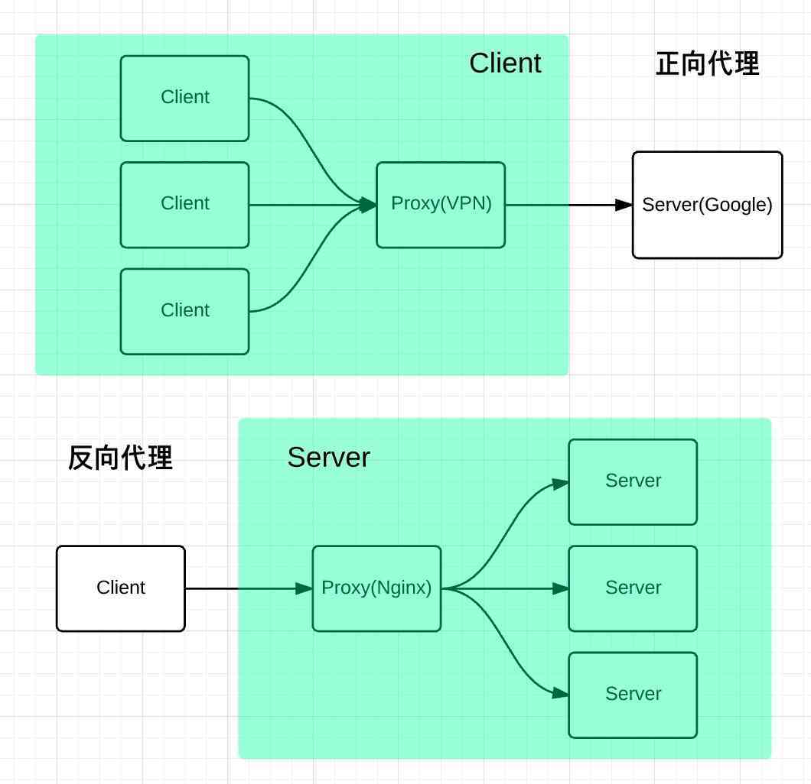

# Nginx代理

代理是在服务器和客户端之间的一层服务器，代理将客户端的请求转发给服务器，然后将服务端的响应转发给客户端。常用的代理技术分为正向代理、反向代理。Nginx虽然主要是来解决反向代理的，但也能支持正向代理。


- 正向代理：代理服务器替代访问者去访问目标服务器。访问者知道目标服务器，目标服务器只知道代理服务器。需要访问者端进行代理配置。主要作用有“翻墙”、加速、缓存、访问授权、隐藏身份等。
- 反向代理：访问者访问代理服务器，代理服务器根据请求判断并转发到目标服务器，并将获得的内容返回给客户端。访问者把代理服务器当作目标服务器，目标服务器能感知到真实访问者，当然代理服务器可以修改请求的部分信息。主要作用有保护和隐藏原始资源、负载均衡等。

##  四层与七层代理

Nginx原来是在七层做代理的，新的版本是支持四层代理的。这里的层是OSI 7层网络模型，OSI 模型是从上往下的，越底层越接近硬件，越往上越接近软件，所以四层代理要比七层代理性能高很多，但是七层可以进行更多的业务控制。


- 四层代理：工作在TCP层，处理tcp / udp，基于IP+端口的转发，nginx修改请求进来的数据包里面的目标和源IP和端口，然后把数据包发向目标服务器，服务器返回数据，由Nginx再返回给请求客户端。此模式只做包转发，无复杂逻辑，性能非常快。
- 七层代理：工作在应用层，处理http/https，基于URL等应用层信息的转发，根据具体内容(url,参数，cookie,请求头)然后转发到相应的服务器，收到服务器的响应数据后再转发给请求客户端。此模式可以实现**http**信息的改写、头信息的改写、安全应用规则控制、**URL**匹配规则控制、以及转发、**rewrite**等等的规则。

## 正向代理配置项

Nginx正向代理配置较少，主要在server中配置resolver来指定指定DNS服务器IP地址。resolver是必需的，解析接收到的域名，要支持https是需要安装ngx_http_proxy_connect_module模块。

```yaml
...
server {  
    resolver 192.168.1.1; #指定DNS服务器IP地址  
    listen 8080;  
    location / {  
        proxy_pass http://$http_host$request_uri; #设定代理服务器的协议和地址  
    }  
}  
...
```

## 反向代理配置-七层

Nginx的七层代理是其最常用的重要功能，也同时衍生出很多与此相关的 Nginx 服务器重要功能。主要配置项有location块的URL匹配、资源位置、代理跳转等。Nginx转发模块是ngx_http_proxy_module，默认安装的可直接使用。

```yaml
http      #http块
{
    upstream us_name       #upstream块
    { 
        server ...       #被代理服务器地址，以及参数
    }
    server        #server块
    {
        location [PATTERN]    #location块
        {
        	...
        	proxy_pass us_name;
        }
    }
}
```

## 反向代理配置-四层

四层的代理（stream）由模块ngx_stream_core_module支持，默认没有编译到nginx， 编译nginx时候带上 --with-stream。在配置上stream模块用法和http模块差不多，最大区别是在server块配置中没有了对URL的各种规则转发。也支持tcp长连接保持、SSL等。

```yaml
stream      #stream块
{
    upstream us_name       #upstream块
    { 
        server ...       #被代理服务器地址，以及参数
    }
    server        #server块
    {
        listen address:port protocol;       #可选ip/主机名与协议
        proxy_pass us_name;
    }
}
```

## 负载均衡的调度算法

Nginx的upstream目前主流支持的6种方式的分配，分别是内置策略：轮询策略，权重轮询策略，ip_hash策略，最少连接数；和第三方策略：fair策略，url_hash策略，sticky策略等。

- **轮询**：这是Nginx的默认方式，每个请求会按时间顺序逐一分配到不同的后端服务器。两个参数fail_timeout 与max_fails结合使用，周期内最大失败次数即故障不再访问，故障恢复后下一个周期后继续提供服务。还有参数backup标记备用，down标记停机。
- **加权轮询**：权重方式，在轮询策略的基础上指定轮询的几率。数字超大几率越高。
- **IP_HASH**：基于客户端IP的分配方式，相同的IP会访问同一个服务器。最简解决集群的会话(Session)一致问题的方案。
- **最少连接数**：最少的活跃连接数的服务器优先分配。
- **fair**：响应时间短的优先分配。需要安装nginx-upstream-fair模块。
- **URL_HASH**：按访问url的hash结果来分配请求，使每个url定向到同一个后端服务器，要配合缓存命中来使用。需要nginx_upstream_hash模块，新版默认已经安装。
- **sticky**：为一个客户端只和一台服务器保持长连接。基于cookie实现，需要安装nginx-sticky-module模块。

