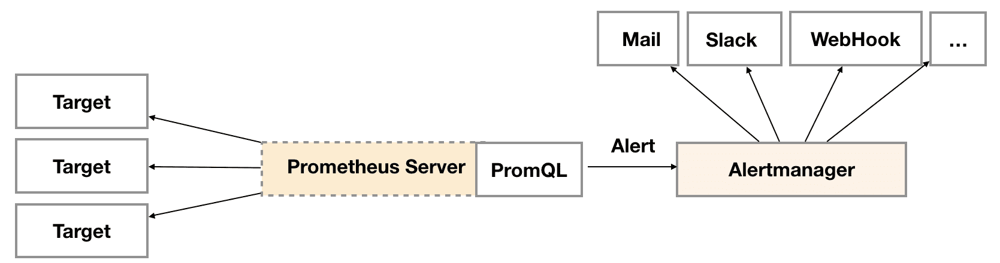

# Prometheus监控平台AlertManager

Prometheus自身只有触发警报能力，但是告警通知能力因此需要结合第三方告警程序。AlertManager是一个独立的告警模块，独立运行，既可接收Prometheus的警报，也可以接受其他客户端的警报请求。收到警报之后可以分组、删除重复、通知到多种接收方。

## 告警架构

Prometheus的告警设计为两个独立的部分，在Prometheus Server中定义AlertRule（告警规则），然后配置的周期进行计算，指标达到条件就会向Alertmanager发送告警信息。在Alertmanager配置路由规则及通知方式，收到Server的告警信息，按规则进行通知，同时还有分组、抑制以及静默等能力。



- 告警规则实际上主要由PromQL进行定义，使用PromQL查询指标，如果有符合的结果，并在达到定义的持续时间（During）后出发告警。
- Alertmanager接收并处理告警信息，能够消除重复，对告警信息进行分组并且路由到正确的通知方，内置了邮件、 IM、移动应用消息推送、自动化运维工具、Webhook等多种通知方式。

## 配置告警规则

在Prometheus配置Alertmanager地址，以及规则。

```yaml
# prometheus.yml
alerting:
  alertmanagers:
    - static_configs:
        - targets:
          - 192.168.16.230:9093
rule_files:
  - "rules/*.yml"
```

规则则配置在rules目录下，后缀yml都会被全部载到。一个典型的规则配置为：

```yaml
groups:
- name: NodeAliveAlert
  rules:
  - alert: 存活告警
    expr: up == 1
    for: 5m
    labels:
      severity: 严重
    annotations:
      description: "{{ $labels.instance }} 已经失去联系,持续5分钟"
      summary: "实例失去联系"
```

- alert，告警名称，也就是告警信息的标题。
- expr，表达式，根据表达式的值进行结果查询，如果命中则看时长是否达到。
- for，持续时长，查询到结果后，持续时间也达到，则发送报警信息。
- severity，告警级别。
- annotations，告警内容，summary是内容，description则是详细信息。

## 安装Alertmanager

Altermanager采用Golang编写，独立的程序，独立部署及维护，下载地址为 prometheus.io/download，下载解压即可运行。

```shell
# 下载alertmanager
cd /usr/local/src/
wget https://github.com/prometheus/alertmanager/releases/download/v0.24.0/alertmanager-0.24.0.linux-amd64.tar.gz
tar -xzf alertmanager-0.24.0.linux-amd64.tar.gz
mv alertmanager-0.24.0.linux-amd64.tar.gz alertmanager
## 用专用用户运行
useradd prometheus
chown -R prometheus:prometheus ./alertmanager
su prometheus
./alertmanager/alertmanager
```

设置为系统服务，自动启动。

```shell
cat > /etc/systemd/system/alertmanager.service <<EOF
#alertmanager.service
[Unit]
Description=alertmanager
Documentation=https://prometheus.io/
After=network.target

[Service]
Type=simple
User=prometheus
ExecStart=/usr/local/src/alertmanager/alertmanager --config.file=/usr/local/src/alertmanager/alertmanager.yml --web.listen-address=0.0.0.0:9093
Restart=on-failure

[Install]
WantedBy=multi-user.target
EOF
## 启动
systemctl enable alertmanager.service
systemctl start alertmanager.service
```

默认配置是开启9093端口，如需更改则启动时加参数--web.listen-address=0.0.0.0:9093。启动后，即可使用ip:9093/访问，Alert菜单下可以查看Alertmanager接收到的告警内容。Silences菜单下则可以通过UI创建静默规则，这部分我们会在后续部分介绍。进入Status菜单，可以看到当前系统的运行状态以及配置信息。

还有比较重要的参数是，--config.file用于指定alertmanager配置文件路径，--storage.path用于指定数据存储路径。

## 配置路由

在alertmanager.yml中配置如下内容：

- 全局配置（global）：全局的公共参数，如全局的SMTP配置，wechat配置等内容；
- 模板（templates）：指定告警通知时的模板文件地址；
- 告警路由（route）：根据标签匹配到指定的receiver。
- 接收人（receivers）：可以是邮箱\微信，Slack或者Webhook等，配合告警路由使用。
- 抑制规则（inhibit_rules）：抑制规则，为了减少垃圾告警。

其中重要的是路由的配置，示例如下：

```yaml
route:
  group_by: ['alertname']
  group_wait: 30s
  group_interval: 5m
  repeat_interval: 1h
  receiver: 'test'
  routes:
   - receiver: 'test'
     group_wait: 30s
     match_re:
       alertname: test|测试
receivers:
  - name: 'test'
    webhook_configs:
      - url: 'http://192.168.16.230:8060/dingtalk/test/send'
```

路由用的是标签匹配告警的处理方式，在match或者match_re指定标签的直接匹配或正则匹配。