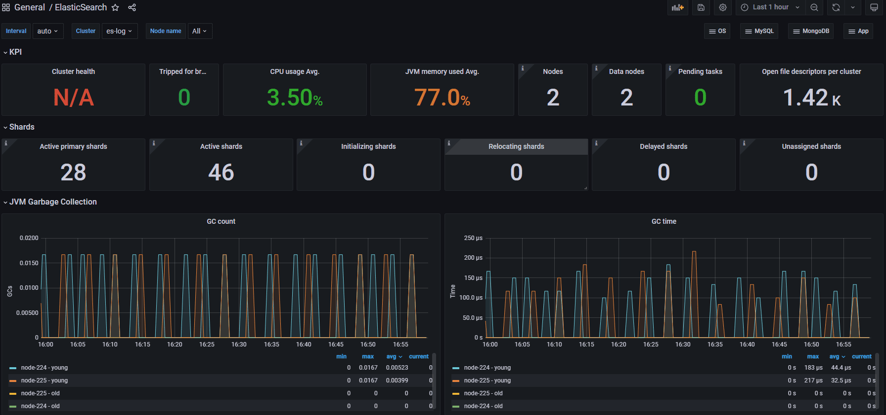

# Prometheus 监控Elasticsearch

Prometheus主要是通过exporter进行监控信息的采集，对Elasticsearch服务主要是elasticsearch_exporter采集服务信息，如存储, 内存，索引大小，查询等信息。

## 安装配置

Elasticsearch Exporter采用Golang编写，下载地址为 github.com/prometheus-community/elasticsearch_exporter，下载解压即可运行。

```shell
# 下载elasticsearch_exporter
cd /usr/local/src/
wget https://github.com/prometheus-community/elasticsearch_exporter/releases/download/v1.5.0/elasticsearch_exporter-1.5.0.linux-amd64.tar.gz
tar -xzf elasticsearch_exporter-1.5.0.linux-amd64.tar.gz
mv elasticsearch_exporter-1.5.0.linux-amd64 elasticsearch_exporter 
## 用专用用户运行
useradd prometheus
chown -R prometheus:prometheus ./elasticsearch_exporter
su prometheus
./elasticsearch_exporter/elasticsearch_exporter
```

参数有：

|        选项        |         默认值         |              含义              |
| :----------------: | :--------------------: | :----------------------------: |
|       es.uri       | http://localhost:9200/ |    Elasticsearch node的地址    |
|       es.all       |         false          |  查询集群中所有节点的统计信息  |
|     es.indices     |         false          | 查询集群中的所有索引的统计信息 |
| web.listen-address |      0.0.0.0:9114      |        HTTP服务暴露端口        |

设置为系统服务，自动启动。

```shell
cat > /usr/lib/systemd/system/elasticsearch_exporter.service <<EOF
#elasticsearch_exporter.service
[Unit]
Description=elasticsearch_exporter
After=network.target

[Service]
Type=simple
User=prometheus
ExecStart=/usr/local/src/elasticsearch_exporter-1.5.0.linux-amd64/elasticsearch_exporter --es.uri http://x.x.x.x:9200 --es.all --es.indices
Restart=on-failure

[Install]
WantedBy=multi-user.target
EOF
## 启动
systemctl enable elasticsearch_exporter.service
systemctl start elasticsearch_exporter.service
```

它还提供了一系列指标开头，--no-collector.<name>参数来指定不想收集的指标，也可以通过--collector.<name>参数来指定想要打开的额外指标。

启动后，即可使用ip:9114/metrics访问，看到系统的即时指标。

## Prometheus Server收集

Prometheus Server收集当前elasticsearch exporter的监控数据，配置prometheus.yml，以及详细的独立文件static_config_es.yml：

```yaml
# prometheus.yml
scrape_configs:
  - job_name: "es"
    file_sd_configs:
      - files:
        - static_config_es.yml
# static_config_es.yml
- targets: ['192.168.16.230:9114']
  labels:
    instance: '生产ES'
```

如果获取主机监控信息时想指定获取的内容，需要配合使用Job的params参数。

配置完之后，如果节点配置在prometheus.yml中，需要重启，如果基于独立文件，加入节点会被定时自动扫描。prometheus提供的web页面的status-->targets中查看到监控的节点信息。

## 数据可视化

数据采集后，一般都使用grafana来展现各种视图。点击加号菜单中的“import”，输入Dashboard ID后点确定，即可从官网导入指定的仪表盘模板。

其中对Elasticsearch监控数据呈现得比较好的图表是，ID为2322的“ElasticSearch cluster stats”仪表盘，能看到集群的详情。



## 预警配置

Prometheus预警由Server触发，再通过独立的Alertmanager服务发送到指定目的地，如钉钉群，邮件，企业微信。配置prometheus.yml指定预警规则文件路径：

```yaml
rule_files:
 - ./rules/*yml
```

预警规则文件(例rules/es.yml)如下：

```yaml
groups:
- name: Elasticsearch
  rules:
  - alert: 集群状态
    expr: elasticsearch_cluster_health_status{color="red"} == 1
    for: 5m
    labels:
      severity: 严重
    annotations:
      description: "{{ $labels.instance }} 集群状态,5分钟持续Red"
      summary: "集群状态不可用"
```

配置如果没问题，则会在展示到alerts菜单下。

几个常用的预警项的表达式是：

- 集群不可用：elasticsearch_cluster_health_status{color="red"} == 1
- 正常的节点数量，elasticsearch_cluster_health_number_of_nodes
- CPU使用率，elasticsearch_process_cpu_percent
- 硬盘可用空间，elasticsearch_filesystem_data_free_bytes
- 内存使用比例（Heap），elasticsearch_jvm_memory_used_bytes{area="heap"} / elasticsearch_jvm_memory_max_bytes{area="heap"}
- 频繁GC，5分钟内出现多次，尤其是{**gc**="old"}，rate(elasticsearch_jvm_gc_collection_seconds_count[5m])

表达式可以先在Server端的graph菜单中验证，或者在Grafana的图表中找参数。

