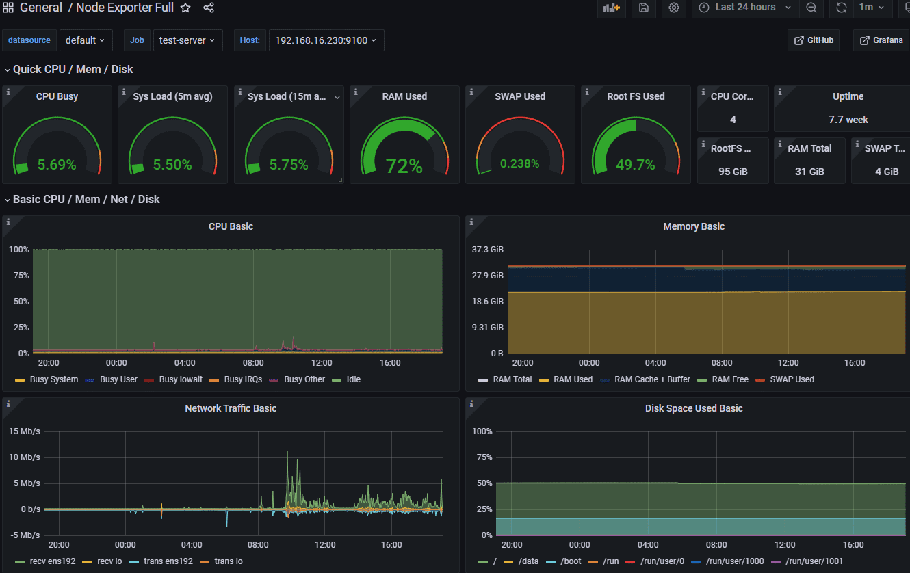
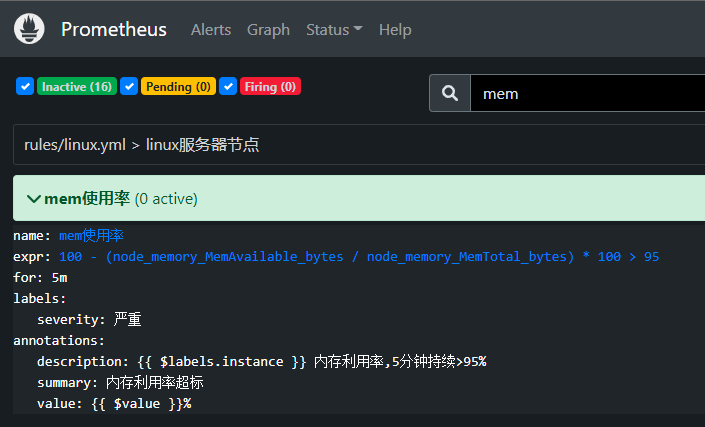

# Prometheus 监控Linux

Prometheus主要是通过exporter进行监控信息的采集，在Linux系统上主要是node_exporter采集主机信息，如CPU, 内存，磁盘等信息。

## 安装配置

Node Exporter采用Golang编写，不存在任何的第三方依赖，下载地址为 prometheus.io/download，下载解压即可运行。

```shell
# 下载node_exporter
cd /usr/local/src/
wget https://github.com/prometheus/node_exporter/releases/download/v1.3.1/node_exporter-1.3.1.linux-amd64.tar.gz
tar -xzf node_exporter-1.3.1.linux-amd64.tar.gz
mv node_exporter-1.3.1.linux-amd64 node_exporter 
## 用专用用户运行
useradd prometheus
chown -R prometheus:prometheus ./node_exporter
su prometheus
./node_exporter/node_exporter
```

设置为系统服务，自动启动。

```shell
cat > /etc/systemd/system/node_exporter.service <<EOF
#node_exporter.service
[Unit]
Description=node_exporter
Documentation=https://prometheus.io/
After=network.target

[Service]
Type=simple
User=prometheus
ExecStart=/usr/local/src/node_exporter/node_exporter
Restart=on-failure

[Install]
WantedBy=multi-user.target
EOF
## 启动
systemctl enable node_exporter.service
systemctl start node_exporter.service
```

默认配置是开启9100端口，如需更改则启动时加参数--web.listen-address=0.0.0.0:9100。它还提供了一系列指标开头，--no-collector.<name>`参数来指定不想收集的指标，也可以通过`--collector.<name>参数来指定想要打开的额外指标。

启动后，即可使用ip:9100/metrics访问，看到系统的即时指标。

## Prometheus Server收集

Prometheus Server收集当前node exporter的监控数据，配置prometheus.yml，并在scrape_configs节点下添加此节点，有多种方式，直接配置在prometheus.yml：

```yaml
scrape_configs:
  # 采集node exporter监控数据
  - job_name: 'linux_node'
    static_configs:
      - targets: ['192.168.16.230:9100']
```

或者基于文件的服务发现：

```yaml
# prometheus.yml中配置
scrape_configs:
 - job_name: "linux_node"
    file_sd_configs:
      - files:
        - static_config_linux.yml
# static_config_linux.yml中配置
- targets:
  # node_exporter配置
  - '192.168.16.230:9100'
```

如果获取主机监控信息时想指定获取的内容，需要配合使用Job的params参数。

配置完之后，需要重启，如果基于文件发现的，加入节点会被定时自动扫描。prometheus提供的web页面的status-->targets中查看到监控的节点信息。

## 数据可视化

数据采集后，一般都使用grafana来展现各种视图。点击加号菜单中的“import”，输入Dashboard ID后点确定，即可从官网导入指定的仪表盘模板。

其中对linux监控数据呈现得比较好的图表是，ID为1860的“Node Exporter Full”仪表盘，能看到单节点的详情。



另外一个是以列表的方式查看总体指标，ID为16098的“1 Node Exporter Dashboard 通用Job分组版”仪表盘。

## 预警配置

Prometheus预警由Server触发，再通过独立的Alertmanager服务发送到指定目的地，如钉钉群，邮件，企业微信。配置prometheus.yml指定预警规则文件路径：

```yaml
rule_files:
 - ./rules/*yml
```

预警规则文件(例rules/linux.yml)如下：

```yaml
groups:
- name: NodeStatsAlert
  rules:
  - alert: mem使用率
    expr: 100 - (node_memory_MemAvailable_bytes / node_memory_MemTotal_bytes) * 100 > 95
    for: 5m
    labels:
      severity: 严重
    annotations:
      description: "{{ $labels.instance }} 内存利用率,5分钟持续>95%"
      summary: "内存利用率超标"
      value: '{{ $value }}%'
```

配置如果没问题，则会在展示到alerts菜单下。



几个常用的预警项的表达式是：

- 节点不可用：up == 0
- 内存，可用内存的比例：(node_memory_MemAvailable_bytes / node_memory_MemTotal_bytes) 
- CPU，5分钟平均的CPU空闲：(avg by (instance)(irate(node_cpu_seconds_total{mode="idle"}[5m]) ))
- 硬盘，挂载的硬盘的可用比例：(node_filesystem_size_bytes - node_filesystem_avail_bytes) / node_filesystem_size_bytes

表达式可以先在Server端的graph菜单中验证，或者在Grafana的图表中找参数。

