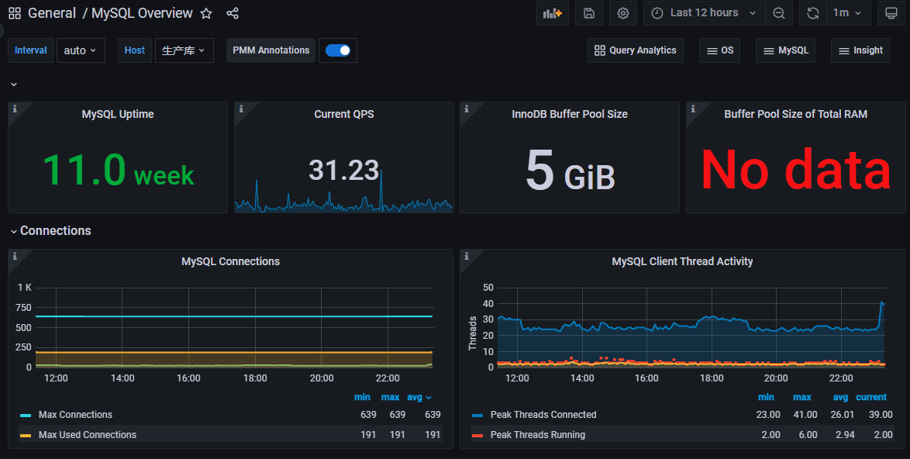
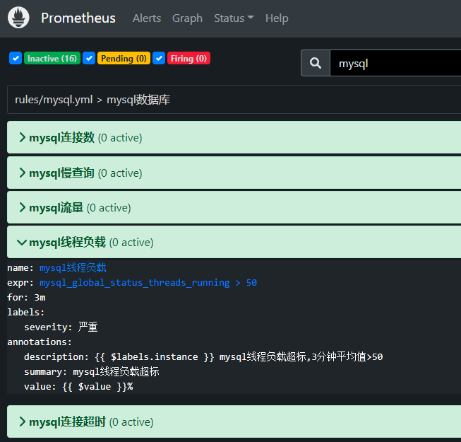

# Prometheus 监控Mysql

Prometheus主要是通过exporter进行监控信息的采集，针对Mysql主要是mysqld_exporter采集Mysql的系统运行信息，如读写, 连接，慢查询等信息。

## 安装配置

MySQL Exporter采用Golang编写，不存在任何的第三方依赖，下载地址为 prometheus.io/download，下载解压即可运行。

```shell
# 下载node_exporter
cd /usr/local/src/
wget https://github.com/prometheus/mysqld_exporter/releases/download/v0.14.0/mysqld_exporter-0.14.0.linux-amd64.tar.gz
tar -xzf mysqld_exporter-0.14.0.linux-amd64.tar.gz
mv mysqld_exporter-0.14.0.linux-amd64 mysqld_exporter 
## 用专用用户运行
useradd prometheus
chown -R prometheus:prometheus ./mysqld_exporter
su prometheus
./mysqld_exporter --config.my-cnf=mysql.cnf
```

需要提前配置mysql.cnf。

```yaml
[client]
host=x.x.x.x
port=3306
user=userx
password=pw
```

在数据库端，需要配置权限。

```sql
grant select,replication client,process ON *.* to 'userx'@'x.x.x.x' identified by 'pw';
```

设置为系统服务，自动启动。

```shell
cat > /etc/systemd/system/mysqld_exporter.service <<EOF
#mysqld_exporter.service
[Unit]
Description=mysqld_exporter
Documentation=https://prometheus.io/
After=network.target

[Service]
Type=simple
User=prometheus
ExecStart=/usr/local/src/mysqld_exporter/mysqld_exporter --config.my-cnf=/usr/local/src/mysqld_exporter/mysql.cnf
Restart=on-failure

[Install]
WantedBy=multi-user.target
EOF
## 启动
systemctl enable mysqld_exporter.service
systemctl start mysqld_exporter.service
```

它还提供了一系列指标开头，--no-collector.<name>`参数来指定不想收集的指标，也可以通过`--collector.<name>参数来指定想要打开的额外指标。

mysqld_exporter默认端口是9104，可以通过启动参数 --web.listen-address=0.0.0.0:9105来修改开放的地址与端口。

启动后，即可使用ip:9104/metrics访问，看到Mysql数据库的即时指标。

## Prometheus Server收集

Prometheus Server收集当前mysqld exporter的监控数据，配置prometheus.yml，以及详细的static_config_mysql.yml：

```yaml
# prometheus.yml
scrape_configs:
  - job_name: "mysql"
    file_sd_configs:
      - files:
        - static_config_mysql.yml
# static_config_mysql.yml
- targets: ['192.168.16.230:9104']
  labels:
    instance: '生产库'
```

如果获取主机监控信息时想指定获取的内容，需要配合使用Job的params参数。

配置完之后，需要重启，基于文件发现的配置，加入节点会被定时自动扫描。prometheus提供的web页面的status-->targets中查看到监控的节点信息。

## 数据可视化

数据采集后，一般都使用grafana来展现各种视图。点击加号菜单中的“import”，输入Dashboard ID后点确定，即可从官网导入指定的仪表盘模板。

其中对linux监控数据呈现得比较好的图表是，ID为7362的“MySQL Overview”官方推荐的仪表盘，能看到单节点的详情。



## 预警配置

Prometheus预警由Server触发，再通过独立的Alertmanager服务发送到指定目的地，如钉钉群，邮件，企业微信。配置prometheus.yml指定预警规则文件路径：

```yaml
rule_files:
 - ./rules/*yml
```

预警规则文件(例rules/mysql.yml)如下：

```yaml
groups:
- name: MysqlStatsAlert
  rules:
  - alert: mysql线程负载
    expr: mysql_global_status_threads_running > 50
    for: 5m
    labels:
      severity: 严重
    annotations:
      description: "{{ $labels.instance }} mysql线程负载超标,3分钟平均值>50"
      summary: "mysql线程负载超标"
      value: '{{ $value }}%'
```

配置如果没问题，则会在展示到alerts菜单下。



几个常用的预警项的表达式是：

- 吞吐量，5分钟的查询平均增量，rate(mysql_global_status_questions[5m])
- 连接数，已连接数与全局最大连接数比例，mysql_global_status_max_used_connections / mysql_global_variables_max_connections
- 慢查询，5分钟慢查询数的平均增量，rate(mysql_global_status_slow_queries[5m])
- 运行中的线程数，mysql_global_status_threads_running
- 客户端连接超时，5分钟的增量，increase(mysql_global_status_aborted_clients[5m])
- 主从延时秒数，mysql_slave_status_sql_delay

表达式可以先在Server端的graph菜单中验证，或者在Grafana的图表中找参数。

