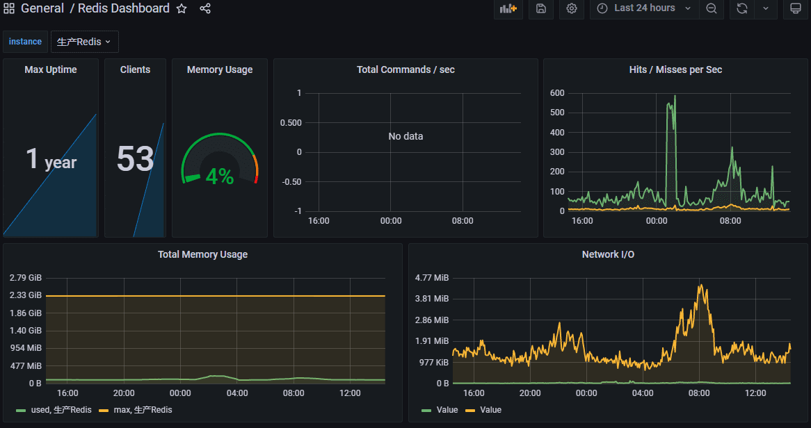

# Prometheus 监控Redis

Prometheus主要是通过exporter进行监控信息的采集，针对Redis服务的监控，官方推荐使用是github上开源的redis_exporter来采集服务的运行数据，如Key，内存，命中率等信息。

## 安装配置

Redis Exporter采用Golang编写，下载地址为 github.com/oliver006/redis_exporter，下载解压即可运行。

```shell
# 下载node_exporter
cd /usr/local/src/
wget https://github.com/oliver006/redis_exporter/releases/download/v1.43.0/redis_exporter-v1.43.0.linux-amd64.tar.gz
tar -xzf redis_exporter-v1.43.0.linux-amd64.tar.gz
mv redis_exporter-v1.43.0.linux-amd64 redis_exporter 
## 用专用用户运行
useradd prometheus
chown -R prometheus:prometheus ./redis_exporter
su prometheus
./redis_exporter/redis_exporter -redis.addr x.x.x.x:6379
```

-redis.addr后面可以跟上多个地址，空格分隔。这个地址与可以配置到-redis.file指定的文件中去。如果有密码，则用参数redis.user与redis.password。

设置为系统服务，自动启动。

```shell
cat > /etc/systemd/system/redis_exporter.service <<EOF
#redis_exporter.service
[Unit]
Description=redis_exporter
Documentation=https://prometheus.io/
After=network.target

[Service]
Type=simple
User=prometheus
ExecStart=/usr/local/src/redis_exporter/redis_exporter -redis.addr x.x.x.x:6379
Restart=on-failure

[Install]
WantedBy=multi-user.target
EOF
## 启动
systemctl enable redis_exporter.service
systemctl start redis_exporter.service
```

默认配置是开启9121端口，如需更改则启动时加参数-web.listen-address 0.0.0.0:9121。它还提供了一系列指标开头，--no-collector.<name>`参数来指定不想收集的指标，也可以通过`--collector.<name>参数来指定想要打开的额外指标。

启动后，即可使用ip:9121/metrics访问，看到系统的即时指标。

## Prometheus Server收集

Prometheus Server收集当前redis exporter的监控数据，配置prometheus.yml，并在scrape_configs节点下添加此节点，有多种方式，可直接配置在prometheus.yml或加上独立配置文件：

```yaml
# prometheus.yml
scrape_configs:
  - job_name: "mysql"
    file_sd_configs:
      - files:
        - static_config_redis.yml
# static_config_redis.yml
- targets: ['192.168.16.230:9121']
  labels:
    instance: '生产Redis'
```

如果获取主机监控信息时想指定获取的内容，需要配合使用Job的params参数。

配置完之后，如果节点配置在prometheus.yml中，需要重启，如果基于独立文件，加入节点会被定时自动扫描。prometheus提供的web页面的status-->targets中查看到监控的节点信息。

## 数据可视化

数据采集后，一般都使用grafana来展现各种视图。点击加号菜单中的“import”，输入Dashboard ID后点确定，即可从官网导入指定的仪表盘模板。

其中对Redis监控数据呈现得比较好的图表是，ID为763的“Redis Dashboard for Prometheus Redis Exporter”仪表盘，能看到单节点的详情。



## 预警配置

Prometheus预警由Server触发，再通过独立的Alertmanager服务发送到指定目的地，如钉钉群，邮件，企业微信。配置prometheus.yml指定预警规则文件路径：

```yaml
rule_files:
 - ./rules/*yml
```

预警规则文件(例rules/redis.yml)如下：

```yaml
groups:
- name: Redis
  rules:
  - alert: redis内存
    expr: redis_memory_used_bytes/redis_memory_max_bytes * 100 > 80
    for: 5m
    labels:
      severity: 严重
    annotations:
      description: "{{ $labels.instance }} redis内存使用比较,5分钟平均值>80%"
      summary: "redis内存使用超标"
      value: '{{ $value }}%'
```

配置的结果会在展示到alerts菜单下看到。几个常用的预警项的表达式是：

- 节点不可用，up == 0
- 内存使用比例，redis_memory_used_bytes / redis_memory_max_bytes
- 连接数，redis_connected_clients
- 连接超限后拒绝数，redis_blocked_clients
- 未命中数，5分钟平均增量，irate(redis_keyspace_misses_total[5m])

表达式可以先在Server端的graph菜单中验证，或者在Grafana的图表中找参数。

