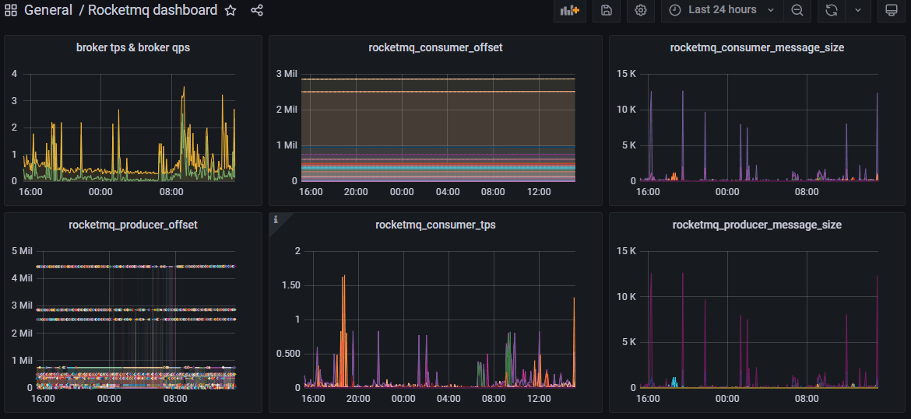

# Prometheus 监控RocketMQ

Prometheus主要是通过exporter进行监控信息的采集，针对RocketMQ服务的监控，官方推荐使用是github上开源的rocketmq-exporter来采集服务的运行数据，如TPS，QPS，生产情况，消费情况等信息。

## 安装配置

RocketMQ Exporter采用Java编写，下载地址为 github.com/apache/rocketmq-exporter，没有打包好的可运行包，需要自己下载源码，编译，打包再运行。

```shell
# 生成exporter可运行包
git clone https://github.com/apache/rocketmq-exporter.git
mvn clean install
# 配置运行服务
mkdir /usr/local/src/rocketmq-exporter 
# 上传包rocketmq-exporter-0.0.2-SNAPSHOT.jar
# 用专用用户运行
useradd prometheus
chown -R prometheus:prometheus ./rocketmq-exporter
su prometheus
java -jar /usr/local/src/rocketmq-exporter/rocketmq-exporter-0.0.2-SNAPSHOT.jar --rocketmq.config.namesrvAddr="x.x.x.x:9876"
```

启动参数可以编译到Jar中，也可以在启动时跟上后面，参数有：

|               选项               |     默认值     |        含义         |
| :------------------------------: | :------------: | :-----------------: |
|   rocketmq.config.namesrvAddr    | 127.0.0.1:9876 | MQ集群的nameSrv地址 |
| rocketmq.config.webTelemetryPath |    /metrics    |    指标搜集路径     |
|           server.port            |      5557      |  HTTP服务暴露端口   |

设置为系统服务，自动启动。

```shell
cat > /etc/systemd/system/rocketmq-exporter.service <<EOF
#rocketmq-exporter.service
[Unit]
Description=rocketmq-exporter
After=network.target

[Service]
Type=simple
User=prometheus
ExecStart=java -jar /usr/local/src/rocketmq-exporter/rocketmq-exporter-0.0.2-SNAPSHOT.jar --rocketmq.config.namesrvAddr="x.x.x.x:9876"
Restart=on-failure

[Install]
WantedBy=multi-user.target
EOF
## 启动
systemctl enable rocketmq-exporter.service
systemctl start rocketmq-exporter.service
```

它还提供了一系列指标开头，--no-collector.<name>`参数来指定不想收集的指标，也可以通过`--collector.<name>参数来指定想要打开的额外指标。

启动后，即可使用ip:5557/metrics访问，看到系统的即时指标。

## Prometheus Server收集

Prometheus Server收集当前rocketmq exporter的监控数据，配置prometheus.yml，并在scrape_configs节点下添加此节点，有多种方式，可直接配置在prometheus.yml或加上独立配置文件：

```yaml
# prometheus.yml
scrape_configs:
  - job_name: "RocketMQ"
    file_sd_configs:
      - files:
        - static_config_rocketmq.yml
# static_config_rocketmq.yml
- targets: ['192.168.16.230:5557']
  labels:
    instance: '生产RocketMQ'
```

如果获取主机监控信息时想指定获取的内容，需要配合使用Job的params参数。

配置完之后，如果节点配置在prometheus.yml中，需要重启，如果基于独立文件，加入节点会被定时自动扫描。prometheus提供的web页面的status-->targets中查看到监控的节点信息。

## 数据可视化

数据采集后，一般都使用grafana来展现各种视图。点击加号菜单中的“import”，输入Dashboard ID后点确定，即可从官网导入指定的仪表盘模板。

其中对RocketMQ监控数据呈现得比较好的图表是，ID为10477的“Rocketmq dashboard”仪表盘，能看到单节点的详情。



## 预警配置

Prometheus预警由Server触发，再通过独立的Alertmanager服务发送到指定目的地，如钉钉群，邮件，企业微信。配置prometheus.yml指定预警规则文件路径：

```yaml
rule_files:
 - ./rules/*yml
```

预警规则文件(例rules/rocketmq.yml)如下：

```yaml
groups:
- name: rocketmq
  rules:
  - alert: RocketMQ消息队列积压
    expr: rocketmq_group_diff{countOfOnlineConsumers!="0"} > 20
    for: 10m
    labels:
      severity: 严重
    annotations:
      description: "{{ $labels.topic }} :{{ $labels.group }}列积压严重,10分钟数量 > 20"
      summary: "RocketMQ队列积压超标"
      value: '{{ $value }}%'
```

配置的结果会在展示到alerts菜单下看到。几个常用的预警项的表达式是：

- 节点不可用，up == 0
- 消息积压，未消费的消息，可以不算没消费者的，rocketmq_group_diff{countOfOnlineConsumers!="0"}
- 消息积压，用offset计算，(sum(rocketmq_producer_offset) by (topic) - on(topic)  group_right  sum(rocketmq_consumer_offset) by (group,topic))
- 消费延迟，毫秒数，sum by (group,topic)(rocketmq_group_get_latency_by_storetime)
- 生产者的tps，sum(rocketmq_producer_tps) by (cluster)
- 消费者的tps，sum(rocketmq_consumer_tps) by (cluster)

表达式可以先在Server端的graph菜单中验证，或者在Grafana的图表中找参数。

