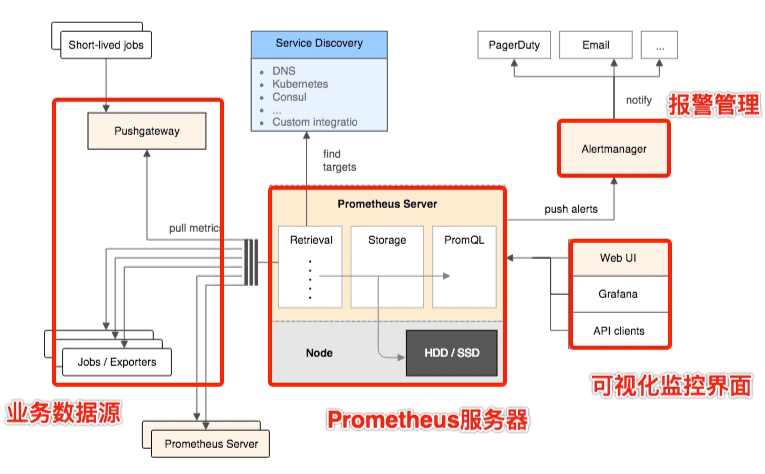

# Prometheus

Prometheus是一个开源的系统监控和报警系统，设计思路来源于Google的Brogmon监控系统，2015 年正式发布，并加入到CNCF基金会的项目。在kubernetes体系中，通常用prometheus进行监控，也同时支持多种`exporter`采集数据，能替代Zabbix、Open-Falcon等监控系统做非容器化的场景下的监控。

## 系统特点

Prometheus 基于时序数据库(TSDB)，所有采集的监控数据由度量名和键值对组成的多维数据保存在TSDB。通过PromQL实现灵活查询，用自带UI或更常用Grafana展现。

也是基于PromQL配置告警，并基于指标结果进行多种方式通知出来。

支持通过静态文件配置和动态发现机制发现监控对象，自动完成数据采集。主要是服务器主动抓的pull模式，但也支持Pushgateway的push模式。

## 时间序列（time-series）

time-series是指将同一组统计指标，在相等时间间隔内依照给定的采样率，将观测的数值按其发生的时间先后顺序排列而成的数列。时间序列数据具有短期随机、长期趋势等特性。根据已有的历史数据分析，可对未来进行预测。

此数据的记录格式是按照时间戳和值的序列顺序存放的，我们称之为向量(vector). 每条time-series通过指标名称(metrics name)和一组标签集(labelset)命名。

每条记录称之为样本（sample），如node_disk_reads_merged_total{device="dm-0"}@1660880272782 10，它由以下三部分组成：

- 指标(metric)：有metric name和描述当前样本特征的多个labelsets。
- 时间戳(timestamp)：一个精确到毫秒的时间戳。
- 样本值(value)： 一个float64的浮点型数据表示当前样本的值。

指标(metric)的格式为<metric name>{<label name>=<label value>, ...}。名称反映样本的意义，标签(label)反映了当前样本的特征维度。

Prometheus定义了4种不同的指标类型(metric type)：Counter（计数器）、Gauge（仪表盘）、Histogram（直方图）、Summary（摘要）。

- Counter，只增不减的计数器。一般_total作为后缀，记录次数，可以了解速率变化。PromQL的rate()函数可以计算增长率。
- Gauge，可增可减的仪表盘。侧重于反应系统的当前状态。PromQL的函数delta()可以计算一段时间的差别。
- Histogram，时间范围内直方图，由<basename>_ bucket{le="<upper inclusive bound>"}，<basename>_ bucket{le="+Inf"}, <basename>_ sum，<basename>_ count三种指标一组，通常反映一段时间内指标的区间总数的统计。
- Summary，由 <basename>{quantile="<φ>"}，<basename>_ sum，<basename>_ count 一种指标一组，通常反映一段时间内指标的 quantile 数据（不经计算的总数）。

## 架构

Prometheus的生态系统包括多个组件，大部分的组件都是用 Go 语言编写的，基础组件有Prometheus Server、Alertmanager、各种Exporters、pushgateway，以及Grafana仪表盘。

- Prometheus Server，核心部分，负责对监控数据的获取，存储以及查询。包括时序数据库、对外提供了自定义的 PromQL 语言、发现目标和采集数据，还有个简单的UI。
- Exporter，业务数据源，用来采集数据，并通过 HTTP 服务的形式暴露，Server主动访问此服务的接口。
- AlertManager，管理告警，负责报警。在Server中配置基于 PromQL 创建告警规则，产生的告警由它进行处理。一般告警方式有邮件、微信、钉钉等。
- push gateway，接收由 Client push 过来的指标数据，然后供Server来定时抓取。
- Grafana，监控仪表盘系统，一个配合使用的必不少的独立系统，展示各种监控图表。

Prometheus获取数据的设计核心是Pull模型，exporter不需知道Server，配置简单可以降低耦合。而且他能通过Consul、kubernetes、DNS等发现客户端。支持多种时序数据库。

