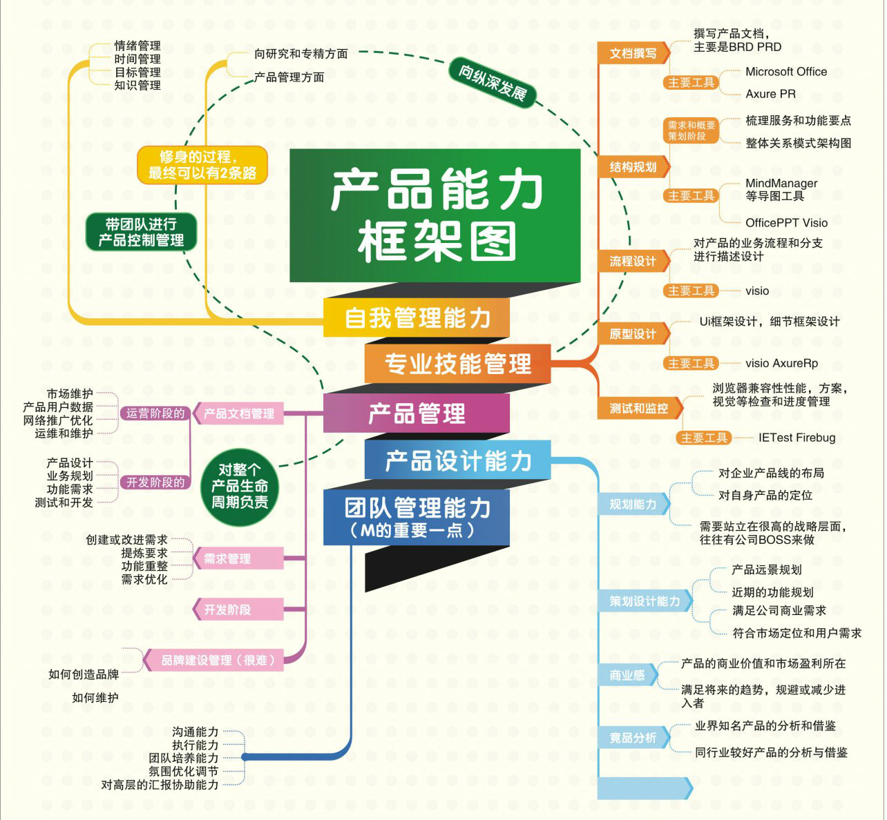

# 产品经理的能力框架
> 网上遇到一张描述产品经理能力框架的图，各项都非常清晰，拿来分享。并加以注解。
- 推动产品目标的实现是产品经理一般职责，然后是需求的挖掘和分析，最后是产品战略和发展的规划。
- 重点是沟通、推动、设计、分析、规划方面。
- 主要武器，是office、visio、AxureRP、以及脑图工具，还有一张嘴~_~。

> 图

`此图系转载，如有版权侵犯请联系将及时删除。`