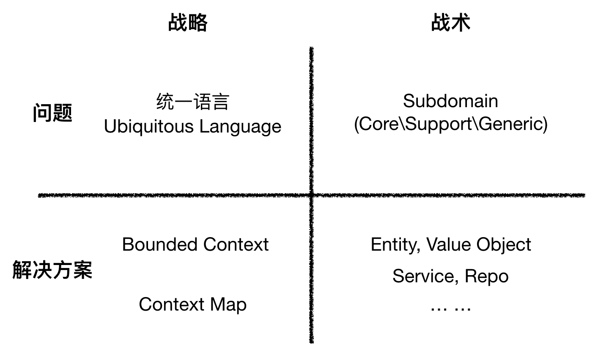

# 领域模型方法之DDD，领域驱动设计

Eric Evans的著作Domain-Driven Design领域驱动设计，简称DDD。一套软件开发方法论，用来解决复杂的现实问题。从如何需求沟通（构建领域知识），到高层设计（战略建模）、详细设计（战术建模）。

DDD提供的是架构设计的方法论，本质上面对问题解决域，偏向技术解决方案更多一些。但是DDD也强调模型与实现高度统一，开发者和领域专家工作在一起，让开发者学习领域知识并挖掘出领域的关键概念。

微服务的兴起推动了DDD的落地，应该用 DDD 的思想去指导微服务的实践。

## 使用DDD的价值

技术目标是产生业务价值，相较其他技术而言DDD更聚焦在业务价值，创造通用语言将团队对业务价值的理解达到无偏差的一致。

1. 获得了非常有用的领域模型，模型帮助关注业务的核心域，并不过度建模。
2. 领域专家可以为软件设计做出贡献，专家与开发人员一起定义概念与术语，用通用语言进行交流。
3. 更准确的定义和理解业务与业务规则，业务模型也是逐渐完善起来的，团队讨论模型的过程中，有助于掌握业务价值。
4. 按照领域专家的模型来设计系统，系统直接反映出业务人员的理解，提供更好的用户体验，减少培训。
5. 技术团队面向业务寻找解决方案，都能理解项目的限界上下文，有清晰的模型边界。
6. 划分好限界上下文后，就有了明确的边界与关系，以及模型间的依赖与集成，有助于全面了解企业架构。
7. 敏捷、迭代式和持续增量建模。
8. 战略上为单个限界上下文中的团队内提供一套通用语言，为不同团队提供限界上下文划分与集成。
9. 战术上为团队提供了聚合、实体、值对象、领域服务、领域事件等多个建模工具。

不过实施过程需要花费太多的精力在通用语言上，开发人员与领域专家保持长时间和深入的沟通与定义概念与术语，这都是需要克服的前期显著的成本。

开发人员同样需要改变思考问题的方式，编码前需要对系统中的对象与行为给予准确的业务上的定义。

## DDD建模的步骤

落地 DDD 的时候，应当分成两个阶段，“战略设计”和“战术设计”。

战略设计，团队从“问题空间”和“解决方案空间”两个方面针对系统整体的建模和设计决策，会优先关注限界上下文以及限界上下文之间的协作关系。

战术设计，从实现方面出发，通过精炼的方式得到领域模型，如核心域和通用域等。

在《领域驱动设计》的作者Eric Evans看来是应先用“战术”手段解决简单的系统设计，当系统越来越复杂的时候再用“战略”上的手段。复杂的系统一般也需要多个团队进行协作分析和设计，那么知道协作对方的领域和边界就是沟通时必要的条件了。

>  第一阶段战略阶段，以统一语言为核心，通过协作设计的方式，对业务问题进行分析和澄清，我们围绕业务问题、场景和流程来进行探索，通过限界上下文寻找概念二义性的边界，划分问题子域，从而在宏观（战略）层面降解系统理解上的复杂度。

- 在问题空间中确定核心域，同时考虑其他子域及支撑域的组合。核心关注点放在核心域。
- 在解决方案空间中确定一个或多个限界上下文，一个限界上下文对应一个特定的解决方案。
- 定义出多个限界上下文之间的相互集成关联，即上下文映射图。

> 第二阶段战术阶段，对问题子域和限界上下文内部进行更细化的分析和抽象，通过领域建模的方式，以“聚合”进行封装和隔离，将业务抽象为一系列的领域模型。并且基于系统实现，识别业务服务的划分以及识别其提供的能力。

- 创建实体，承载了聚合的主干。
- 创建值对象。
- 创建聚合与聚合根，承载业务逻辑，并对业务问题最细粒度的澄清和划分。
- 迭代细化实体、值对象、聚合，并根据需要抽象出其他的领域模型，如领域服务、资源库等。

## DDD的实现阶段

绝不提前考虑技术实现。

搞清业务的问题，流程，数据等内容，再到构建模型，在这阶段要专注于核心的业务逻辑，解耦具体实现技术。

系统架构是到了实现阶段再根据需求选择，包括技术架构的选择、数据库设计、部署方案、运维方案等。

实现阶段重要产出物是概要设计方案。

## 实现阶段的重要方法，分层设计

通常情况下模型分成四层，越往上，预期变动越频繁，越往下，预期变动越少。其核心是高度提纯、通用、少变化的领域层，这层来描述业务、处理领域中的业务逻辑，并对外提供访问接口。

- UI 层，负责界面展示。
- 应用层（Application Layer），负责业务流程。
- 领域层（Domain Layer），负责领域逻辑。
- 基础设施层（Infrastructure Layer），负责提供基础设施，如处理持久化或支持库等。

## 实现阶段的实体模式选择

在常见的项目中，DO、VO、DTO等等都只有数据没有行为，而DDD中强调了实体对象是有数据与行为的，所以在领域层的实体对象就是在贫血模型和充血模型中选择。

- 失血模型，此模型只有简单的get set方法，业务行为由服务类完成。
- 贫血模型，有业务能力的模型，但是不做持久化。
- 充血模型，有业务能力，并做持久化。
- 胀血模型，除了业务能力、持久化等，也包括其他所有的业务逻辑。

