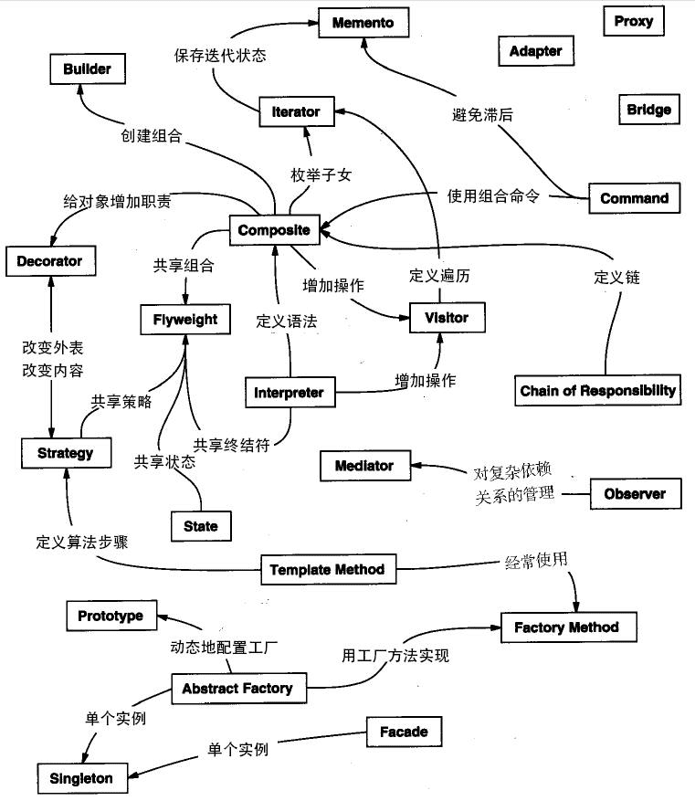

# 设计模式

软件开发技术发展过程中，人们致力于代码可重用性、可维护性，将一些被反复使用、多数人知晓的、经过分类的、代码设计经验，总结成为了设计模式。每一个模式描述了一个在我们周围不断重复发生的问题，以及该问题的核心解决方案。

由 Erich Gamma、Richard Helm、Ralph Johnson 和 John Vlissides 1995年合著《设计模式》中，归纳发表了23种在软件开发中使用频率较高的设计模式。这四人被称为Gang of Four，简称GoF。虽然软件开发技术发展很快，但是现在主要的设计模式仍然是GoF的23种设计模式。

## 模式的分类

根据设计模式是工作内容，可分为创建型模式、结构型模式和行为型模式 3 种。

1. 创建型模式：用于描述“怎样创建对象”，它的主要特点是“将对象的创建与使用分离”。
2. 结构型模式：用于描述如何将类或对象按某种布局组成更大的结构。
3. 行为型模式：用于描述类或对象之间怎样相互协作共同完成单个对象都无法单独完成的任务，以及怎样分配职责。

根据模式的作用点，可分为类模式和对象模式两种。

1. 类模式：用于处理类与子类之间的关系，这些关系通过继承来建立，是静态的，在编译时刻便确定下来了。
2. 对象模式：用于处理对象之间的关系，这些关系可以通过组合或聚合来实现，在运行时刻是可以变化的，更具动态性。

## GoF 的 23 种设计模式的分类表

| 范围\目的 | 创建型模式                | 结构型模式                                  | 行为型模式                                               |
| --------- | ------------------------- | ------------------------------------------- | -------------------------------------------------------- |
| 类模式    | 工厂方法                  | (类）适配器                                 | 模板方法、解释器                                         |
| 对象模式  | 单例 原型 抽象工厂 建造者 | 代理 (对象）适配器 桥接 装饰 外观 享元 组合 | 策略 命令 职责链 状态 观察者 中介者 迭代器 访问者 备忘录 |

## 模式之间的关系

## 各模式简介

1. [单例模式](pattern_singleton.md) （Singleton）：某个类只能生成一个实例，该类提供了一个全局访问点供外部获取该实例。
2. [原型模式](pattern_prototype.md)（Prototype）：将一个对象作为原型，通过对其进行复制而创建新实例。
3. [工厂方法模式](pattern_factory.md)（Factory Method）：定义一个用于创建对象的接口，由子类决定实例化对应的类。
4. [抽象工厂模式](pattern_factory.md)（AbstractFactory）：提供一个创建相关或依赖对象的家族的接口，其每个子类可以生产一系列相关的对象。
5. [建造者模式](pattern_builder.md)（Builder）：将一个复杂对象分解成多个相对简单的部分，然后根据不同需要分别创建它们，最后按步骤构建成该复杂对象。
6. [代理模式](pattern_proxy.md)（Proxy）：为某对象提供一种代理以控制对该对象的访问。即客户端通过代理间接地访问该对象，从而限制、增强或修改该对象的一些特性。
7. [适配器模式](pattern_adapter.md)（Adapter）：将一个类的接口转换成客户希望的另外一个接口，来解决兼容问题。
8. [桥接模式](pattern_bridge.md)（Bridge）：将抽象与实现分离，使它们可以独立变化。它是用组合关系代替继承关系来实现，从而降低了抽象和实现这两个可变维度的耦合度。
9. [装饰模式](pattern_decorator.md)（Decorator）：动态的给对象增加一些职责，即增加其额外的功能。
10. [外观模式](pattern_facade.md)（Facade）：为多个复杂的子系统提供一个一致的接口，使这些子系统更加容易被访问。
11. [享元模式](pattern_flyweight.md)（Flyweight）：运用共享技术来有效地支持大量细粒度对象的复用。
12. [组合模式](pattern_composite.md)（Composite）：将对象组合成树状层次结构，使客户对单个对象和组合对象具有一致的访问性。
13. [模板方法模式](pattern_template.md)（TemplateMethod）：定义一个操作中的算法骨架，而将算法的一些步骤延迟到子类中，使得子类可以不改变该算法结构的情况下重定义该算法的某些特定步骤。
14. [策略模式](pattern_strategy.md)（Strategy）：定义了一系列算法，并将每个算法封装起来，使它们可以相互替换，且算法的改变不会影响使用算法的客户。
15. [命令模式](pattern_command.md)（Command）：将一个请求封装为一个对象，使发出请求的责任和执行请求的责任分割开。
16. [职责链模式](pattern_chain.md)（Chain of Responsibility）：把请求从链中的一个对象传到下一个对象，直到请求被响应为止。通过这种方式去除对象之间的耦合。
17. [状态模式](pattern_state.md)（State）：允许一个对象在其内部状态发生改变时改变其行为能力。
18. [观察者模式](pattern_observer.md)（Observer）：多个对象间存在一对多关系，当一个对象发生改变时，把这种改变通知给其他多个对象，从而影响其他对象的行为。
19. [中介者模式](pattern_mediator.md)（Mediator）：定义一个中介对象来简化原有对象之间的交互关系，降低系统中对象间的耦合度，使原有对象之间不必相互了解。
20. [迭代器模式](pattern_iterator.md)（Iterator）：提供一种方法来顺序访问聚合对象中的一系列数据，而不暴露聚合对象的内部表示。
21. [访问者模式](pattern_visitor.md)（Visitor）：在不改变集合元素的前提下，为一个集合中的每个元素提供多种访问方式，即每个元素有多个访问者对象访问。
22. 备忘录模式（Memento）：在不破坏封装性的前提下，获取并保存一个对象的内部状态，以便以后恢复它。
23. 解释器模式（Interpreter）：提供如何定义语言的文法，以及对语言句子的解释方法，即解释器。

