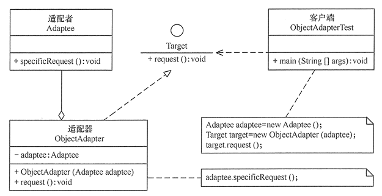
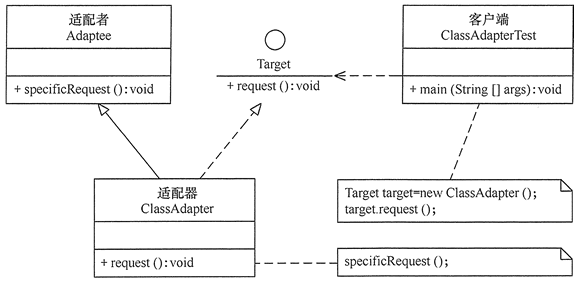

# 适配器模式（Adapter）

适配器模式（Adapter），也称Wrapper，是结构型模式，将类或对象重新布局变成新的结构。

模式的核心是解决本来业务需要B接口，但是现成的只有A接口。解决的方案是，提供一个Adapter，将A接口进行转换为业务所需的B接口。

在JDK中，IO包下的输入输出流大量使用了适配器模式，如ByteArrayInputStream 继承了 InputStream 接口，而内部封装了一个 byte 数组，它将 byte 数组接口适配成 InputStream 流处理器接口。FileInputStream适配了FileDescriptor等等。

## 适配器实现

适配器模式在两种不同的实现方案，基于对象组合的对象适配器，基于类继承的类适配器。但是角色依然不变，有4个角色：

- 目标（Target）接口：当前客户端所期待的接口，它可以是抽象类或接口。
- 适配者（Adaptee）类：它是现存组件库中的组件。
- 适配器（Adapter）类：它是一个转换器，通过继承或引用适配者的对象，把适配者接口转换成目标接口，完成客户所期待的目标接口的实现。
- 客户端（Client）类：使用目标接口。

对象适配器是将适配者对象组合起来完成目标接口，类图如下：

类适配器是继承适配者，然后实现目标接口的方法中调用适配者的具体方法，类图如下：

## 适配器模式的变化

适配器可以收缩为单接口适配器，子类不需要实现父类全部方法时，接口中的每个方法都给出了一个默认的实现，子类只用覆盖父类的特定方法即可，可以减少代码。

单接口适配器场景中，目标接口这个角色可以省略。

适配器模式也可以扩展到为适配者接口与目标接口同时做转换。

在JDK中的IO包下的输入输出流同时也使用了装饰模式，不同的是装饰模式适配的是本体系内相同接口的底层组件。

适配器模式带来解耦与开闭原则的优势，同时系统中过多使用必然带来复杂性，过多的中间层增加代码阅读难度，降低代码可读性。

