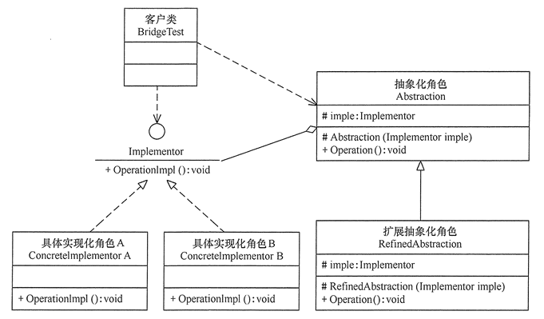

# 桥接模式

桥接模式（Bridge），是一种结构型设计模式，它是用组合关系代替继承关系来分离复杂结构中不同维度的问题。目标是：将抽象部分与它的实现部分分离，使它们都可以独立地变化。

当复杂的场景中使用继承时出现子类爆炸、不同的变化交融的时候，就可以使用桥接模式。

当需要将每个维度抽取为独立的类层次时，也可以使用桥接模式了。

如何使用桥接模式呢，基本思想有两个：

- 组合代替继承，可以减少子类，更有灵活性。
- 抽象，将关注的那个维度进行抽象，从复杂中拆分出来。

桥接模式分抽象部分和实现部分，抽象部分就是抽取的那个维度而形成的独立的类层次，实现部分就是原来那部分，抽象部分就是“桥”。

开发前期进行设计时使用桥接模式更有效，改造已有系统，适配器模式更适合。

## 桥接模式实现

主要的角色有：

- 抽象化（Abstraction）角色：定义抽象化接口，并包含一个对实现化对象的引用。
- 扩展抽象化（Refined Abstraction）角色：是抽象化角色的子类，实现抽象出来的业务方法，并调用实现化角色中的业务方法。
- 实现化（Implementor）角色：实现化角色的接口。
- 具体实现化（Concrete Implementor）角色：给出实现化角色接口的具体实现。
- 客户端（Client）角色：使用抽象化的“桥”。

类图如下：



用遥控与设备来演示代码实现：

```java
/** 实现化部分 */
// 接口
public interface Device {
    void setVolume(int percent);
    int getVolume();
}
// 具体实现
class TV implements Device {
    public void setVolume(int percent) {
        // 业务逻辑
    }
    public int getVolume() {
        // 业务逻辑
    }
}
/** 抽象化部分 */
// 接口
public abstract class RemoteControl {
    // 引用实现化的对象:
    protected Device device;
    // 抽象出来的业务
    public abstract void volumeDown();
    public abstract void volumeUp();
}
// 扩展抽象化
public class TvRemoteControl extends RemoteControl {
    // 实现抽象化部分的业务。主要是组合了实现化的对象
    public void volumeDown() {
        this.device.setVolume(this.device.getVolume()-10);
    }
    public void volumeUp() {
        this.device.setVolume(this.device.getVolume()+10);
    }
    // 还可以再扩展业务
    public void mute() {
        this.device.setVolume(0);
    }
}
// 客户端使用汽车时
RemoteControl rc = new TvRemoteControl(new TV());
car.volumeUp();
```

以上代码将遥控从整个系统提出来，设备代表原系统。各自可以独立发展自己的体系。

## 桥接模式的扩展

桥接模式实现比较复杂，设计思想是不要过度使用继承，而是优先拆分某些部件，使用组合的方式来扩展功能。这种思想价值大于实际实现意义。

- 抽象化的组件可更换，与策略模式相似，区别是桥接模式从结构设计的，策略模式是在运行时改变行为。

在 JDBC 体系中，从整体中抽象出来的 Driver 类就是桥接对象。各个数据库厂商有自己实现的 Driver 类。加载厂商的Driver类时，就会将 Driver 对象注册到 DriverManager 中，客户端从DriverManager获取Connection时，DriverManager将交给注册的Driver类去实现。

- 分解独立变化的维度，遇到需要桥接既有功能时，可以加上适配器模式。

