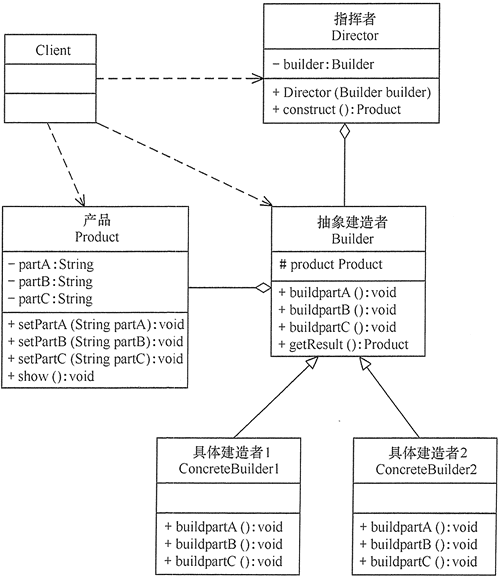

# 建造者模式

有时需要创建一个复杂的对象，这个复杂对象通常由多个子部件按一定的步骤组合而成。

建造者（Builder）模式将这个创建过程与使用过程分离，建造者将一个复杂的对象分解为多个简单的对象，然后一步一步组装成最终对象。客户端使用时不需要关注此过程，只需要调用统一的接口即可得到此对象。

建造者模式是创建型模式，是用于处理对象之间的关系的对象模式。

在各大框架中，使用建造者模式的场景比较广泛。

MyBatis 中 SqlSessionFactoryBuiler 类用到了建造者模式。

Spring应用到的建造者模式可以在BeanDefinitionBuilder类中有体现。

JDK 的 StringBuilder 类中提供了 append() 方法，这就是一种链式创建对象的方法，开放构造步骤，最后调用 toString() 方法就可以获得一个完整的对象。

## 建造者的实现

建造者模式由产品、抽象建造者、具体建造者、指挥者等 4 个要素构成。

| 组成（角色）                  | 关系                       | 作用                                                         |
| :---------------------------- | :------------------------- | :----------------------------------------------------------- |
| 产品（Product）               | 具体产品                   | 包含多个组成部件的复杂对象                                   |
| 抽象建造者（Builder）         | 建造者父类                 | 创建产品各个子部件的抽象方法的接口                           |
| 具体建造者(Concrete Builder） | 具体的建造者，建造产品对象 | 实现复杂产品的各个部件的具体创建过程                         |
| 指挥者（Director）            | 协调建造者；建造对象的接口 | 调用建造者对象中的部件构造与装配方法完成复杂对象的创建，并对外提供建造接口。 |

类图如下：

## 建造者模式的特点

建造者模式主要是为了把复杂的建造过程封装起来，让使用者不需要了解内部细节，对建造者建造过程修改不影响使用者，符合封装思想。

对新的建造者也方便加入，不影响其他建造者，符合开闭原则。

建造者模式唯一区别于工厂模式的是针对复杂对象的创建。

建造者模式对产品类频繁变化的场景维护成本较高，因为建造者同样也会改变建造过程。

