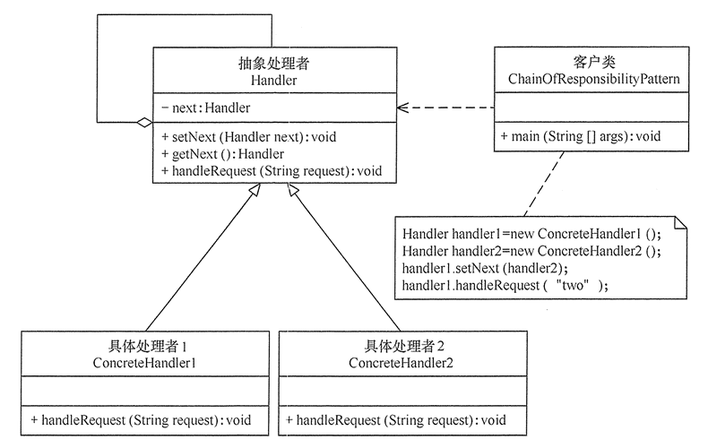

# 责任链模式

责任链（Chain of Responsibility）模式，也叫职责链模式，是一种对象行为型模式。它是将所有请求的处理者连成一条链，可将请求沿着这条链传递，直到全部处理。

主要想解决的问题是，避免请求发送者与多个处理者耦合在一起，解决问题的核心就是这个“链”。

有了这个“链”后，能做到的有：

- 请求者把请求发送给链，不用了解处理者细节。
- 处理者只关注自己处理的逻辑，增加处理者只需要在链上合适的位置插入。
- 工作流程变化，只需要调整链上的元素位置。

责任链在框架中有应用比较多的是 Struts2 的拦截器、JSP 和 Servlet 的 Filter 等。

## 责任链模式的实现

责任链中最主要的是“链”，通过数据链表即可实现此结构，另外就是抽象出处理者体系。角色如下：

- 抽象处理者（Handler）角色：定义处理请求的接口，并有一个后继处理者链接。
- 具体处理者（Concrete Handler）角色：实现抽象处理者的处理方法，首先判断能否处理本次请求，再判断将该请求是否转给它的后继者。
- 客户类（Client）角色：创建处理链，并提交请求（向链头的具体处理者对象提交）。

类图如下：



代码如下：

```java
//抽象处理者角色
@Data
abstract class Handler {
    private Handler next;
    //处理请求的方法
    public abstract void handleRequest(Object request);
    // next set get
}
//具体处理者角色1..n
class ConcreteHandler extends Handler {
    public void handleRequest(Object request) {
        //判断是否需要处理
        if (needHand(request) {
            //本类的业务处理
        }
        //交给下一个，可以加判断是否需要下一个
        if (getNext() != null) {
            getNext().handleRequest(request);
        }
    }
}
//客户端处理
//组装责任链
Handler handler1 = new ConcreteHandler1();
Handler handler2 = new ConcreteHandler2();
handler1.setNext(handler2);
//提交请求
Object request;//封装请求
handler1.handleRequest(request);
```

## 责任链模式的变化

责任链模式比较简单，执行时可根据实现场景判断是否要将请求到达链上所有的处理者。同时对请求参数可以抽象和封装，增强了消息的兼容性。

另外还可以让其中多个处理者都处理其中一部分业务逻辑，或者允许部分请求一个都不处理。

责任链模式主要场景还是：请求被有序的多个处理者所处理。

