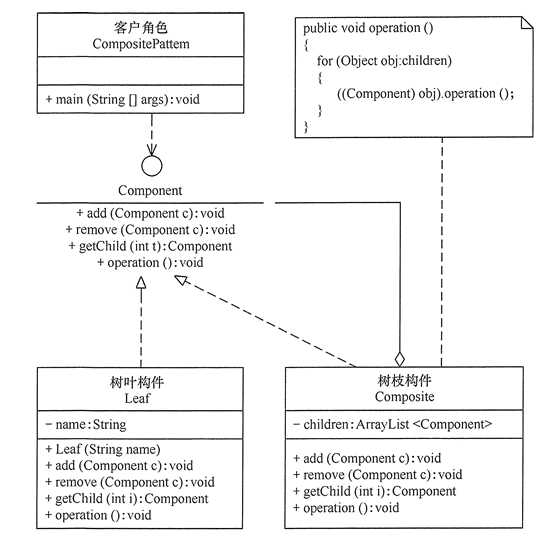
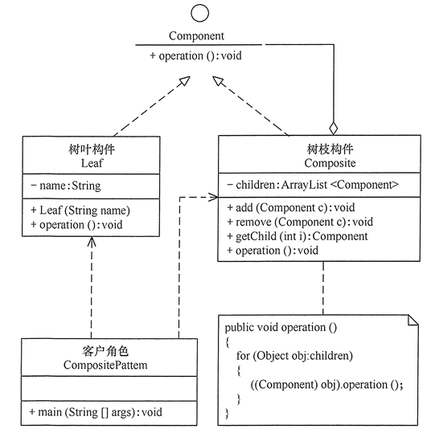

# 组合模式

组合（Composite）模式，有时又叫作整体-部分（Part-Whole）模式，将对象组合成树状的层次结构，用来表示“整体-部分”的关系，属于结构型模式。

模式的目标是使用户对单个对象和组合对象都具有一致的访问性。

这种结构软件开发中比较常见，如操作系统中的文件管理，UI组件管理等。

在Java中，Map的putAll、List的addAll等方法都应用了组合模式。

## 组合模式的实现

组合模式分为透明式的组合模式和安全式的组合模式。不同点是安全模式将严格区别树叶对象和树枝对象。

组合模式包含以下主要角色：

- 抽象构件（Component）角色：树叶构件和树枝构件声明公共接口，并实现它们的默认行为。透明式的组合模式中抽象构件还声明访问和管理子类的接口。
- 树叶构件（Leaf）角色：叶节点对象，它没有子节点，用于继承或实现抽象构件。
- 树枝构件（Composite）角色 / 中间构件：是组合中的分支节点对象，它有子节点，也继承和实现抽象构件，但是主要是存储和管理子部件。
- 客户端（Client）角色：使用的是引用整个树的根。

**透明组合模式**中，抽象构件声明了所有子类中的全部方法，所以客户端无须区别树叶对象和树枝对象，对客户端来说是透明的。树叶与树枝都实现所有方法，只是树叶对存储和管理子部件这些方法空实现或抛异常。树枝将具体的业务实现交给子节点。

**安全组合模式**中，管理子构件的方法只有树枝构件具备，抽象构件和树叶构件没有对子对象的管理方法，客户端需要区别树枝与树叶。

代码部分较为简单，重点在树枝上，根节点就是一个树枝，如图示。

## 组合模式的扩展

组合模式运用的场景比较聚焦，是能组合成树状的层次结构的对象集合，目标是为用户提供一致的访问。

但是这种将工作委派给其他对象（树枝）的做法，在桥接模式、策略模式、适配器模式都能见到。

同样将部分组合成一个整体的思想，也是常见的设计思想。

对于树枝树叶功能差异较大时，此模式将不太好理解。

