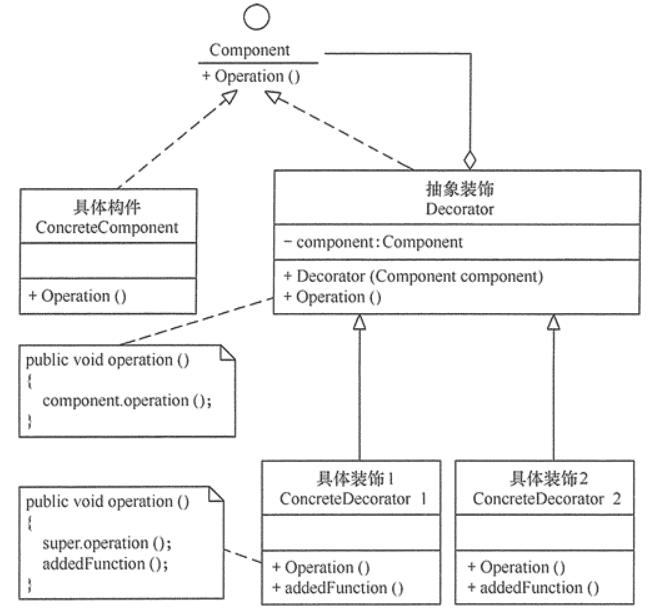

# 装饰器模式

装饰器模式（Decorator），也称Wrapper，是结构型模式，在运行期动态给某个对象的实例增强功能。

装饰器模式也是对象模式，核心是不改变现有对象结构的情况下，动态地给该对象增强 ，在对象功能扩展方面，它比继承更有弹性，也体现了开闭原则。

适配器同样有别名叫Wrapper。适配器模式的意义是要将一个接口转变成另一个接口，它的目的是通过改变接口来达到重复使用的目的。 装饰器模式要保持原有的接口，但是增强原有对象的功能，或者改变原有对象的处理方式而提升性能。

在JDK中的IO包下的输入输出流大量使用了装饰器模式，FileInputStream、ServletInputStream等做基础具体组件，FilterInputStream是抽象的装饰器，BufferedInputStream、LineNumberInputStream等类是具体装饰器，做各自增强的功能。

## 装饰器的实现

装饰器模式主要包含以下角色：

- 抽象构件（Component）角色：定义抽象接口，构件体系中的定义部分。
- 具体构件（ConcreteComponent）角色：实现具体功能的构件，构件体系中的实现部分。
- 抽象装饰（Decorator）角色：继承抽象构件，持有具体构件的实例，并定义与抽象构件一致的接口。
- 具体装饰（ConcreteDecorator）角色：实现抽象装饰的相关方法，并给具体构件对象添加附加的责任（增强）。

类图如下：



实现的代码如下：

```java
//抽象构件角色
interface Component {
    public void operation();
}
//具体构件角色
class ConcreteComponent implements Component {
    public void operation() {
    }
}
//抽象装饰角色
class Decorator implements Component {
    private Component component;
    public Decorator(Component component) {
        this.component = component;
    }
    public void operation() {
        component.operation();
    }
}
//具体装饰角色
class ConcreteDecorator extends Decorator {
    public ConcreteDecorator(Component component) {
        super(component);
    }
    public void operation() {
        super.operation();
        //添加增强业务实现
    }
}

```

## 装饰者模式的变化

构件一般是系统已有功能或者基础功能，有没有接口，同样都可以装饰。

也可以简化装饰者，只有一个具体装饰者时，简化为抽象装饰和具体装饰合并。

在实际使用中，装饰者并非仅透明的装饰构件，也会根据需要增加自己的特有方法。这也叫退化的装饰模式。

装饰者模式与代理模式有相似的结构，差异是在构件的生命周期管理上，代理通常自行管理，装饰者则是交由客户端来管理。

