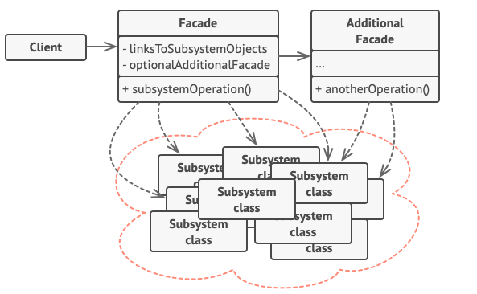

# 外观模式

外观（Facade）模式又叫作门面模式，为多个复杂的子系统提供一个一致的接口，而使这些子系统更加容易被访问的模式。

外部无需了解子系统细节，降低应用程序的复杂度，提高了程序的可维护性。

外观模式不但广泛用在第三方SDK、开源类库，咱们日常的代码中，也有非常大概率使用到，如开放一个API让外界访问本系统的一些功能。

## 外观模式的实现

外观模式的结构比较简单，主要是定义了一个高层接口，有子系统的引用，可以访问子系统的功能。

主要角色有：

- 外观（Facade）角色：对外的高层接口。还可以有附加外观，实现更多的附加功能。
- 子系统（Sub System）角色：现有系统，或内部子系统，具体功能的实现。
- 客户（Client）角色：访问外观角色。

类图如下：

## 使用外观模式

外观模式最直接的优点是：

- “迪米特法则”的典型应用，不需要了解子系统过多细节。
- 只要外观接口不变，子系统变化不影响外界，较低的耦合度。

但是新增子系统时，可能要修改接口了，不符合开闭原则。

