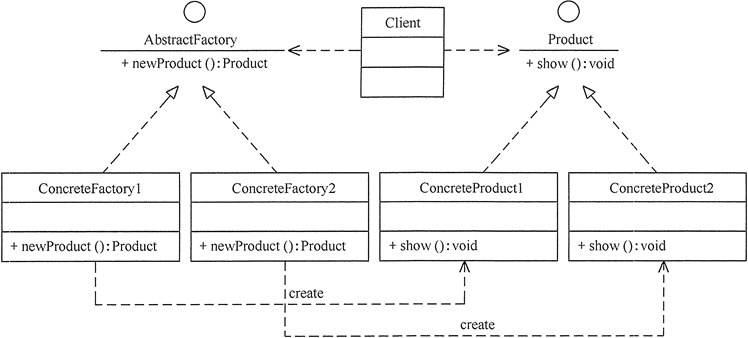
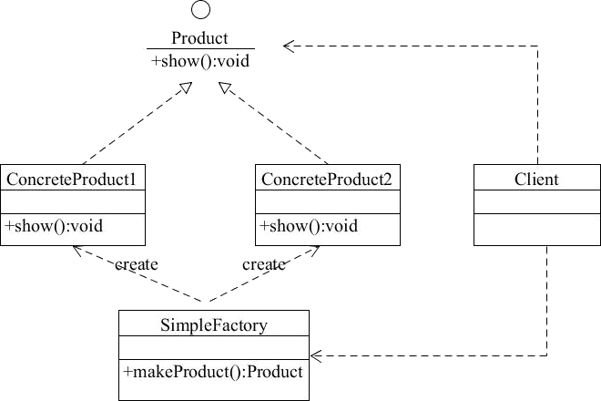
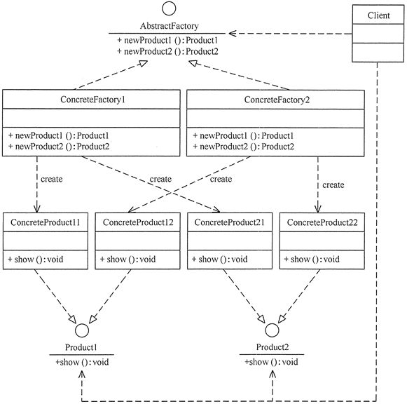

# 工厂模式

工厂模式归类在创建模式中，创建模式是对类的实例化过程进行抽象化，要求“创建与使用相分离”。

使用场景有：

- 凡是需要生成复杂对象的地方，都可以尝试考虑使用工厂模式。
- 不需要让客户端知道其生产的复杂细节。

工厂模式有 3 种不同的实现方式，分别是简单工厂模式、工厂方法模式和抽象工厂模式。共同的特点是定义一个创建对象的工厂接口，将对象的实际创建工作交给具体子工厂类。

三种实现方式以工厂方法模式为基准，对象创建过程简单的使用简单工厂模式，多个类且复杂的创建过程则使用抽象工厂模式。

为解释此模式，把被创建的对象称为“产品”，把创建产品的对象称为“工厂”。

## 工厂方法模式

工厂方法模式，又称工厂模式、多态工厂模式和虚拟构造器模式，核心思想是不同子类则负责生成具体的对象，让工厂生产类符合开闭原则，具体工厂类符合单一职责原则。

工厂方法模式由抽象工厂、具体工厂、抽象产品和具体产品等4个角色构成。

| 组成（角色）                 | 关系                                     | 作用                                     |
| :--------------------------- | :--------------------------------------- | :--------------------------------------- |
| 抽象产品（Product）          | 具体产品的父类                           | 描述具体产品的公共接口                   |
| 具体产品（Concrete Product） | 抽象产品的子类；工厂类创建的目标类       | 描述生产的具体产品                       |
| 抽象工厂（Creator）          | 具体工厂的父类                           | 描述具体工厂的公共接口                   |
| 具体工厂（Concrete Creator） | 抽象工厂的子类；被外界调用，生产具体产品 | 描述具体工厂；实现工厂方法创建产品的实例 |

类图如下：

客户端想要得到产品实例，只需要交给工厂类即可，工厂类会完成整个创建过程，当然也需要提前实例化具体的工厂类。

工厂方式模式会让系统复杂度上升，有新产品时类的个数成对增加。也只适合生产一个产品类的场景。

Spring源码中有很多关于工厂方法模式的应用，如FactoryBean及其实现者就是工厂，子类ListFactoryBean可以创建List对象、子类MapFactoryBean可以创建Map对象。

## 简单工厂模式

简单工厂模式又叫静态方法模式，工厂类提供的是静态方法。是工厂方法模式的一个特例，当产品体系比较有限时，不需要提供复杂的工厂体系，就退化到用一个工厂类的静态方法生产有限的产品实例。

简单工厂模式由工厂、抽象产品和具体产品等3个角色构成。与工厂方法模式相比，用一个工厂类代替了工厂体系。

类图如下：

客户端使用时只需要调用工厂的静态方法，告诉他需要什么产品，就可以得到对应产品实例。

简单工厂模式只做到了对象的创建与使用分离。因为他只有一个工厂，所以加产品时会影响全部，不符合开闭原则。

在JDK源码中 ，java.util.Calendar中实例化自己的getInstance方法，使用了工厂模式的简单工厂模式。

## 抽象工厂模式

抽象工厂模式提供一个创建一组相关或相互依赖对象的接口，而无需指定它们的具体类。可以说是工厂方法模式的延伸，用在需要创建的产品有多个产品线（产品族）的场景。

抽象工厂模式与工厂方法模式有相同的角色，只是产品横向扩展为多个产品族（并可支持多等级），工厂中也是有多个创建产品实例的方法，每个具体工厂需要实现此等级中所有产品的创建方法。

- 产品等级，产品的种类，同种类称为同等级，如电脑、电视等。
- 产品族，同一个具体工厂所生产的位于不同等级的一组产品，如联想、小米等。

类图如下：

客户端只需要知道抽象工厂模式提供的接口，不需要了解创建细节。对产品族的增加是符合开闭原则的。

但是产品族中需要增加一个新的产品种类（等级）时，需要修改所有的工厂类，这个场景使用抽象工厂模式就增加了复杂度。

