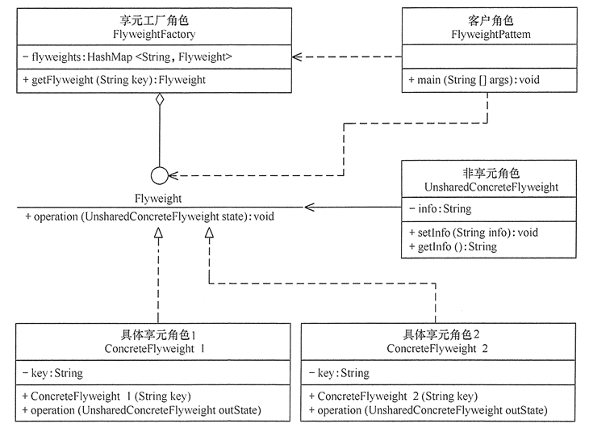

# 享元模式

享元（Flyweight）模式，是一种结构型设计模式，运用共享技术来有效地支持大量细粒度对象的复用。减少需要创建的对象数量、避免大量相似类的开销，从而提高系统资源的利用率。

它主要目标是提升性能，相同对象只要保存一份，降低内存的使用，保持对象的内部信息统一并共享。

享元模式也算是工厂方法模式的一种改进，相当于为其增加了缓存功能。

**连接池**就是享元模式的一个典型应用，连接可快速的被获取，也能控制其数量，保证系统的稳定。

## 享元模式的实现

享元模式结构比较简单，重点是享元对象及管理容器，主要角色有：

- 抽象享元（Flyweight）角色：定义公共接口。
- 具体享元（Concrete Flyweight）角色：实现抽象享元角色中所规定的接口。
- 非享元（Unsharable Flyweight)角色：是不可以共享的外部状态，它以参数的形式注入具体享元的相关方法中。
- 享元工厂（Flyweight Factory）角色：负责创建和管理享元角色。
- 客户（Client）角色：通过享元工厂获取享元角色。

类图如下：



其中最重要的是将不变的部分抽取为享元角色，其他的变化部分放非享元角色。这就需要区分内在状态与外在状态。

- 内在状态，是对象的常量数据，要将其放置在对象内部，其他对象只读。
- 外在状态，能被外部改变的对象的其他状态。这个数据就需要抽取为非享元对象，并被享元对象所引用。

代码如下：

```java
//非享元角色
@Data
class UnsharedConcreteFlyweight {
    // 外部状态
    private String info;
    UnsharedConcreteFlyweight(String info) {
        this.info = info;
    }
    // info get set
}
//抽象享元角色
interface Flyweight {
    public void operation(UnsharedConcreteFlyweight state);
}
//具体享元角色
class ConcreteFlyweight implements Flyweight {
    // 内部状态
    private String innerState;
    // 身份，方便工厂管理
    private String key;
    ConcreteFlyweight(String key) {
        this.key = key;
    }
    public void operation(UnsharedConcreteFlyweight outState) {
        // 业务处理
    }
}
//享元工厂角色
class FlyweightFactory {
    private HashMap<String, Flyweight> flyweights = new HashMap<String, Flyweight>();
    public Flyweight getFlyweight(String key) {
        Flyweight flyweight = flyweights.get(key);
        if (flyweight == null) {
            flyweight = new ConcreteFlyweight(key);
            flyweights.put(key, flyweight);
        }
        return flyweight;
    }
}
// 客户端使用
FlyweightFactory factory = new FlyweightFactory();
Flyweight xxx = factory.getFlyweight("xxx");
xxx.operation(new UnsharedConcreteFlyweight("outstate"));
```


## 享元模式的变化

享元模式中，如果不存在变化的部分，则非享元角色可以不需要。

同时如果外在状态维度单一，也可以加入一个上下文角色来维持外在状态。上下文角色也可以在为了减少客户端复杂度而存在。

