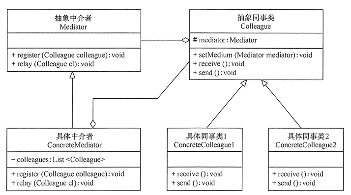

# 中介者模式

中介者（Mediator）模式，又叫调停模式，是一种对象行为型模式，用一个中介对象来封装一系列对象之间的交互。

中介者模式的主要职责是使原有对象之间的耦合松散，迫使大家都被中介者对象进行协调。总体上有可能承担了两方面的职责：

- 中转，解开各组件相互依赖，只依赖中介者实现间接调用。
- 协调，封装维护组件之间关系和逻辑，并由中介者实现相互调用的那部分逻辑。

在JDK中，java.util.Timer就是一个典型的中介者，负责协调各种定时任务的执行。另外一种典型应用，MVC模式中，Controller 是也算中介者，根据 View 层的请求来操作 Model 层。

## 中介者模式的实现

如果识别到大量耦合的对象之间相互有交互，那么实现中介者模式核心是从中抽象出中介者，为其封装那部分对象相互交互逻辑。

主要的角色就是中介者：

- 抽象中介者（Mediator）角色：它是中介者的接口，提供了同事对象注册与转发同事对象信息的抽象方法。
- 具体中介者（Concrete Mediator）角色：实现抽象中介者接口，它拥有并管理所有同事角色，协调各个同事角色之间的交互关系。
- 抽象同事类（Colleague）角色：定义同事组件的接口，保存中介者对象。
- 具体同事类（Concrete Colleague）角色：实现具体业务，并调用中介者实现与其他同事的交互。

类图如下：



注：同事体系并非一定要有相同的接口。

代码如下：

```java
//抽象中介者
abstract class Mediator {
    //管理同事组件
    public abstract void register(Colleague colleague);
    //转发
    public abstract void relay(Colleague cl); 
}
//具体中介者
class ConcreteMediator extends Mediator {
    //维护同类集合，可容器，也可作属性
    private List<Colleague> colleagues = new ArrayList<Colleague>();
    public void register(Colleague colleague) {
        if (!colleagues.contains(colleague)) {
            colleagues.add(colleague);
            colleague.setMedium(this);
        }
    }
    //处理同事交互逻辑
    public void relay(Colleague cl) {
        for (Colleague ob : colleagues) {
            if (!ob.equals(cl)) {
                ((Colleague) ob).receive();
            }
        }
    }
}
//抽象同事类
@Data
abstract class Colleague {
    protected Mediator mediator;
    //交互逻辑
    public abstract void receive();
    public abstract void send();
    //mediator get set
}
//具体同事类1、2、3...
class ConcreteColleague1 extends Colleague {
    public void receive() {
        //响应其他组件请求
    }
    public void send() {
        //请求别人，请中介者转发
        mediator.relay(this); 
    }
}
//客户端调用
Mediator md = new ConcreteMediator();
Colleague c1 = new ConcreteColleague1()
md.register(c1);
md.register(c2);
c1.send();
```

## 中介模式的应用

中介模式的主要任务是解开对象之间错综复杂的联系，在这个目标下，中介者本身将会有多种变化。

- 处理相似功能的同事对象，他们存在相同的接口，那可以使用容器管理，然后将事件依次通知容器中的同事对象。这类似观察者模式，只是中介者更多的职责是与同事对象进行双向交互。
- 处理功能上并非一致的同事对象时，可以将这些同事对象作为中介者的属性，可以实现较为复杂的业务逻辑，这种情况可以处理更复杂的协调调度逻辑。但是处理的同事对象不能太多，太多则让中介者太重。

中介者将系统中组件的沟通行为中心化，但是要避免中介者过于庞大，沉重。

