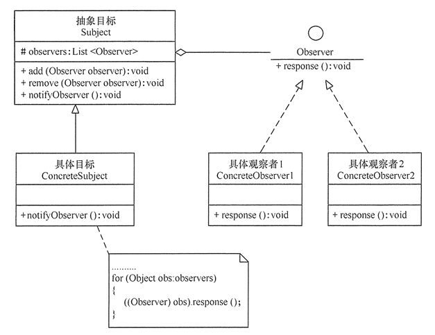

# 观察者模式

观察者（Observer）模式，是对象行为型模式，当一个对象的状态发生改变时，所有依赖于它的对象都得到通知并被自动更新。有时又称作发布-订阅模式、模型-视图模式。

观察者模式主要场景是处理一对多的影响关系，把紧密联系中的观察者识别抽象出来，并规划好他们的行为。

这种订阅关系的设计，在软件系统中非常常见，如Spring框架中ApplicationListener，启动容器时可以加入事件通知。

## 观察者模式实现

观察者模式主要是解开对象状态变化与对其他对象的影响，结构和实现都比较简单，就两个体系，主题与观察者。主要角色如下：

- 抽象主题（Subject）角色：也叫抽象目标类，维护保存观察者对象清单，提供通知所有观察者的抽象方法。
- 具体主题（Concrete Subject）角色：也叫具体目标类，它实现抽象目标中的通知方法，当内部状态改变时，通知所有观察者。
- 抽象观察者（Observer）角色：它是一个抽象类或接口，提供响应通知的接口。
- 具体观察者（Concrete Observer）角色：实现抽象观察者中定义的抽象方法，响应通知，做具体的业务操作。
- 客户类（Client）角色：分别创建发布者和订阅者对象， 然后为订阅者注册发布者更新。

类图如下：



代码如下：

```java
//抽象主题
abstract class Subject {
    protected List<Observer> observers = new ArrayList<Observer>();
    //通知观察者方法
    public abstract void notifyObserver(); 
    //add remove observers
}
//具体主题
class ConcreteSubject extends Subject {
    public void notifyObserver() {
        for (Object obs : observers) {
            ((Observer) obs).response();
        }
    }
}
//抽象观察者
interface Observer {
    //响应
    void response(); 
}
//具体观察者1、2...
class ConcreteObserver1 implements Observer {
    public void response() {
        //业务处理
    }
}
//客户端使用
Subject subject = new ConcreteSubject();
//加入多个观察者
subject.add(new ConcreteObserver1());
subject.notifyObserver();
```

## 观察者模式的应用

在 Java 中已经定义一标准的观察者模式实现，通过 java.util.Observable 类和 java.util.Observer 接口定义了观察者模式，只要实现它们的子类就可以编写观察者模式实例（Flow API 是 Java 9 引入的响应式编程的接口，替代了Observable）。

当然，还好的办法还是使用Spring的ApplicationEvent体系。

