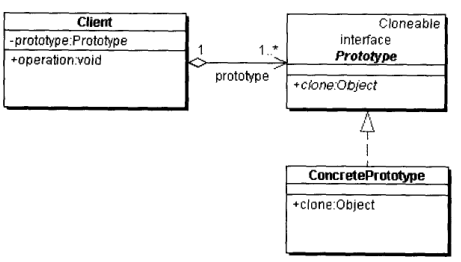
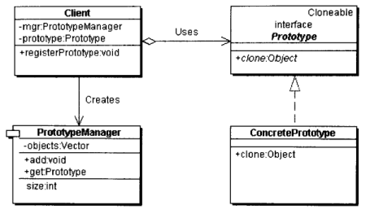

# 原型模式

原型模式是一种创建型模式，也是直接利用对象的对象模式。

通过拷贝现有对象生成完全一样的新对象。调用者不需要知道任何创建细节。主要用在当直接创建对象花费的代价比较大的场景，如繁琐的数据准备、消耗过多系统资源、生成逻辑复杂等等。

## 原型模式的实现

原型模式简单的实现在Java中就是Object的 clone() 方法，需要和Cloneable结合使用。

模式的结构中角色比较简单，只有三个：

- 抽象原型类：规定了clone()接口。
- 具体原型类：实现抽象原型类的 clone() 方法，标记它是可被复制的对象。
- 访问类：使用具体原型类中的 clone() 方法来复制新的对象。

类图如下：

Java 自带的原型模式基于内存二进制流的复制，clone()的性能比new要好很多。但是默认情况下是浅克隆。

同时需要实现类实现clone()方法，也需要实现Cloneable接口，违背开闭原则。深克隆也比较麻烦，需要每一层对象都克隆。

- 浅克隆：创建一个新对象，新对象的属性和原来对象完全相同，对于非基本类型属性，与原有属性的内存地址相同。
- 深克隆：创建一个新对象，属性中引用的其他对象也会被克隆，是全新对象。

还有一些工具类来实现原型模式，而且是非侵入式的：

- BeanUtils.copy()，用反射进行浅克隆。
- JSON.parseObject()，通过Json格式完成序列化与反序列化可以完成深克隆。

## 扩展原型模式

一般情况下，对象数目有限且固定，交给客户端自己管理，不需要统一管理，简单的原型模式就够用了。

如果对象的数目数量较大不固定，可以扩展原型模式，加入原型管理器角色，相当于一个缓存容器。由原型管理器创建与销毁原型的对象。

类图如下：

新加角色：

- 原型管理类：保存多个复制的原型，给客户端提供一个get方法获得复制的原型对象。

## 原型模式的变化

在Java中，简单的原型模式在常见的应用场景中已经固化。直接使用Object的 clone() 与 Cloneable接口的组合，只需要注意业务上需要的是浅克隆还是深克隆。

使用到对象克隆时多数可以直接使用BeanUtils工具类。

经常与其他创建型模式组合使用，如与工厂模式结合时，原型模式来生成其中的对象。

