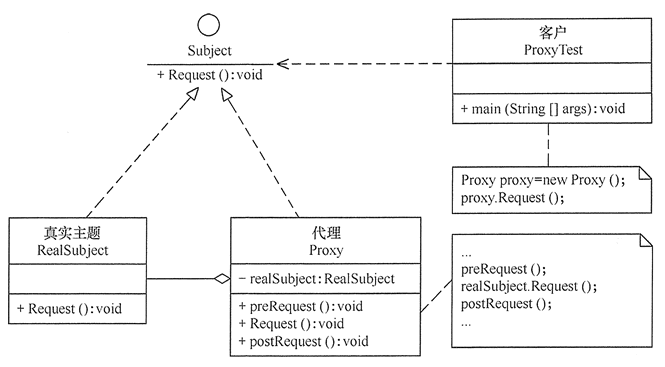

# 代理模式

代理模式（Proxy）是一种结构型设计模式，作用在对象上，为其他对象提供一种代理以控制对这个对象的访问，应对那种不适合或不能直接引用目标对象的场景。

代理可以适用的场景很多，如延迟初始化、 记录日志、 访问控制和缓存等。可以让主要业务代码的职责更清晰，将非主要功能交给代理者去实现，更易于解藕。

它和适配器模式很类似，都可以在目标对象调用前后加入增强处理。但是通常情况下，代理会对其服务对象的整个生命周期进行管理。

## 代理模式的实现

代理模式的结构比较简单，主要是通过一个代理来包含真实主题，从而实现对真实主题的访问。

所涉及到的角色有：

- 抽象主题（Subject）角色，声明真实主题和代理对象实现的业务方法，可以是接口或抽象类。
- 具体主题（Real Subject）角色，实现了具体业务，被代理对象。
- 代理（Proxy）角色，实现抽象主题的接口，内部调用具体主题来实现。可以访问、控制或扩展真实主题的功能。
- 客户端（Client）类：使用代理。

类图如下：

## 代理模式的扩展

- 动态代理

在Java中，运用反射机制实现**动态代理**的方案更具有灵活性。目前普遍使用的是 JDK 自带的代理和 GGLib 提供的类库，动态的生成代理对象，为代理对象动态地增加方法、增加行为。

- 远程代理

Java内置的RMI机制就是一个完整的远程代理模式。本地的调用者持有的接口实际上是一个代理，这个代理负责把对接口的方法访问转换成远程调用，然后返回结果。

- 虚拟代理

调用者先持有一个代理对象，但是并不创建真实对象，等到真正使用时，才创建。JDBC的连接池返回的Connection对象就是此模式。

- 增强代理

提供访问控制、缓存、延迟加载、日志记录等增强功能的代理。如SpringAOP最主要的目标就是增强。

