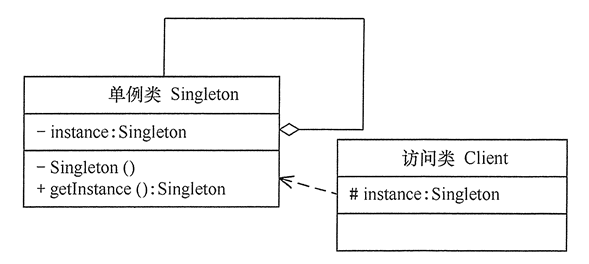

# 单例模式

单例是指一个类只有一个实例，并为这个实例提供一个全局访问点，且该类能自行创建这个实例的一种模式。

主要的作用是：

- 减少频繁创建实例，降低系统的内存压力与耗时。
- 只允许创建一个对象来控制资源的共享访问。

单例模式主要还是在解决性能或控制访问问题，因此很难遵守开闭原则、单一职责原则等。

## 实现单例模式

类图如下：



单例模式是设计模式中最简单的模式之一。最主要的角色是单例类，完成实例创建，访问接口等功能。

创建实例时也有多种方案可以选择，常见的有，根据创建实例时间分为饿汉式与懒汉式。

- 提前创建实例（饿汉式），不管有没有人用，提前先创建了再说。

```java
public class MQClientManager {
    private static MQClientManager instance = new MQClientManager();
    private MQClientManager() {}
    public static MQClientManager getInstance() {
        return instance;
    }
}
```

- 首次调用时创建（懒汉式），第一次调用才初始化，避免内存浪费。

```java
public class ConfigurationFactory{

    private static volatile Configuration CONFIG_INSTANCE = null;
    public static Configuration getInstance() {
        if (CONFIG_INSTANCE == null) {
            synchronized (Configuration.class) {
                if (CONFIG_INSTANCE == null) {
                    CONFIG_INSTANCE = buildConfiguration();
                }
            }
        }
        return CONFIG_INSTANCE;
    }
}
```

这种方式为了线程安全和性能，一般都会使用**双重检查锁**的方式来创建。就是第一次不加锁检查，如果需要创建，再加锁检查，再创建对象。

- 也有用**静态内部类**代替双重检查锁来实现安全的单例创建。

```java
public class DefaultRMHandler extends AbstractRMHandler{

    protected DefaultRMHandler() {
        initRMHandlers();
    }
    private static class SingletonHolder {
        private static AbstractRMHandler INSTANCE = new DefaultRMHandler();
    }
    public static AbstractRMHandler get() {
        return DefaultRMHandler.SingletonHolder.INSTANCE;
    }
}
```

- 有些场景还有可以通过枚举的方式来创建单例对象

```java
enum Singleton{
    INSTANCE;
}
// 获取单例的方式：
Singleton singleton = Singleton.INSTANCE;
```

