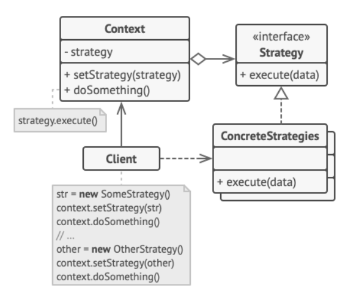

# 策略模式

策略（Strategy）模式，是一种对象行为型模式，定义了一系列算法，并将每个算法封装起来，使它们可以相互替换。将算法的使用与实现分离开，不同的算法由不同的对象承接。

策略模式的最主要的事是抽象这一组算法。

策略模式在 Java 代码中很常见。它经常在各种框架中使用，能在不修改类的情况下让用户选择不同的实现。如Comparator定义算法接口，各子类实现自己的比较算法，Collections#sort()就是那个Context角色，内部使用了Comparator的compare()接口完成比较，再排序。

## 策略模式的实现

策略模式将一组算法封装到一系列的策略类里面，上层可以灵活的组织这些算法。主要的角色有：

- 抽象策略（Strategy）类：定义了一个公共接口。
- 具体策略（Concrete Strategy）类：实现了抽象策略定义的接口，提供具体的算法实现。
- 环境（Context）类：持有一个策略类的引用，最终给客户端调用。

- 客户（Client）角色：访问环境类。

类图如下：



客户端要自己选择所需策略，然后传递给环境（上下文），环境只需要暴露一个访问入口，并无差异的调用策略接口方法。 

代码如下：

```java
//抽象策略类
interface Strategy {
    public void execute();    //策略方法
}
//具体策略类A、B、C
class ConcreteStrategyA implements Strategy {
    public void execute() {
        // 具体算法
    }
}
//环境类
@Data
class Context {
    private Strategy strategy;
    public void doSomething() {
        strategy.execute();
    }
    //strategy get set
}
// 客户端如下执行，可选A、B、C不同实现
Context c = new Context();
c.setStrategy(new ConcreteStrategyA());
c.doSomething();
```

## 策略模式的应用

只要是通过允许嵌套对象完成实际工作，并能按需替换实现，就是策略模式的典型应用场景。

如果你的业务代码中有大量的if...else，那么就可以考虑是否可以使用策略模式改造一下。

也可以仅为了将类的业务逻辑与其算法实现细节隔离。这时环境角色就不重要了。

Java 8 开始的 lambda 方法， 它可作为一种替代策略模式的简单方式。