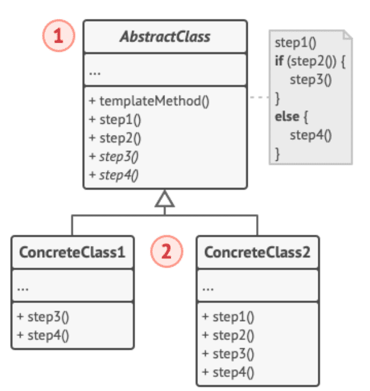

## 模板方法模式

模板方法（Template Method）模式，是在运行时进行流程控制的行为型模式。此模式基于类继承，由父类定义一个操作中的算法框架，特定的步骤交给子类去实现。

模板方法模式主要思想是封装不变部分，扩展可变部分。

无论是在框架中，还是在咱们自己的业务系统中，模板方法模式因为其简单有效而广泛用就。遇到复用一段固定的业务逻辑，或者抽象一个固定的操作步骤，都可以用抽象类把。

## 模板方法的实现

模板方法模式主要是抽象类与具体子类之间的协作。角色比较简单，就抽象类与子类。

- 抽象类/抽象模板（Abstract Class），定义一个算法的轮廓和骨架。它由一个模板方法和若干个基本方法构成。
- 具体子类/具体实现（Concrete Class），实现抽象类中所定义的抽象方法。

类图如下：

## 使用模板方法模式

当小部分特殊逻辑需要变化时，使用模板模式才能体现复用的价值，否则，组合一个专用类更能分离变化。

抽象类增加抽象方法时，子类需要都修改一遍，不符合开闭原则。

另外常见的作法是，在算法的关键步骤之间添加钩子，让子类实现。

子类也可以选择重写父类的模板步骤，但是不建议修改主要流程。也是违反里氏替换原则的。

虽然模板方式模式非常简单，应用场景较多，但是能使用组合代替继承的地上，有必要使用组合。

