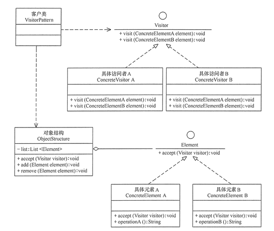

# 访问者模式

访问者（Visitor）模式，是一种行为设计模式， 它能将某对象结构中的各元素对象的业务操作与其所作用的对象隔离开来，可以在不改变各元素的情况下，增加新操作。

访问者模式有两个重要前提：

- 针对的是某种数据结构中的元素集合。
- 增加新操作，这个操作并非原来元素的主要业务。

可以是面对一个复杂对象结构，不想去直接修改元素本身。也可以是把元素中非主要的行为抽取到访问者中去。

## 访问者模式实现

访问者模式主要是附加一组访问者来承接新的业务操作。主要角色有：

- 抽象访问者（Visitor）角色：定义每个具体元素的访问接口visit(ElementA)，参数为具体元素。
- 具体访问者（Concrete Visitor）角色：实现抽象访问者角色中声明的各个访问操作，并实现具体的业务操作。
- 抽象元素（Element）角色：声明带accept(Visitor) 的接口，参数是一个访问者，表明接受新的业务操作。
- 具体元素（Concrete Element）角色：实现抽象元素角色提供的 accept() 操作，其方法体通常都是 visitor.visit(this) ，另外具体元素中可能还包含本身业务逻辑的相关操作。
- 对象结构（Object Structure）角色：是一个包含元素角色的容器。

类图如下：



代码如下：

```java
//抽象访问者
interface Visitor {
    void visit(ConcreteElementA element);
    void visit(ConcreteElementB element);
}
//具体访问者A、B...
class ConcreteVisitorA implements Visitor {
    public void visit(ConcreteElementA element) {
		//元素A上，新加的业务操作
    }
    public void visit(ConcreteElementB element) {
        //元素B上，新加的业务操作
    }
}
//抽象元素类
interface Element {
    void accept(Visitor visitor);
}
//具体元素A、B...
class ConcreteElementA implements Element {
    //接收新功能
    public void accept(Visitor visitor) {
        visitor.visit(this);
    }
    //正常的业务操作...
}
//对象结构角色
class ObjectStructure {
    private List<Element> list = new ArrayList<Element>();
    //为新的访问者开放新功能
    public void accept(Visitor visitor) {
        Iterator<Element> i = list.iterator();
        while (i.hasNext()) {
            ((Element) i.next()).accept(visitor);
        }
    }
   	// list管理如：add、remove
}
//客户端使用
ObjectStructure os = new ObjectStructure();
os.add(new ConcreteElementA());
Visitor visitor = new ConcreteVisitorA();
//执行新功能
os.accept(visitor);
```

## 访问者模式的应用

访问者模式加新功能不用修改原元素，也可以把非主要的功能从原元素中隔离出来。但是新增元素时改动比较大了，违背开闭原则。而且元素还必须关联访问者，结构关系复杂。访问者中也必须知道具体的元素，和依赖倒置原则相违背。

访问者模式的使用条件较为苛刻，本身结构也较为复杂，因此在实际应用中使用频率不是特别高。

