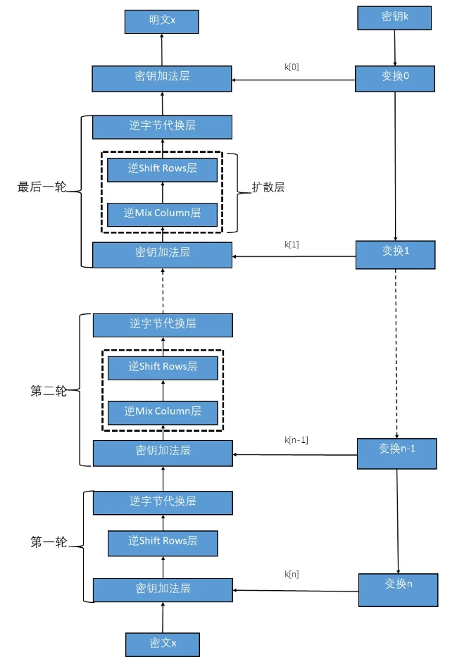

# 常用加密方式-AES对称加密算法

AES（Advanced Encryption Standard）高级加密标准，又称Rijndael加密法，是一种对称密钥加密算法，是NIST在2002年发布的一种分组加密标准，用来取代DES。目前是对称加密算法中最流行的算法之一，。

AES的分组长度固定为128位，支持不同长度的密钥，包括128位、192位和256位，不同长度的密钥加解密的轮数会适当增加。在通信时双方用同一个密钥，并不对外公开。

### AES加密的原理

- 密钥，需要通信的双方提前约定同一个密钥。密钥长度越长，计算复杂度越大，破解难度越大。
- 分组的填充，对明文进行分组加密，最后拼接起来。分组大小为128位（16字节），不够128位时，需要对明文块进行填充，填充模式有PKCS5Padding（固定数值）、ISO10126Padding（随机数）等等。
- 分组的模式（Modes of Operation），大于128位的明文，为了增强安全性，可以用多种模式进行分组和增强，常见模式有ECB、CBC、CFB、OFB、CTR。
- 使用SPN结构（Substitution-Permutation Network，代换-置换网络），并通过交错的若干“轮”代换操作和置换操作产生密文块。
- 不同的密钥不同的加密计算轮数，128位密钥使用10轮，192位密钥使用12轮，256位密钥使用14轮。

## AES加密的步骤

以AES-128为例来详细分析加密的步骤，也就是密钥的长度为128位，加密轮数为10轮。

大的步骤如下：

- 明文填充，按指定的填充模式，将明文填充至128位的倍数。
- 密钥扩展，将128位的密钥扩展成11个128位的子密钥来用于接下来的轮密钥加操作。
- 明文分组，按指定的分组的模式进行分组，每组128位。
- 多轮加密，涉及4种操作：字节替代（SubBytes）、行移位（ShiftRows）、列混淆（MixColumns）和轮密钥加（AddRoundKey），其中首轮和最终轮操作与其他轮不同。
- 密文合并，将多组密文合并为最终密文。

上述的密钥扩展（11个子密钥）的步骤如下：

- 将初始密钥以4*4字节矩阵（上到下、从左到右进行排列）表示，以列取4个32位的字节，分别记为W[0],W[1],W[2],W[3]，做1个初始子密码。
- 通过密钥编排函数该密钥矩阵被扩展成一个44个字组成的序列W[0],W[1], … ,W[43]。

- 后面40个字分为10组，每组4个字节，再形成10个子密钥。

密钥编排函数主要操作是，移位，S盒置换，和RC常量（一维数组）异或。

上述的多轮加密的步骤如下：

- 初始轮计算，16位明文与16位密钥进行一次轮密钥加，即与初始子密钥进行异或。

- 再进行N-1轮4个不同的变换计算，字节替代、行移位、列混淆和轮密钥加。
- 最终轮计算，进行3个不同的变换计算，字节替代、行移位和轮密钥加。得到16位的密文。

加密算法的核心4种操作如下：

- 字节替代（SubBytes），用一个S盒完成明文的字节到字节的代替。
- 行移位（ShiftRows），将明文作为一个 4 * 4 的字节矩阵，2到4行分别向左旋转移动1、2、3位。
- 列混淆（MixColumns），对每列数据进行线性变换。它是主要的扩散元素，它混淆了输入矩阵的每一列，使输入的每个字节都会影响到 4 个输出字节。
- 轮密钥加（AddRoundKey），明文和扩展子密钥按位异或。首轮使用了初始子密钥，其他轮依次使用其他N个扩展子密钥。

### 解密

解密的基本的数学原理是：一个数进行两次异或运算就能恢复。

所以解密过程就是加密的逆过程，其中轮计算是逆向进行，核心4种操作中也是相反方向进行：行移位向右旋转移动、列混淆用逆矩阵进行恢复。

