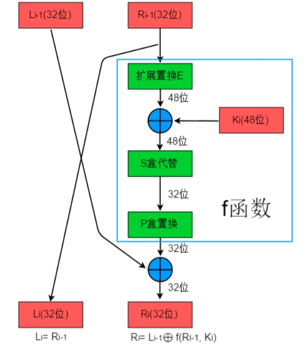

# 常用加密方式-DES对称加密算法

DES（Data Encryption Standard），数据加密标准，是一种对称加密算法。在1970年代由IBM开发，后被NIST确定为联邦资料处理标准（FIPS）。随着技术的进步，DES 已经不安全，能够被破解，到了2000年代，逐渐被3DES替代，现在又由更安全的AES替代。

> 对称加密：
>
> 通信双方用同一个密钥，加密和解密都是由此密钥完成的。双方通信前共同拟定一个密钥，不对第三方公开。

### DES加密的原理

DES加密过程和解密过程使用相同的密钥，由通信双方通信前共同拟定。密钥共长64位，其中56位的密钥，和8奇偶校验位。它是一种块加密，对以64位为单位的块数据进行加密，产生64位的密文，最后将所有密文块合并输出。

> 块加密：
>
> 把明文划分为很多个等长的块(block)，对每个块进行加密，最后以某种手段拼在一起。
>
> 填充模式：
>
> 不够指定长度的需要进行填充，比较多见的填充模式有PKCS1、PKCS5、ISO10126等等。

DES 算法是在 Feistel network （费斯妥网络）的基础上执行的。生成16个子密钥，将明文以64位进行分组，每组明文数据再被分为左右两部分，各32位，加密过程都包含16轮循环。

> Feistel网络：
>
> 一个广泛用于对称加密算法设计的理论框架，主要逻辑是数据对称分组、多组子密钥、轮函数、加解密对称等。将输入分成对称的两个部分，在每一轮用轮函数对其中一半进行加密，并将处理结果与另一半进行XOR异或操作，作为下一轮轮函数的输入。
>
> 解密的流程和加密的流程是类似的，只不过把加密的操作反过来，这也使得软件或者硬件更容易设计。

DES设计中使用了分组密码设计的两个原则：混淆（confusion）和扩散(diffusion)。其目的是抗击对密码系统的统计分析。

> 混淆，是密文与密钥的关系复杂化，比如替换。
>
> 扩散，就是将每一位明文的影响尽可能迅速地作用到较多的输出密文位中，比如换位。

DES属于分组密码，对大于64位的明文进行分组加密，他支持多种分组模式。

> 分组模式（Block Cipher Modes of Operation）：
>
> 因为分组密码算法只能加密固定长度的明文，如果需要加密更长的明文，就需要对明文分组迭代加密，这个迭代方式就是分组模式。常见模式有ECB、CBC、CFB、OFB、CTR。

### DES的加密过程

加密的大致流程如下：

- 对明文以64位进行分组。
- 对位数不够的明文组进行填充。
- 用原密码进行16轮迭代计算，生成16个子密钥，每个48位。
- 用得到的子密钥对64位数据块进行16轮计算，得到密文。
- 将每块密文进行合并输出。

解密过程与加密过程是同样的步骤，只是子密钥是按照逆向的顺序对密文进行处理。

其中核心算法是计算每个64位数据块的密文，流程如下：

- 16 轮迭代前，初始置换，对明文进行一次初始IP置换(initial permutation，用到IP表)，然后分成两个部分。
- 开始迭代过程，将两部分输入（当前迭代只使用右边部分，计算结果与左边部分异或后再互换，当下个迭代的输入）。
- 扩展置换，扩展到48位（用到扩展置换表），与48位子密钥异或。
- S盒替代，将结果通过S盒替代（8个不同的替代盒），将位数变换回32位。
- P盒置换，将结果进行置换（置换表P）。
- 将32位结果与左边部分（32位）进行异或得到本迭代加密结果（要与左边部分互换再到下一迭代）。
- 以上步骤进行16 轮迭代后，对两部分合并，然后进行逆置换（用到逆置换表），得到最终密文。

