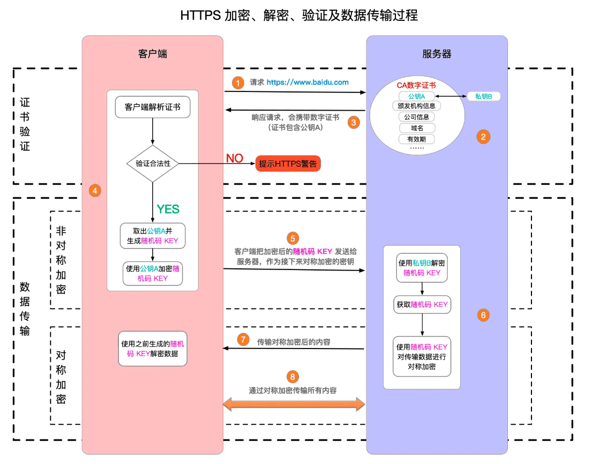

# HTTPS加密的超文本传输协议

HTTP 协议是以明文方式发送信息的，在web1.0阶段以信息发布为主，是合理选择。但是到了web2.0阶段，信息的流向变成双向了，尤其电子商务的出现，对安全有了较高的需求，就出现了HTTPS来加密通信。现在大部分的网站都已经开始使用 HTTPS 协议，包括新的Chrome浏览器都是默认不支持HTTP了。

HTTPS 是以安全为目标的 HTTP 通道，是 HTTP 的安全版。HTTPS 的安全基础是 SSL（Secure Sockets Layer）安全套接层，因此 HTTPS 也常指 HTTP over SSL。

### 通信过程

HTTPS是建立在HTTP基础上的，只是使用了密文传输http的内容。在TCP建立连接后，主要有两步骤，证书验证和数据加密传输，数据阶段传输先后使用了非对称加密交换密钥，以及使用密钥对称加密数据。

1，证书验证过程：

- 客户端向服务器发起HTTPS请求。
- 服务器将数字证书发给客户端。
- 客户端验证数字证书，包括证书链、有效期等等。

> 证书如何被验证的？
>
> 1，服务器在向CA机构申请证书时，生成公钥给CA，私钥自己保密。
>
> 2，CA颁发数字证书时，用自己的私钥签名，公钥公开给所有人。
>
> 3，客户端就可以用CA的公钥去验证服务器给他的数字证书的签名了。

2，数据传输过程：

- 先使用数字证书交换随机密钥（非对称加密过程）。
- 使用密钥加密数据（对称加密），进行通信。

> 密钥交换的详细过程：
>
> 1，在证书验证的第一次握手是，客户端就会发送一个随机数c1给服务器。
>
> 2，服务器回复的时候，附带一个随机数s1。（随后还会发送CA证书，如果DH算法还要再发送DH公钥）
>
> 3，客户端验证证书后，再生成新的随机数c2，用CA证书中服务器公钥加密这个数，发给服务器。
>
> 4，服务器解密得到c2。c1、s1、c2就组成了会话密钥。
>
> 5，随后双方使用会话密钥相互做个验证就完成了密钥交换。
>
> 注：以上主要是使用RSA密钥交换算法。选择不同的密钥交换算法（主流是RSA以及DH算法），过程有些许差异。

DH密钥交换算法使用了随机公钥私钥进行密钥交换，安全系数比RSA密钥交换算法要高。并且TLS1.3也对密钥交换过程做了简化。

### TLS & SSL

HTTPS 在 HTTP 与 TCP 层之间加入了SSL/TLS 协议，那么什么是SSL，和TLS什么关系呢？

TLS（Transport Layer Security）和SSL（Secure Sockets Layer）是用于在网络上提供安全通信的加密协议。TLS 是 SSL 的继任者，主要改进了安全性和性能。

SSL最初由Netscape开发，1996年发布SSL3.0，但是因为一些安全漏洞，IETF在 SSL 3.0 的基础上开发了 TLS 1.0，并在1999年作为标准发布。之后发布了多次更新，如 TLS 1.1、TLS 1.2 和 TLS 1.3。

但是，习惯性还是都称之为SSL协议。目前使用最多的是 TLS 1.2 或 TLS 1.3。

### CA证书

HTTPS中使用的CA证书的主要作用是提供信任链，验证通信对方的身份，从而确保数据传输的安全性。

首先，由CA证书来验证服务器的身份。CA证书由权威机构颁发，其中包含了服务器的公钥及其签名、签发机构的公钥。

其次，参与到密钥交换过程中的签名，客户端使用服务器的公钥进行签名，服务器使用私钥验证，确保过程信息不会被伪造。

浏览器或操作系统会持有根证书，以及缓存最终用户证书。

### 对称加密 & 非对称加密

HTTPS使用了对称加密和非对称加密结合的混合加密方案。

- 对称加密，又被成为私钥加密，即信息的发送方和接收方使用同一个秘钥去加密和解密信息。如：AES。主要优点是加密速度快。但是服务器需要管理大量的私钥，并且一旦泄露，之后的通信都不安全。

- 非对称加密算法需要使用两个秘钥：公钥、私钥，是成对出现的，公钥加密，对应私钥才能解密。常见的非对称加密算法如：RSA。主要优点是只有公钥对外公布，相对安全。但是存在中间人攻击风险，加密过程计算量非常大，速度慢。

对称加密和非对称加密结合的混合加密方案就能很好的解决以上问题。

- 通信过程还是使用对称加密，但是对称加密需要的密钥每次建立连接的时候才生成，密钥以非对称加密的方式进行交换。
- 使用CA数字证书，由权威机构专门提供网络身份认证服务。用CA证书进行数字签名，确保信息来源的信任。