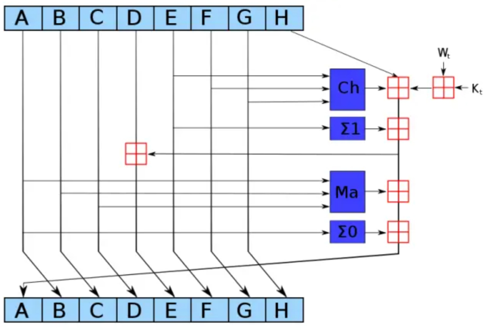

# 常用加密方式-SHA安全哈希算法

SHA（Secure Hash Algorithm）安全哈希算法，是一系列密码哈希函数的集合。和MD5算法类似，他也是一种信息摘要生成算法，比MD5更安全，得到了FIPS的认证。此算法用单向函数产生固定长度的哈希值，对信息并非是加密，常用在识别真实性、防篡改等场景。

SHA最早由美国的 NSA 设计 NIST 发布，其发展历程经历了SHA-0、SHA-1、SHA-2、SHA-3。SHA家族的情况如下：

- SHA-0几乎没有存在。

- SHA-1在许多安全协议中广为使用，包括TLS、SSH和IPsec等，但是后面也被证明不安全。

- SHA-2在2001年就已经发布，包括SHA-224、SHA-256、SHA-384、SHA-512、SHA-512/224、SHA-512/256。后来的SSL证书的签名就强制使用了SHA-2。
- SHA-3在2015年由NIST发布，弥补之前的算法在安全性、效率上的不足。

### SHA算法的特点

其核心特点包括：

1. **固定长度输出**：不同版本的SHA算法生成的哈希值长度固定，如SHA-256生成256位哈希值。
2. **单向性**：哈希算法是单向的，即无法从哈希值反推出原始数据。
3. **抗碰撞能力**：SHA算法设计为抗碰撞，即使输入数据微小改变也会导致哈希值大幅变化。
4. **安全性**：结合使用复杂的数学运算和位运算来生成哈希值，使得产生相同哈希值的两个输入极为困难。SHA-2算法比SHA-1更安全。

> SHA-1的最终哈希值长度是160位。
>
> SHA-2的哈希值长度则算法名称后面的数字对应的长度，分别是224、256、384、512。主要算法是SHA-256、SHA-512，SHA-224和SHA-384则是SHA-256和SHA-512的“阉割版”，另外SHA-512/224和SHA-512/256这两个是SHA-512的派生截断出224位和256位的版本。
>
> SHA-3算法采用了Keccak算法作为其基础，输出哈希值长度同SHA-2一样。

输出的哈希值越长，发生碰撞的几率就越低，破解的难度就越大。耗费的性能和占用的空间也就越高。

### SHA-256原理

目前SHA-2已经成为新的标准，所以现在签发的SSL证书，必须使用SHA-2算法签名。SHA-256算法使用最为广泛，SHA-1、SHA-2同MD5算法的核心过程大同小异。

对于任意长度的输入，SHA-256都会产生一个256位的哈希值，是个长度为32个字节的数组，通常用长度为64的十六进制字符串来表示。

算法的大致流程如下：

1. **常量初始化**，算法中用到了8个哈希初值以及64个哈希常量。8个哈希初值是对自然数中前8个质数（2~19）的平方根的小数部分取前32位而来。64个哈希常量类似，用自然数中前64个质数。
2. **数据预处理**，对输入的消息进行填充，使得消息的长度512的倍数。步骤一，附加填充比特位直到长度满足mod 512=448；步骤二，附加64位输入信息的长度值，整体达到512的倍数。
3. **初始化缓存**，使用一个 256 位的缓存来存放该散列函数的中间及最终结果。它可以表示为 8 个 32 位的寄存器（A, B, C, D, E, F, G, H），开始前使用8个哈希初值进行填充。
4. **消息分块**，将填充后的消息分割成若干个512位的块。
5. **迭代散列函数处理**，对每个512位的消息块进行迭代计算，使用了六个非线性函数。首先分解为64个输入（32个原始输入，32个分别计算后值）；再进行64 个迭代运算，其中每步都会使用一个输入和一个哈希常数，与 8 个寄存器中的数值进行计算；最后迭代结果再放回 8 个寄存器。
6. **输出哈希值**，所有块计算完成后，将 8 个寄存器的值合并，输出是一个 256 位的最终哈希值。

算法中的6个不同的非线性函数主要是逻辑运算（AND、OR、XOR）和位移运算（循环左移、循环右移）等。

他与MD5的差别是，MD5把128位的信息摘要分成A，B，C，D四段。

SHA-1算法，则是把160位的信息摘要分成了A，B，C，D，E五段。

SHA-512也是输入补齐到512的倍数，分8段，但是每一段摘要长度是64位，8个哈希初值以及64个哈希常量都是64位。

### 常见应用场景

- MD5的应用场景，SHA算法基本也都可以使用。
- 区块链交易验证，区块链的区块头就是SHA-256 哈希值。比特币中，挖矿算法其实就是SHA-256算法，运算最快的得到奖励。
- SSL/TLS协议中，数字证书、握手等就使用SHA计算哈希值进行验签。
- 数字签名，对文件进行计算得到哈希值，接收方用同样的计算结果与此值对比，用于验证信息的真实性和完整性。
