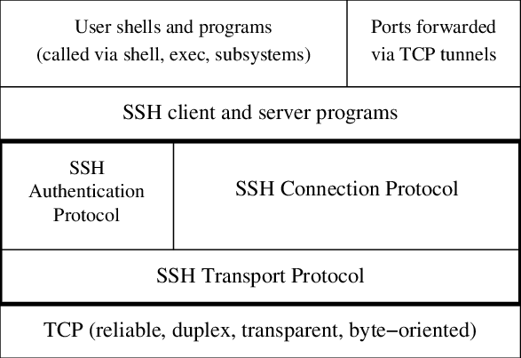
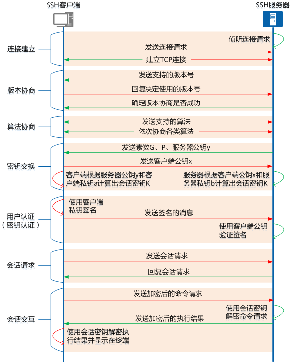

# SSH协议提供加密的网络传输

SSH（Secure Shell）安全外壳协议，是一种加密的网络传输协议标准，在不安全的网络中创建安全隧道来实现安全远程登录以及其它安全网络服务。先用非对称加密方式做身份验证与建立可信连接，再使用对称加密进行数据传输。其具体的实现有很多，广泛使用的是开源实现的OpenSSH，当然也有商业实现方案。

SSH协议有两个主要版本，分别是SSH-1和SSH-2，1.x版本从1995年开始发布，2006年2.x版本成为新的标准。OpenBSD的开发者在1999年后与OpenBSD 2.6一起发行了开源的OpenSSH，提供了大量的安全隧道功能、多种身份验证方法和复杂的配置选项。

## 基本结构

SSH协议是服务端与客户端双方在TCP协议基础上，结合对称加密与非对称加密，协商建立加密的保护数据传输的会话通道。

最主要的三个协议：

- 底层的传输层协议（Transport Layer Protocol），提供服务器认证，数据机密性，信息完整性等支持。
- 用户认证协议（User Authentication Protocol），对客户端的身份鉴别。
- 连接协议（Connection Protocol），将加密的信息隧道复用成若干个逻辑通道，提供给更高层的应用协议使用。

上层的各类应用协议独立在SSH基本体系之上，通过连接协议使用SSH的安全机制。

## 建立加密通信通道的阶段

客户端与服务端的通信过程中，建立安全的SSH通道的几个阶段如下：

- 一，连接建立：客户端向服务器发起连接请求，双方建立一个普通的TCP连接，服务器需要开启22端口。

- 二，版本协商：双方协商确定最终使用的SSH版本号（也就是1.x/2.x）。

- 三，算法协商：双方根据各自支持的算法，协商出密钥交换算法、加密算法、公钥算法、HMAC算法等。

- 四，密钥交换：双方通过密钥交换算法，动态生成共享的会话密钥和会话ID，至此就建立了加密通道。

接下来，就在此加密通道中进行后继通信。

- 五，用户认证：客户端向服务器端发起认证请求，服务器端对客户端进行认证。

- 六，会话请求：认证通过后，客户端向服务器端发送会话请求，请求服务器提供某种类型的服务，即请求与服务器建立相应的会话。

- 七，会话交互：会话建立后，SSH服务器端和客户端在该会话上进行数据信息的交互。

## 使用的几类算法

在算法协商环节中，服务器端和客户端分别发送算法协商报文给对方，报文中包含自己支持的公钥算法列表、加密算法列表、MAC算法列表等。

- 公钥算法，就是非对称加密算法，用于认证阶段的信息加解密。SSH1支持RSA，SSH2还支持DSA，默认情况下都是RSA。
- 密钥交换算法，使用了非对称加密算法，主要用于交换会话密钥（动态生成的、对称密钥），SSH1使用的是RSA算法，SSH2使用了DH（Diffie-Hellman）算法及其变种。
- 加密算法，就是对称加密算法。SSH1采用DES、3DES、Blowfish和RC4等对称加密算法，SSH2增加了AES和Twofish等。通常情况下是AES。
- MAC算法，（Message Authentication Code，消息验证码），创建报文摘要，验证消息的完整性，用在认证过程中的用户信息的传递。常见算法有HMAC、CBC-MAC等，HMAC的散列函数通常情况下使用了SHA。

## 密钥交接过程

在SSH会话过程中使用了对称加密，整个会话过程一直使用同一个密钥，为了保证传输数据时的加解密密钥的安全性，SSH利用密钥交换算法动态地生成对称密钥，能够有效防止第三方窃听加解密密钥。

在算法协商过后，就已经确定了各个环节需要的算法，也包括密钥交换算法，常见的是Diffie-Hellman算法（DH）。

DH密钥交换算法过程如下：

- 1，服务器生成素数G、P、随机数b，并计算得到服务器公钥y=(G^b)%P，将G、P、y发送给客户端。
- 2，客户端生成随机数a，计算得到客户端公钥x=(G^a)%P，将x发送给服务器。
- 3，服务器计算得到对称密钥K=(x^b)%P，同时客户端也计算得到对称密钥K=(y^a)%P，对称密钥K就交换完成。

通常素数G、P，都是实现者预定义好的。

## 用户认证过程

当对称密钥确认后，就可以安全的通信了，首先就需要进行用户身份确认过程。服务端识别客户端身份有两种方式：账号密码和SSH密钥对。

使用SSH密钥对进行认证是一种广泛使用且推荐的登录方式，使用了非对称加密算法，如RSA。前提是要先将客户端的公钥存储到服务端的`authorized_keys`文件中（Linux中存储在`~/.ssh/authorized_keys`文件中）。

详细过程如下：

- 1，客户端向服务器发起公钥认证请求，包含用户标识和公钥。
- 2，服务端在对应用户的 `~/.ssh/authorized_keys` 中搜索与之匹配的公钥。
- 3，如果找到匹配的公钥，则生成一个随机数，用公钥加密再发送给客户端。

- 4，客户端使用私钥解密，得到随机数，和通信用的对称密钥组合再取MD5值，将MD5值发送给服务端。
- 5，服务端用同样的方式计算MD5，与客户端的MD5进行比较，如果相等，则身份认证通过。

账号密码的认证比较简单，就是客户端发送用户名和密码给服务端，服务端对用户名和密码进行匹配，完成认证。
