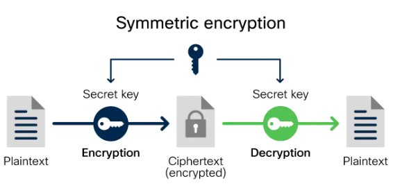
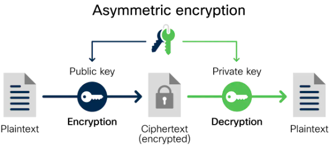

# 加密概念及用到的算法

信息技术方面的信息安全的技术核心之一就是对信息进行加密。常见的场合是信息在网络上传输时，为了防止数据泄露，会对数据进行加密，特别是敏感数据，要求的安全性更高。

加密本身并不能防止信息传输被截取，但加密能防止截取者理解其内容。任何加密信息都可能被破解，不同的加密算法，破解需要的技术和算力是不同的。用到加密的场景一般有如下情况：

- 数据的保密，防窃取或泄露。
- 数据的完整，防篡改。
- 确认身份。

## 相关概念

加密技术中基本的概念有：

- 信息，明文，密文

  信息是存储或在网络上传输的内容，加密之前是明文，经加密算法处理后是不法直接读取内容的密文。密文经解密算法处理后再还原为明文。

- 密钥，公钥，私钥

  密钥是用于加解密数据工具的一种参数，具体来说就是一串看似无规律的字符。密钥分为对称密钥和非对称密钥。

  对称加密中用到的就是对称密钥，通信双方都使用相同的密钥进行加密和解密。

  非对称加密中则使用非对称密钥，使用成对存在的公钥和私钥，公开公钥，私钥只有自己知道。公钥加密，私钥解密，反过来也行。

- 加密算法

  算法类型大体可以分为三类，对称加密、非对称加密、单向加密。

  采用对称密钥方式的是对称加密，常见算法有DES、3DES、AES，其算法公开、加密快速效率高，适合对大量数据进行加密。但是并不安全。

  采用成对的公钥和私钥进行加解密的是非对称加密，常见算法有RSA、DSA，更安全但是算法复杂效率低，一般只用在信息安全传输，数字签名等。

  只加密不解密的是单向加密，常见算法有MD5、sha1，常用于验证数据的完整性、数字摘要、数字签名等。

  另外还有一种密钥交换算法，如Diffie-Hellman。

## 加密方式

加密方式主要有对称加密、非对称加密和单向加密。

- 对称加密

  

  这是应用较早的加密方式，绝大多数需要加密的场合，最初广泛使用的是DES算法，现在取代它的是AES算法。

  它的工作模式是：数据发送方将明文先分割成固定大小的块，再逐个使用密钥加密为密文，发送给接收方，接收方使用同样的密钥将密文解密和组合，还原为明文。

  一般情况下都会为每对通信用户之间协商密钥，至少有一方需要对这些密钥进行管理；而很少采用通信各方都用同样的密钥。

  因为此类算法的算法简单，计算量比较小，适合加密大量数据，比如在https的正式传输数据的环节就使用了对称加密。

- 非对称加密

  

  非对称加密也称公钥加密，有公钥和私钥两份密钥，公开公钥，客户端自行保管私钥。相对于对称加密，此加密方式要安全很多，适合于敏感信息传输。RSA是此方式的最常见算法。

  它的工作模式是：如果甲向乙发送数据，那么由乙生成一个包含公钥和私钥的密钥对，自己保管私钥，公开公钥；甲获取到公钥；甲使用公钥对数据进行加密为密文；甲将密文发送给乙；乙使用自己的私钥对密文进行解密，获得明文的数据。

  使用公钥加密，必须使用私钥解密，反过来也一样，并且从公钥推导不出私钥。

- 单向加密

  单向加密又称为不可逆加密，即生成密文无法反解的一种加密方式，通常作为加密的基础，而不单纯以此方式加密。它最大的用途：消息认证摘要、内容或文档的数字指纹、口令存储。

  常用的MD5和SHA1只是个摘要算法，SHA1只是长度更长，安全性更高，一般都是用来做检验数据的。

