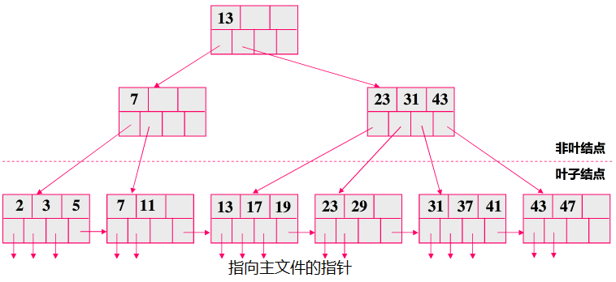

# 关系数据库中的索引

数据库一方面需要将大量的数据存储到文件中，另一方面则需要快速的从中提取出数据。许多查询只涉及文件中的少量记录，理想情况下，需要系统能够直接定位记录，于是设计了与文件相关的数据结构-索引。

查询执行开销主要包括磁盘存取块数（I/O代价）、处理机时间（CPU代价）以及查询的内存开销。索引主要优化I/O开销。

- 索引，目的就是提高查询效率，索引的作用相当于图书的目录，可以根据目录中的页码快速找到所需的内容。

- Search Key，是用来查找数据库记录的属性集合。索引是由一个个index entry组成的，每个entry由两部分组成：search key和pointer <K(i),P(i)>. 。pointer就是指向对应search key数据块地址的指针。

## 多种索引分类方法

根据是否按照search key的顺序存储，可以将索引分为两种基本的索引类型，顺序索引（ordered indices)和散列索引（hash indices)。

- 顺序索引，索引中的记录基于搜索码值顺序排序。
- 散列索引，索引中的记录基于搜索码值的散列函数的值平均地，随机地分布在若干个散列桶中。

另外还有几个特殊的索引：

- 位图索引，主要针对大量相同值的列而创建的索引，通过一个bit位来记录一个数据行是否存在对应键值。
- 函数索引，基于函数的索引。
- 全文索引。

在顺序索引中，根据记录的物理顺序与搜索码的顺序是否一致，又分聚集索引（clustering index）和非聚集索引（nonclustering index）。

- **聚集索引**，一般就是**主索引**，记录在文件中的物理顺序与搜索码的顺序一致，一个表中只有一个。
- **非聚集索引**，也叫**辅助索引**，搜索码的顺序与文件记录的顺序不同。一个表可有多个辅助索引。

另外在顺序索引中，另一种分类是根据搜索码与索引项的关系，分为稠密索引（dense index）和稀疏索引（sprase index）。

- 稠密索引，每个搜索码值都有一个索引项。
- 稀疏索引，部分搜索码具有索引项，定位记录时先找小于等于搜索码值的最大的索引项，然后从该索引项开始顺序往下查找。所以只有聚集索引才能使用稀疏索引。

## 四种索引文件

数据库文件在磁盘中的物理存储方式，主要有以下四种文件组织方式：

- 堆文件，记录存储顺序即插入顺序，新的数据放尾部。此类数据存储结构通常与辅助索引结合作用，辅助索引单独存到一个索引文件。
- 索引顺序文件，将索引和数据记录存储在一起，以主键进行排序，二叉树的形式对表的数据进行存储。大数据量时用多级索引对顺序文件进行优化。
- B+树索引文件，只是索引顺序文件的优化，也是一种多级索引，但结构不同。
- 散列文件，存储单位是桶，主键的散列值决定了一条记录应该存储的桶。每个桶中的记录可以按添加顺序，也可以按主键排序存储。

B+树索引结构是使用最为广泛的，在数据插入和删除的情况下仍能保持执行效率的几种索引结构之一。

## 索引的性能指标

- 访问类型（Access types）：如范围查找、随机查找等。
- 访问时间（Access time）：查询中访问数据项或项集所需要的时间。
- 插入时间（Insert time）：找到正确的位置插入数据项和更新索引所需要的时间。
- 删除时间（Delete time）：找到要被删除的项和更新索引所需要的时间。
- 空间开销（Space overhead）：索引结构所占据的额外空间。

## B+树索引

目前大部分数据库系统及文件系统都采用B-树或其变种B+树作为索引结构。主要解决当索引项比较多的时候，不能一次装入内存，可以对索引再建立索引，形成多级索引。B+树索引是一种以树形结构来组织索引项的多级索引。

B+树的实现方式：

- B+树包括了根节点，非叶节点，叶节点。
- 根节点和非叶节点的指针指向的是索引项的数据块，是对索引建立索引。
- 叶子节点的指针指向主文件的数据块，但是它的最后一个指针指向的是下一个数据块。所有的叶子节点是对主文件的全部索引。

B+树索引可以作主索引，也可以作辅助索引，作主索引时，可以是稀疏的，也可以是稠密的。同时支持范围与随机查找。

