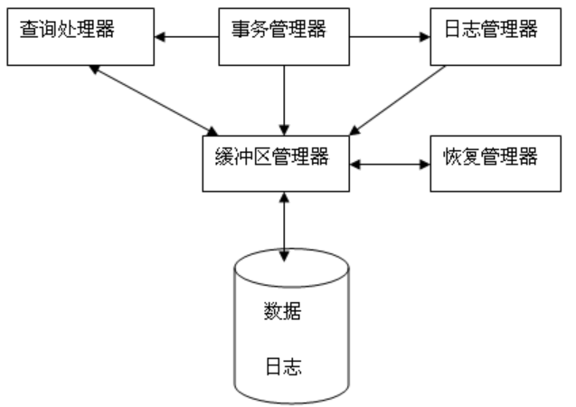

# 数据库恢复机制

数据库的恢复机制是数据库系统必不可少的组成部分，负责把数据库从错误状态恢复到某一已知的正确状态，使用的基础技术便是日志，以一种安全的方式记录数据库变更的历史。

系统可能发生的故障有很多种，需要不同的方法进行处理。

- 事务故障，逻辑错误如非法输入等，这需要撤消事务（UNDO）来保证一致性；也可能数据库系统错误如死锁等，这个就可以尝试重试来解决。
- 系统故障，如操作系统异常，断电等，会导致系统重启，将未提交事务进行撤消（UNDO），对已经提交的事务但未写回硬盘的重做（REDO）。
- 存储介质故障，需要恢复到故障之前的冗余副本，再重做（REDO）成功但未写入的事务。

根据故障的处理方式来看，主要是冗余数据（转储）和登记日志文件。

## 数据转储

转储是指将整个数据库复制到磁带或另一个磁盘上保存起来的过程，备份的数据可以用来恢复数据库。

转储十分耗费时间和资源，不能频繁进行。转储可分为静态转储和动态转储。

- 静态转储，系统空闲时进行，等正在进行的事务结束，新的事务也会等待转储结束。
- 动态转储，转储期间允许对数据库进行存取或修改，但是副本上的数据并不能总是正确有效。

转储还可以分为全量转储和增量转储。增量就是上一次转储后的更新数据。

## 事务的过程

事务故障是恢复机制中最重要的部分，需要借助日志系统才能展开，日志记录了系统中发生的各个事务。为了保证恢复时可以从Log中看到最新的数据库状态，要求Log先于数据内容落盘，也就是常说的Write Ahead Log，WAL。

事务的两种恢复操作：

- redo：就是重做，按照日志上的操作记录重做，而不是重做事务。
- undo：就是撤销/回滚，把日志上记录的操作撤销，恢复到原本的值。

事务日志也能解决动态转储的数据正确性问题。

事务操作是先写入主内存，然后再写回磁盘。输入输出以块为单位，磁盘上的物理块，主内存上临时的块叫缓冲块，主内存中这部分区域叫缓冲区。

- 读流程：事务到缓冲中读取元素X，如果命中，则读取事务局部地址空间并返回，如果未命中，则先将相关页从磁盘读入缓冲区。

- 写流程：事务在它的局部地址空间中修改元素X，然后写入缓冲区，再从缓冲区写入磁盘。

写磁盘有两种策略：

- 延迟：事务达到了commit点，被提交，然后先把事务的日志记录到数据库以后，才把事务更新到数据库。如果恢复需要redo。
- 立即：事务不需要到达commit点就可以更新到数据库，但是操作被更新前必须先记录日志。如果恢复需要redo（commit的事务）+undo（没commit的事务）。

事务的原语操作有：

- INPUT(X)：将包含数据库元素X的磁盘块拷贝到内存缓冲区。
- READ(X,t)：将数据库元素X拷贝到事务的局部变量t。
- WRITE(X,t)：将局部变量t的值拷贝到内存缓冲区中的数据库元素X。
- OUTPUT(X)：将包含X的缓冲区拷贝到回磁盘。

## 登记日志记录

登记数据库修改的就是日志，记录了数据库中所有的更新动作。

事务记录的日志记录类型有：

- <Ti start>，事务开始。
- <Ti commit>，事务提交。
- <Ti abort>，事务中止。

事务更新日志记录包括的数据有：

- 事务标识，write事务的唯一标识。
- 数据库项标识，被修改的数据项的唯一标识，一般是数据项的硬盘位置。
- 旧值，用来undo。
- 新值，用来redo。

日志记录序列写入日志文件中，每个日志记录都将立即追加到日志文件的尾部。

为了优化日志恢复性能，减少搜索日志范围，引入检查点技术，加入了新的日志记录类型：

- <checkpoint L>，L是执行检查点时正活跃的事务列表。

执行检查点操作的过程中不允许执行任何更新，并将所有更新过的缓冲块都输出到磁盘。过程如下：

- 将当前位于主存的所有日志记录输出到稳定存储器（磁盘）。
- 将所有修改的缓冲块输出到磁盘。
- 将记录检查点类型的日志记录到日志中，输出到稳定存储器。

有了检查点后，恢复从最后一条检查点类型的日志记录开始的所有日志。

另外还有一个模糊检查点技术，允许记录检查点过程中事务执行。

## 恢复算法

在基于磁盘的数据库系统中，恢复子系统大都是基于ARIES（Algorithms for Recovery and Isolation ExploitingSemantics）算法实现。ARIES对于数据缓冲区和日志缓冲区的管理采用Steal + No Force的管理策略

- Steal + No Force，Commit前数据不可以提前刷盘，Commit时不需要强制刷盘。

ARIES的日志类型包括Update、Commit、Abort、End以及补偿日志记录CLR（Compensation Log Record ）。

故障恢复包含三个阶段：Analysis，Redo和Undo。

- Analysis阶段，主要是利用Checkpoint及Log中的信息确认后续Redo和Undo阶段的操作范围，即下一步Redo的开始位置RedoLSN。
- Redo阶段，从Analysis获得的RedoLSN出发，重放所有的Log中的Redo内容，也包含了未Commit事务；
- Undo阶段，对所有未提交事务利用Undo信息进行回滚，通过Log的PrevLSN可以顺序找到事务所有需要回滚的修改。

