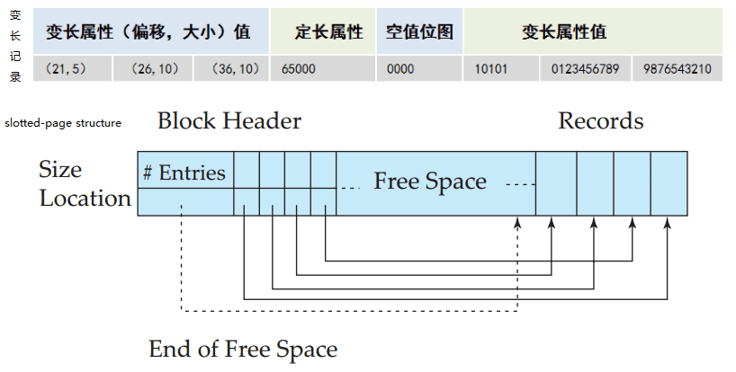

## 数据库的数据存储

数据库系统是文件系统的发展，它把文件及其中独立的数据建立起联系。数据库实现的基础是文件，对数据库的任何操作最终要转化为对文件的操作。

## 数据的组织

数据库要存储的内容包括：数据描述（数据外模式、模式、内模式）、数据本身、数据之间的联系、存取路径等。

- 数据描述，存储在数据库的数据字典中，数据量少且频繁访问，所以单独放在一个特殊的物理文件中。

- 数据及其联系，这两种数据是紧密结合的，在关系数据库中使用了“表”来表示。可以一个表一个物理文件，由OS管理，也可以多个表一个物理文件，由DBMS来管理。
- 存取路径，关系数据库中存取路径和数据是分离的，可以动态建立与删除，存取路径的物理组织通常采用B树类文件结构和hash文件结构。

## 存储管理器

存储管理器组件是负责管理数据库中存储的底层数据，并提供接口。接口包括：存储的底层数据向应用程序接口、系统提交的查询接口。它将各种DML语句翻译为底层文件系统命令，也就是数据库中数据的存储、检索和更新。

包括的子组件有：

- 权限及完整性管理器，检查权限，检查约束。
- 事务管理器，保证数据的一致的状态，保证并发事务的不冲突。
- 文件管理器，管理存储空间的分配，管理存储信息的数据结构。
- 缓冲区管理器，负责将磁盘上的数据取到内存中，并决定哪些数据需要缓冲在内存中。

存储管理器实现了几种数据结构，作为系统物理实现的一部分：

- 数据文件(data file)，存储数据库自身。
- 数据字典(data dictionary)，存储关于数据库结构的元数据，尤其是数据库模式。
- 索引(index)，提供对数据项的快速访问。

## 文件组织

一个数据库被映射到多个不同的文件，这些文件与结构由底层的操作系统来维护。文件在逻辑上是数据记录的集合，数据在文件中存储和读取的基本单元是块（block）。

- 块的大小固定，大多数数据库默认使用 4~8KB 的块大小。创建实例时就固定下来了。
- 一个块可能包含多条记录，每条记录包含在单个块中，但大数据需要单独存储，在记录中只保存地址指针。

不同的表记录具有不同的大小，数据库可以选择映射到多个文件中，每个文件都存储固定长度的记录。或者使用特殊的文件，保存不定长度的记录。

- 定长记录，占用固定大小的存储空间，记录不跨块，文件中的记录是连续的，删除也会进行整理。整理使用的方式有删除时移动剩余记录填充，或者删除时记录空闲列表，新插入时填充。

- 变长记录，让多种记录类型在一个文件中存储，或者有变长字段，或复合记录类型。

变长记录的实现有不同的技术，都需要解决的是如何描述一条记录和在块中如何存储变长记录。

- 记录表示为先定长属性，再是变长属性，头部有变长的偏移量，变长属性开始处使用空值位图，用来表示记录中的哪些属性是空值。

- 分槽的页结构（slotted-page structure）组织块中变长记录，块头记录了记录数、空闲空间的末尾地址、条目数组（记录大小和地址）。记录数据连续添加到空闲空间的末尾。

## 文件中记录的组织

操作系统提供的常用文件结构有顺序文件、索引文件、索引顺序文件、hash文件和B树类文件等。

对应到数据库的文件中，记录的组织方式有多种方式，通常每种方式用一个独立的文件，但是在多表聚簇文件组织中，将相关的多种记录存储在同一块中，可以一次性读出。

- 堆文件组织，一条记录可以放在文件中的任何位置。但是每个关系一个独立文件。
- 顺序文件组织，根据记录的某个属性（一般是主键）顺序存储记录。
- 散列文件组织，根据每条记录的某个属性的hash值确定存储位置（文件中的块位置）。
- 多表聚簇文件组织，在一个文件块中保存两个或更多关系的记录。
- B树类结构文件组织，就是B树以及它的变种B+,B-树，是顺序文件组织改进，记录以某个属性或属性集为搜索码存放在 B+ 树中，每个节点是文件的一个块。索引数据主要使用此类文件组织。

记录的修改，无论记录是定长还是变长，都会遇到不同的问题。

- 插入，如果没特定的顺序，那只需找到空闲块或新块写入；如果在次序，则找到存放位置后可能还需要移动记录腾出空间。如果块的空间不够存放，则可能会找邻近的块的空闲位置，或者创建溢出块。
- 删除，删除记录时可以回收空间，可能需要移动块内记录，让出可用区域。但是也有不能移动记录的情况，可以使用块头部的可用空间列表来标识可以空间。为了保证拿着原记录指针不能再访问实际的物理地址，需要使用删除标志，并且是永久的。标记的方案有：要么标记到偏移量表上或者映射表的物理地址，标志为空指针；要么在原删除记录位置起始处放一个字节为删除标志。
- 修改，定长的记录修改，直接修改。但是变长的字段修改则需要考虑记录比原来的长则需要创建新空间，类似插入；如果比原来的记录短则需要恢复或合并空间，类似删除。

