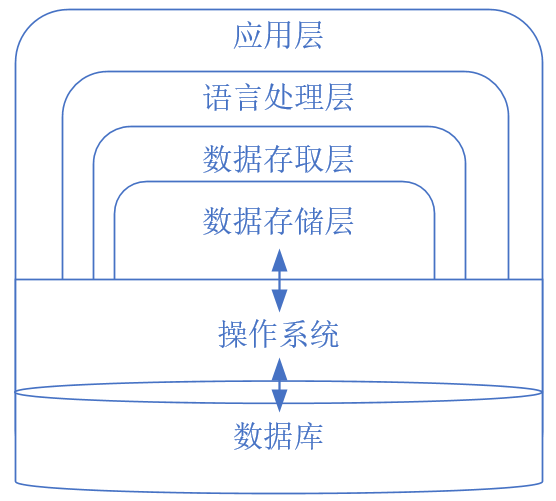
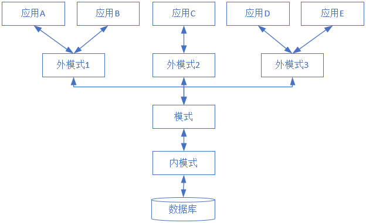

# 数据库管理系统及数据库结构

数据库是按照数据结构来组织、存储和管理数据的仓库。处理的数据的特点是一个长期存储、有组织的、可共享的、统一管理。

数据库建立在计算机硬件、操作系统、编译系统和网络通信等技术基础上，对海量数据进行高效的存取、管理，以及事务等处理。

常见的数据库类型有关系数据库，产品有Oracle、MySQL、SQLServer；还有非关系型数据库（NoSQL），它又分键值数据库、列数据库、文档数据库、图形数据库等等。

## 数据库管理系统功能

围绕着数据处理，数据库管理系统一般都具有六项基本的功能。

- **数据库定义和创建功能**，使用数据定义语言（DDL），定义和创建数据库模式、外模式，内模式等数据库对象。如数据库、表、视图、索引等，还有用户、安全、完整性等，这些定义存储在数据字典中。
- **数据组织存储和管理功能**，分类组织、存储和管理各种数据，包括数据字典、用户数据、存取路径等。基本目标是提高存储空间利用率和存取效率。
- **数据库事务管理和运行管理**，保证数据库系统的正常运行、事务的ACID特性等。包括多用户环境下的事务、安全、完整，和数据库恢复、并发控制和死锁检测，还有安全性检查、存取控制、完整性检查和执行，以及运行日志的组织管理等。
- **数据存取功能**，使用数据操纵语言（DML），对数据库数据的检索，插入，修改和删除等功能。
- **数据库的建立和维护**，包括数据库的初始建立、数据的转换、数据库的转储和恢复、数据库的重组织和重构造以及性能检测分析等。
- 其他，如与其他系统通信、数据转换等等。

## 数据库管理系统的层次结构

将数据管理系统按处理对象，由高级到低级依次为应用层、语言处理层、数据存取层、数据存储层，最底层再依赖操作系统完成最基本的数据文件管理。

- **最上层应用层**，与用户/应用程序的界面层。
- **第二层语言处理层**，处理数据库语言，如SQL，如语法分析、视图转换、安全性检查、完整性检查、查询优化等。向上提供关系、视图等集合；调用下层生成可执行代码并运行。
- **第三层数据存取层**，执行扫描，排序，元组的增删改查，封锁等基本操作。把上层的集合操作转换为单记录操作，完成数据记录的存取、存取路径维护、数据管理、并发控制和恢复等工作。
- **第四层数据存储层**，管理数据页和系统缓冲区，执行文件的逻辑打开、关闭、读页、写页、缓冲区读和写、页面淘汰等操作，完成缓冲区管理、内外存交换、外存的数据管理等功能。

整个关系数据库管理系统的各层模块相互配合、互相依赖，共同完成对数据库的操纵。

## 数据库系统的三级模式结构

数据库对数据定义了三个抽象级别，用户抽象的处理数据，具体的处理由系统去处理。这三个抽象级别对应了数据库的三级模式结构，模式、外模式、内模式。

- **模式**(Schema)也称概念模式(Conceptual Schema)，是对数据库中全部数据的逻辑结构和特征的描述，是所有用户的公共数据视图。它不管物理层面的事，也不管应用程序的事。一个数据库只有一个模式，主要定义数据的逻辑结构、数据项之间的联系、不同记录之间的联系，以及与数据有关的完整性、安全性等要求。
- **外模式**(External Schema)也称子模式(Subschema)，是各用户自己设计的数据的逻辑结构，描述的是数据库用户自己可见的局部数据的逻辑结构和特征。
- **内模式**(Internal Schema)也称存储模式(Storage Schema)，一个数据库只有一个内模式，是对数据物理结构和存储方式的描述，是数据在数据库内部的表示方式。主要提供最优的高效的物理模式。

在三级结构之间提供了两级映像(Mapping)进行联系和转换，外模式/模式映像、模式/内模式映像。

- 外模式/模式映像，模式表示全局，外模式表示局部，一个模式有多个外模式，它们的映像定义在各自外模式的描述中。
- 模式/内模式映像，定义了数据库全局逻辑结构与存储结构之间的对应关系，此映像唯一的，且定义在模式的描述中。

这种三级结构可以保持数据独立性，即应用程序和数据库的数据结构之间相互独立。

- 逻辑数据独立性，模式改变不影响应用程序，只需要改变外模式/模式映像。
- 物理数据独立性，数据库的存储结构改变不影响应用程序，只需要改变模式/内模式映像。

## 外部体系结构

从数据库最终用户角度看，数据库系统的结构分为集中式(单用户结构、主从式结构)、分布式(客户机/服务器结构)和多层结构，这是数据库系统外部的体系结构。

