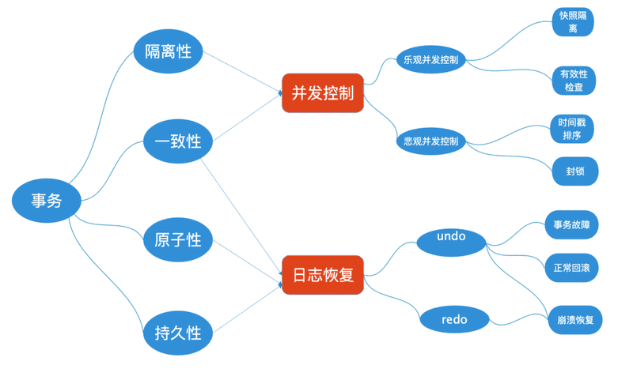

# 事务

数据库事务是构成单一逻辑工作单元的操作集合，这些操作要么全做，要么全不做，是一个不可分割的工作单位。事务通常以BEGIN TRANSSACTION开始，COMMIT或ROLLBACK结束。

- COMMIT表示提交，即提交事务的所有操作，具体说是将事务中所有对数据库的更新写回到磁盘上。
- ROLLBACK表示回滚，即因某种故障，事务不能继续执行，系统将事务中对数据库的所有已完成的操作全部撤销，回滚到事务开始时的状态。

## 事务特性

事务具有 4 个特性，即通常简称的 ACID：

- 原子性（Atomicity），事务中的所有操作作为一个整体像原子一样不可分割，要么全部成功,要么全部失败。
- 一致性（Consistency），事务执行的结果必须是使数据库从一个一致性状态变到另一个一致性状态。
- 隔离性（Isolation），一个事务的执行不能被其他事务干扰。
- 持久性（Durability），一个事务一旦提交，它对数据库中数据的改变就应该是永久性的。

事务的ACID特性中，一致性是事务的根本追求。为了解这个问题需要保证事务可并发执行，事务或系统故障可恢复，数据库系统是通过并发控制技术和日志恢复技术来实现。

- 并发控制技术保证了事务的隔离性，使数据库的一致性状态不会因为并发执行的操作被破坏。
- 日志恢复技术保证了事务的原子性，使一致性状态不会因事务或系统故障被破坏。同时使已提交的对数据库的修改不会因系统崩溃而丢失，保证了事务的持久性。

常见的并发异常是：脏读、脏写、更新丢失、不可重复读、幻读等，控制策略分为乐观并发控制和悲观并发控制两大类。

## 事务的隔离级别

事务具有隔离性，理论上来说事务之间没有影响，但是完全隔离会因为性能问题，会有所放宽。为此SQL标准为事务定义了不同的隔离级别，从低到高依次是：

- 读未提交(READ UNCOMMITTED)，允许读取未提交的数据，即不控制事务的并发。可能会脏读。
- 读已提交(READ COMMITTED)，只允许读已提交的数据，事务之间的对数据的更新提交后都可见。可能会幻读。
- 可重复读(REPEATABLE READ)，只允许读已提交的数据，一个事务两次读取数据期间，看不到其他事务更新该数据的结果。可能会幻读。
- 串行化(SERIALIZABLE)，可以串行调度执行，不会有冲突。

事务的隔离级别越低，可能出现的并发异常越多，但是通常而言系统能提供的并发能力越强。

SQLite默认串行化模式，MySQL默认可重复读模式，Oracle、PostgreSQL、SQL Server默认读已提交模式，几乎没有读取未提交模式的数据库。

## 并发事务控制

并发控制技术是实现事务隔离性以及不同隔离级别的关键。控制策略分为乐观并发控制和悲观并发控制两大类。

- 基于锁的并发控制方法：两段锁协议。

- 基于时间戳的并发控制方法：借助于时间戳，强制使一组并发事务的交叉执行，等价于一个特定顺序的串行执行。
- 基于有效性确认的并发控制方法：事务在启动的时刻被赋予唯一的时间戳，以示其启动顺序，为每一活跃事务保存其读写数据的集合，通过对多个事务的读写集合，判断是否有冲突，来完成事务的提交与回滚，强制事务以可串行化的方式执行。
- 基于快照隔离的并发控制方法：是多版本并发控制(mvcc)的一种实现方式。数据库为每个数据项维护多个版本(快照)，每个事务只对属于自己的私有快照进行更新，在事务真正提交前进行有效性检查，使得事务正常提交更新或者失败回滚。

