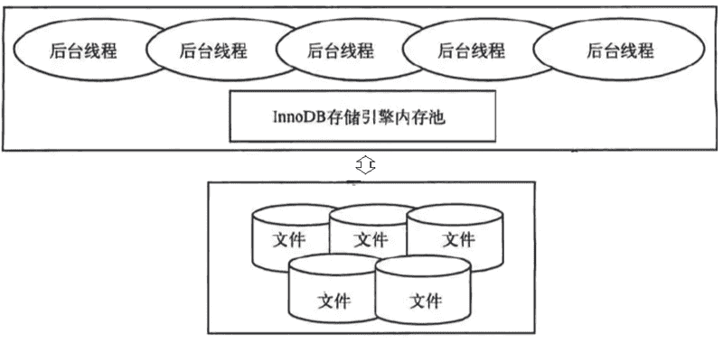
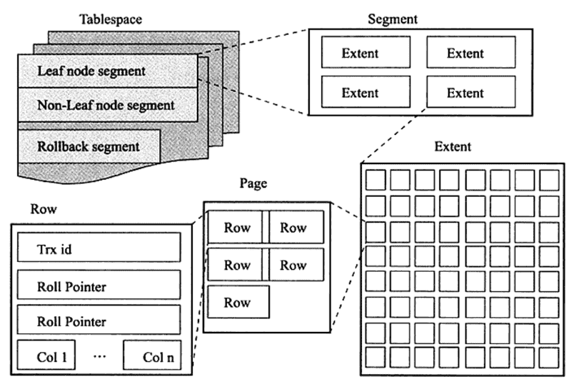

# InnoDB

MySQL区别于其他数据库的最重要一个特点是：插件式的表存储引擎，存储引擎是基于表的，而不是数据库。其中InnoDB是当今最流行的MySQL存储引擎。

InnoDB的设计目标主要是面向在线事务处理（OLTP）的应用。其特点是行锁设计、支持外键，并支持类似于Oracle的非锁定读，即默认读取操作不会产生锁。

## InnoDB体系架构

InnoDB存储引擎有多个内存块，这些内存块组成了一个大的内存池。后台线程主要负责刷新内存池中的数据、将已修改的数据刷新到磁盘等等。

- 后台线程，负责刷新内存池中的数据，保证缓冲池中的内存缓存的是最近的数据，并将修改的数据刷新到磁盘。
- 内存池，很多个内存块，维护共享的缓存数据、重做日志、多个内部数据结构等。

## 后台线程

 InnoDB是单进程多线程的，因此后台有多个不同的后台线程，负责处理不同的任务。

- **Master Thread**，主线程处理数据刷盘如赃页的刷新、合并插入缓冲、UNDO 页的回收等；
- **IO Thread**，异步写IO的回调处理；
- **Purge Thread**，独立的回收已经使用并分配的 undo页；
- **Page Cleaner Thread**，独立的脏页的刷新。

## 内存池

InnoDB 引擎使用缓冲池技术来提高数据库的整体性能。读取页操作时，先判断该页是否在缓冲池中存在，命中则直接读取，否则去磁盘读取，然后放缓冲池中。

- **缓冲池**，其中存储的数据有：索引页、数据页、 undo 页、插入缓冲、自适应哈希索引、 InnoDB 的锁信息、数据字典信息等。其中主要空间是索引页和数据页。

- **redo log buffer**，重做日志缓冲，InnoDB先将重做日志信息放到这个缓冲区，然后按一定频率刷新到重做日志文件。使用了WAL机制。

## 缓冲池的管理，LRU算法

InnoDB利用类似**LRU算法**对缓冲池进行管理。

- **Free List**，存放空闲的页。
- **LRU List**，存放从磁盘读出的页。以midpoint将列表划分为放活跃的热点数据的new区，与放要淘汰的old区。一般midpoint在列表的5/8处。

- **Flush List**，记录修改后需要刷新到磁盘的脏页。只是个指针列表，其中的指针指向了LRU列表中的页。

读出数据页时，先将空闲页从Free列表转移到LRU列表的midpoint位置，用来存放从磁盘读出的页，当Free没可用的空闲页时，则淘汰LRU列表old末尾的页。在old中的数据被访问到后，就转移到new中。

对数据页进行修改后，产生脏页，就把此页记录到Flush列表中，数据库通过checkpoint机制将Flush中的脏页刷新回磁盘。

## 检查点CheckPoint

CheckPoint技术是用来解决如下几个问题：

- 缩短数据库恢复时间，重做日志中记录了的checkpoint的位置，只需对checkpoint之后的重做日志进行恢复。
- 缓冲池不够用时，将脏页刷新到磁盘，在LRU列表溢出时，如果页为脏页，强制执行checkpoint，将脏页刷新回磁盘。
- 重做日志不可用时，刷新脏页，设计为循环使用的重做日志，为了能复用缓冲空间，会强制产生checkpoint，将缓冲池中的页至少刷新到当前重做日志的位置。

InnoDB存储引擎内部，两种checkpoint，分别为:

- Sharp Checkpoint，在数据库关闭时，将所有的脏页都刷新回磁盘。
- Fuzzy Checkpoint，数据库运行时，作用在引擎内部，只刷新一部分脏页。

## undo log

undo log主要记录的是数据的逻辑变化，为了在发生错误时回滚之前的操作，需要将之前的操作都记录下来，然后在发生错误时才可以回滚。

undo log有两个作用：

- 用于事务的回滚（保证原子性），更新数据前记录Undo log。
- 用于实现多版本并发控制（MVCC，保证一致性），将数据在事务提交前写到磁盘，并先于数据持久化。

InnoDB有两种insert和update的undo log，前者提交事务则删除，不需要进行purge操作；后者由delete 和update操作产生，需要提供MVCC机制，提交时放入undo log列表中，等待purge线程进行最后的删除。

undo log是逻辑日志，对事务回滚时，只是将数据库逻辑地恢复到原来的样子，而redo log是物理日志，记录的是数据页的物理变化。

## binlog

binlog是逻辑格式的日志，可以简单认为就是执行过的事务中的sql语句。

用在主从复制中，从库利用主库上的 binlog 进行重播，实现主从同步；还可以用于数据库的基于时间点的还原。

事务提交的时候，一次性将事务中的sql语句按照一定的格式记录到binlog中。然后在生成时间超过expire_logs_days配置的天数之后，会被自动删除。

事务的成功是先写redo log，再写 binlog，两个日志都提交成功。

## 逻辑存储结构

所有数据都被逻辑地存放在一个空间内，称为表空间，而表空间由段（sengment）、区（extent）、页（page）、行（row）组成，页又称块（block）。

- 表空间，InnoDB把数据保存在表空间内，表空间可以看作是InnoDB存储引擎逻辑结构的最高层。本质上是一个由一个或多个磁盘文件组成的虚拟文件系统。InnoDB用表空间并不只是存储表和索引，还保存了回滚段、双写缓冲区等。
- 段，表空间是由各个段组成的，常见的段有数据段、索引段、回滚段等。
- 区，段由多个区组成，一般是连续的，区是由连续的页（Page）组成的空间。
- 页/块，InnoDB存储引擎磁盘管理的最小单位，每个页默认16KB。有各种页类型，如数据页、undo页、系统页等。
- 行，每个页存放的行记录。最多允许存放16KB/2-200，即7992行记录。

## 关键特性

InnoDB的关键特性有：插入缓冲（Insert Buffer）、两次写（Double Write）、自适应哈希索引（Adaptive Hash Index, AHI）、异步IO（AIO）、刷新邻接页（Flush Neighbor Page）等。

