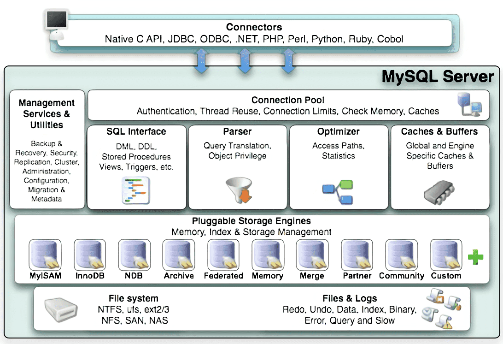

# Mysql体系结构

Mysql的设计特点是通过插件形式提供不同种类的存储引擎，弹性的，同时也是一个单进程多线程数据库，进程即实例。

数据库及实例的概念：

- 数据库，数据库是物理操作系统文件或其他形式的文件类型的集合。
- 实例，数据库后台进程/线程以及一个共享内存区组成，真正用来操作数据库文件的。

通常实例和数据库通常关系是一对一，在集群情况下，可能存在一个数据库可被多个实例使用的情况。

## Mysql体系结构

MySQL逻辑系统架构分为3层:

- 应用层，是MySQL体系架构的最上层，功能如连接处理、用户鉴权、安全管理等。
- MySQL服务层，是MySQL Server的核心层，提供了MySQL数据库系统的所有逻辑功能。
- 存储引擎层，其插件式的表存储引擎，具体与文件打交道的子系统。

## 应用层功能

应用层面对应用程序，管理客户端的接入。

- 连接处理，从线程池中分配一个线程来和客户端进行连接。
- 用户鉴权，检查接入用户的用户名，客户端主机地址和用户密码。
- 安全管理，根据用户的权限来判断用户具体可执行哪些操作。

## 服务层功能

服务层是核心层，提供了MySQL数据库系统的所有逻辑功能。

- Management Serveices & Utilities： 系统管理和控制工具。
- Connection Pool: 连接池，进行身份验证、线程重用，连接限制，检查内存，数据缓存；管理用户的连接，线程处理等需要缓存的需求。

- SQL Interface：SQL 接口，进行 DML、DDL，存储过程、视图、触发器等操作和管理；用户通过 SQL 命令来查询所需结果。
- Parser：解析器，检查对象的权限；解析查询语句，最终生成语法树，会缓存SQL语句。
- Optimizer：查询优化器，对查询语句进行优化，包括选择合适的索引，数据的读取方式。

- Caches & buffers，缓存，包括全局和引擎特定的缓存，提高查询的效率。优先从缓存中取数据。

## 存储层功能

Mysql的存储引擎是插件式的，最常用的MyISAM、InnoDB。

- 存储引擎，通过文件访问层抽象接口来定制一种文件访问的机制，由具体的引擎根据自身不同的特性来实现存储。

- 物理文件，包括：redolog、undolog、binlog、errorlog、querylog、slowlog、data、index等。

- MyISAM引擎，不支持事务，为表级锁，使用B+Tree作为索引结构，索引和数据文件是分离的。
- InnoDB引擎，支持事务、外键，为行级锁，聚集索引，使用B+Tree作为索引结构，数据文件与主键索引在同一个文件中。
