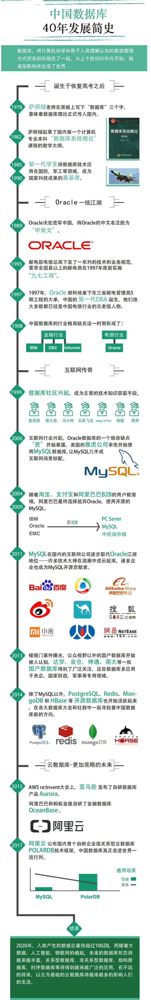

# 数据库在中国发展的这40年

> 网上遇到一张描述中国数据库发展的图，喜其清楚明了，拿来分享。并加以注解。
- 数据库是从20世纪50年代开始发展，数据管理经历手工管理到文件管理到数据库系统。
- 中国从20世纪80年代使用数据库技术。当然，也就直接从数据库系统起步的。
- Oracle占绝对份额，直到互联网兴起，才让开源的Mysql来到大家身边。
- 互联网状大后的海量数据处理中，NoSQL兴起，而且多数是开源的，也在这个市场中吸引了不少的关注。
- 国产数据库接触了些，但本人不才遇到使用国产数据库的项目，无一例外目标都是“你懂的”。
- 阿里那波去IOE的操作，是实际所需，也具有重大意义。

> 图

`此图系转载，如有版权侵犯请联系将及时删除。`