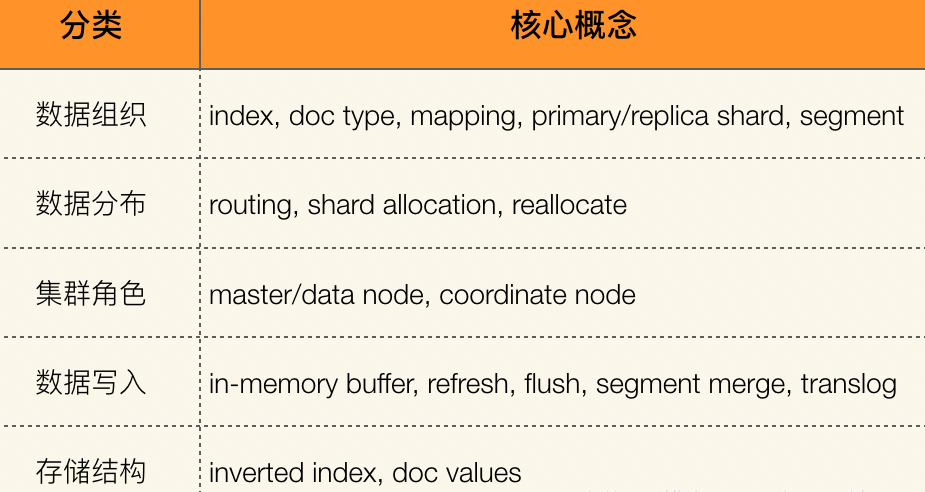

# Elasticsearch 重要的几个概念与功能

Elasticsearch（ES） 是一个分布式、可扩展、实时的搜索与数据分析引擎。它基于Lucene并用Java实现的开源软件，并提供了基于RESTful web接口。Lucene 是当下最先进、高性能、全功能的搜索引擎库，但是比较复杂，ES对Lucene 做了一层封装，它提供了一套简单一致的 RESTful API 来帮助我们实现存储和检索，存储与接口都以Json格式序列化进行。

最重要的功能包括：

- 一个分布式的实时文档存储，文档的字段都可以被定制索引与搜索，可当NoSQL数据库作用。数据分布式存储，以保安全高效。
- 一个分布式实时分析搜索引擎，有各类分词器，聚合过滤等API，数据分析可以达到秒级的速度。
- 易于扩展。

## 基本概念

- ### Node 与 Cluster

  每启动一个ES服务就是一个实例，一台机器可以启动多个实例，也可以多个实例协同起来为一组，单个 ES 实例称为一个节点（node）。一组节点构成一个集群（cluster）。

- ### Index

  数据管理的顶层单位就叫做 Index（索引），它与关系数据库中的数据库同义。因为Lucene对文档的反向索引（Inverted Index），所以ES也叫索引。对应有个Type的分类概念，但是在新版的ES中已经废弃。

- ### Document

  Index 里面单条的记录称为 Document（文档），使用 JSON 格式表示。许多条 Document 构成了一个 Index。相当于关系数据库中的记录。ES不要求同一Index有相同的结构（scheme）。相关的schema信息通过 mapping 来定义，mapping不仅仅包括数据类型的定义，还有很多其他元信息的设置，它们共同决定了数据如何被存储和索引。

- ### Field

  Document中某一数据的字段，与关系数据库表中的字段同义。支持多种数据类型。

- Shard

  每个Index都会被拆分为多个Shard，分布在不同的Node上存储与索引。这种设计就提供了扩展能力，并提高吞吐量与性能。每个Shard都分为primary(主分片)与Replica(副本)，都对等与 Lucene的index。

- Replica

  Replica就是Shard的副本，每个Shard都可选的设置多个副本。相当于多个备份，并可供数据的读取。而且副本会自动的分配在不同的Node上，以保障数据的安全可靠。

- Inverted Index

  Inverted Index，倒排索引，就是Lucene的倒排索引，ES的索引实现方式。

## 存储设计

1. 灵活的数据结构，由 index 组织的最终数据document是一个JSON Object，相关的schema信息通过 mapping 来定义，包括数据类型以及其他元数据，如果没有mapping也会自动推导每个字段的类型。
2. 分布式shard设计，index 会被划分为多个shard（分片），再分散存储到不同的Node（节点）上。为了保证在故障节点退出后数据不丢失，同一份数据需要拷贝多份存在不同节点上，这就是shard的 primary 与 replica 设计理念，当主分片故障时，副本就自动切换为主分片。
3. 均匀分布，每个index 划分到不同的shard后，master节点会记录数据到shard的映射（route，hash算法实现）和shard到节点的映射（shard allocate），为保证均匀分布，随时检测并自动调整（relocate）。
4. 高效检索，对Shard再次细分为segment，它是最小的数据单元，是不可改变的，每隔一段时间产生一个新的segment，里面包含了新写入的数据。segment的不可变性则无修改的锁开销，并可高效的进行缓存。
5. 高效更新，更新的设计则是先删除，后新增，并且删除也只是先记录.del文件，并不直接删除（在查询时，需要排除del文件中的内容），写入也并不直接写硬盘，先写内存，再异步写硬盘。最后提供了segment merge机制，合并已删除的数据，减少文件句柄。每个分片维护一个translog的事务日志文件，保障对分片的事务操作。

## 集群

ES通过多个节点组成一个集群，把单节点的索引文件（index）使用分片技术（shard），分布到多个节点，并为每个分片数据都建立副本（replica），集群状态、数据分布路由是通过中心节点维护。ES的节点分为主节点、合格节点、数据节点、协调节点、数据处理节点等，任何一个节点都可能是其中一种或多种组合。

- 主节点是在从合格节点中选举出来的，保存了集群状态。
- 数据节点保存数据，并响应客户端请求。
- 协调节点负责均衡节点和维持客户端连接。
- 数据处理节点作是数据前置处理转换。

## 查询

客户端发送查询请求到一个协调节点，它会将请示转发给所有的分片，每个分片执行同样的查询并将结果集（只文档的ID）返回给协调节点，由协调节点进行数据的合并、排序、分页等操作，把最终ID结果集根据路由到各节点将文档数据摘取回来，返回给客户端。至于响应请求的分片是主还是副本，是根据随机轮询算法决定的。

在每个分片内部实现是 Lucene 的倒排索引搜索过程，也同样还有一个需要过滤掉删除数据的过程。

es的搜索引擎严重依赖于底层的 filesystem cache，如果需要较高响应速度，是需要较大内存的。

Elasticsearch中存在两种DSL：查询DSL(query DSL)和过滤DSL(filter DSL)。前者用于全文或模糊查询，后者用于精确过滤。 Filter DSL中常见的有term Filter、terms Filter、range Filter、exists and missing Filters和bool Filter。而Query DSL中常见的有match_all、match 、multi_match及bool Query。