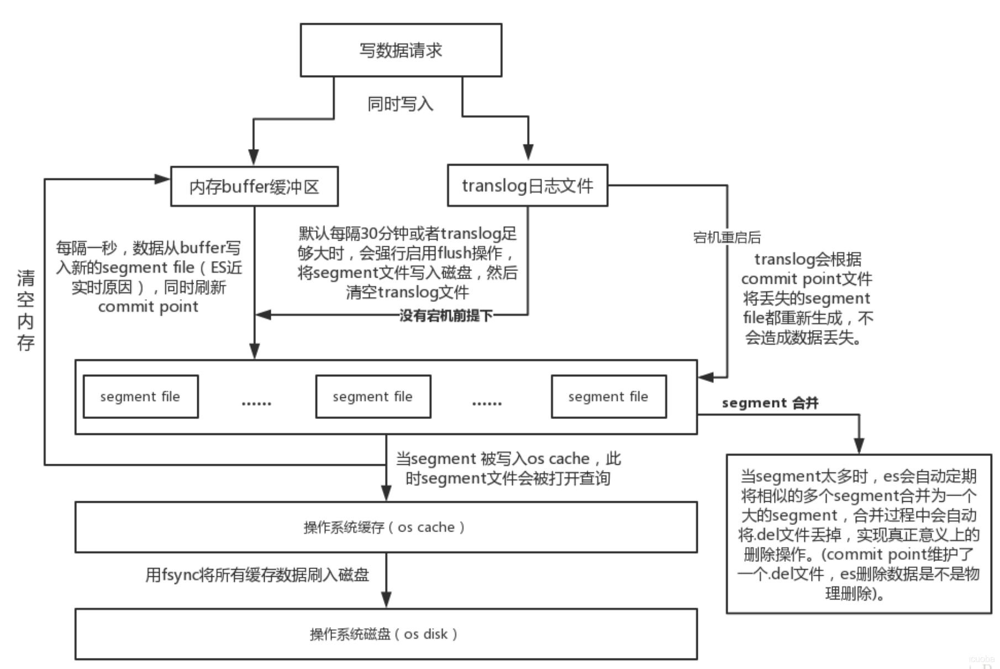
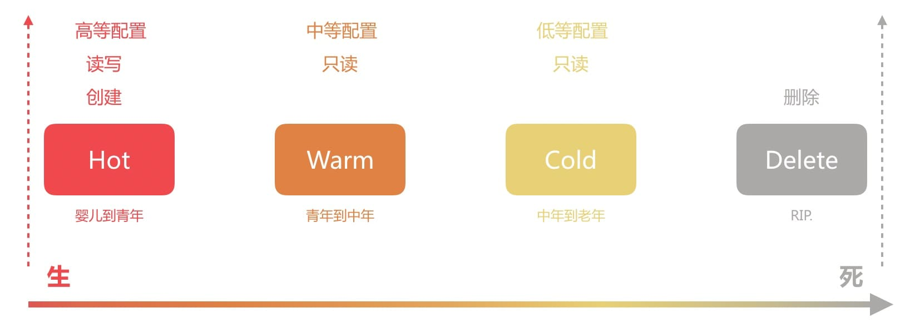

# Elasticsearch Index 索引管理

Elasticsearch(简称ES)是分布式的搜索引擎，底层基于Lucene，Lucene的搜索核心数据结构是倒排索引。ES存储数据的基本单位是索引。Elasticsearch将每个index中的数据划分到不同的shard中，然后将shard分配到不同的节点上，实现分布式存储。

##  概念对比

每个数据记录与索引的关系如下：
index -> [type ->] mapping -> document -> field

类比关系数据库，则index 相当于MySQL里的一张表；type 无对应概念，也可类似一张表；mapping 相当于表结构的定义；document 类似表中的一行记录；field 类似记录中的一个字段。与关系数据库不同的是一个index中对type并无唯一限制（最新版已经没有type），可多个type的document放同一个index，document可包含在mapping定义之外类型的field。

## Index的储存

ES会保存一份原始文档（**_source**字段指向的位置），并将所有索引字段合集放在文档的**_all**字段中，所有的词项与文档关系（**_id**）放置在倒排索引（倒排记录表）中。

索引的新增其实就是直接PUT一个json的对象，查询也是GET到一个json的对象。索引文档中的数据类型由字段的属性type指定，字段还有一些公共的属性，用于约定字段关于索引方面特性。索引的元字段（Meta-field）是以下划线开头的字段，部分元字段可以配置，部分元字段不可配置。

Index在存储时，ES会将索引细分为多个分片（shard）放在不同的node上（根据routing信息和元信息），在每个分片内部最终将数据以段（segment）的形式落地到磁盘上。删除的文档登记在另外的del文件中。

## Index的存储过程

Elasticsearch会为索引的每个index为analyzed的字段建立倒排索引。倒排索引的结构，专门设计做搜索的。倒排索引写入磁盘后就是不可变的，这样没有锁和更新，就很好的支持了大并发，对删除操作单独记录。为提升IO性能，可以把索引加载到内存缓存中。

- **新增过程**，先将文档写入内存索引缓存，为防止意外数据丢失也同时写入translog日志文件，请求返回；ES每秒都会将内存刷（**refresh**）到一个segment文件，此时数据还在filesystem cache中；操作系统调度下再间隔一段时间，ES会真正写磁盘（**flush**）。写入磁盘完成后，新的index segment被打开。

  translog文件则单独处理的，每操作都写硬盘，这是默认策略，也可以选择异步定时写，这就可能丢失数据，最后是在segment文件写盘后删除。每当节点重启都需要从translog里恢复数据。

  refresh过程会创建一个Commit Point，Commit Point包含segment以及.del的信息。

- **删除与修改过程**，当文档被删除时，会在.del文件中会标识哪些文档是有deleted标记的（.del文件的写盘过程同segment文件处理一致），在检索时过滤掉。修改则是先删除后新增。

- **segment合并过程**，ES为优化IO性能会在后台对segment进行合并，减少文件的数量，同时标记为deleted的文档在合并时会被删除，.del文件被删除。

- **查询过程**，当内存数据refresh到segment文件完成后，此时segment内的文档可以被搜索到。

## Index的生命周期

Index Lifecycle Management(索引生命周期管理，ILM) ，ES为了处理大量时序数据，也就是日志场景领域的最佳实践进行的一次总结归纳和落地实施，

ILM 一共将索引生命周期分为四个阶段(Phase)，一般来讲是Hot 转为 Warm，由 Warm 转为 Cold，最后 Delete 。阶段的转换必然是需要时机的，而对于时序数据来说，时间必然是最好的维度，而 ILM 也是以时间为转换的衡量单位。

但它并不强制要求必须有这个4个阶段，用户可以根据自己的需求组合成自己的生命周期。ILM有一个管理策略(Policy)，来定制各个阶段及此阶段的动作。

- Hot 阶段：正在活跃的更新和查询，会不断的进行数据读写，数据量也快速的增加。需要高配置的节点。
- Warm 阶段：不再被更新，数据量基本不会增加了，但是仍被查询。中等配置的节点即可满足需求。
- Cold 阶段：已经不被更新且很少查询。但是索引数据的信息还需要被搜索，若被搜索则比较慢。低等配置的节点即可满足要求。
- Delete 阶段：已经不需要了，可以安全的删除了。

policy包含了多个阶段（phases），就是指上面四个阶段中的某几个，每个阶段再包含多个动作（actions）。

- Rollover： 滚动索引操作，可用在索引大小或者文档数达到某设定值时，创建新的索引用于数据读写，从而控制单个索引的大小。
- Allocate： 设定副本数、修改分片分配规则(如将分片迁移到中等配置的节点上)等。
- Read-Onlly： 设定当前索引为只读状态。
- Force Merge： 合并 segment 操作。
- Shrink： 缩小 shard 分片数。
- Delete： 删除索引。

