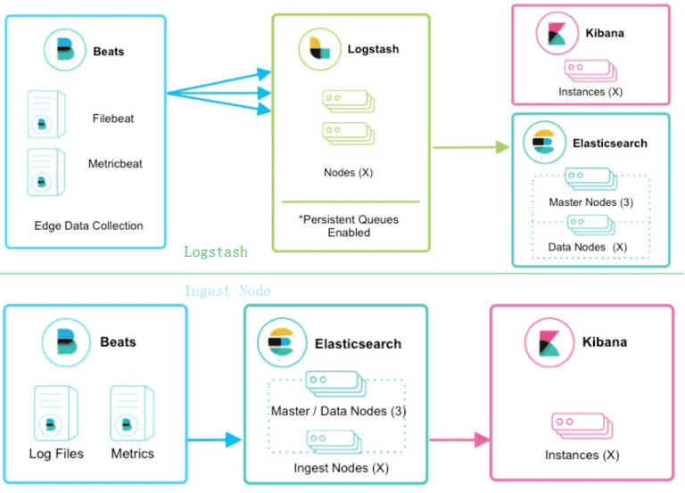

# Elasticsearch 预处理 Ingest

Elasticsearch设计了Ingest特性，在数据写入前做一些前置的过滤、转换等简单的数据处理逻辑，能支持Logstash的大多数常用场景，在5.0版本中发布。为数据的采集和处理提供了一种新的方式，可以在许多场景下不使用Logstash，简化了系统架构。



## Ingest Node

完成预处理的有个独立的Node角色 Ingest Node，默认集群每个节点都具有ingest的作用，也可以独立节点。其开启方式为：在 elasticsearch.yml 中定义（默认开启）：

```yaml
node.ingest：false
```

Ingest Node作为ES索引文档的一部分，只处理单个数据，局限在上下文中，不能与外部打交道。

Ingest 节点接收到数据之后，根据请求参数中指定的管道流 id，找到对应的已注册管道流，对数据进行处理，然后将处理过后的数据，然后将文档传回 index（索引）或者 bulk APIs。

## Ingest Pipeline

确定ingest节点后，要定义pipeline，pipeline中指定具体的逻辑。

```json
PUT _ingest/pipeline/log_pipeline
{
  "description":"log pipeline",
  "processors":[
    {
      "grok":{
        "field":"message",
        "patterns":[
          "%{TIMESTAMP_ISO8601:timestamp} \\[%{DATA:project}\\] \\[%{DATA:thread}\\] %{GREEDYDATA:message}"
        ]
      }
    },
    {
      "date": {
        "field": "timestamp",
        "formats": [
          "yyyy-MM-dd HH:mm:ss,SSS"
        ],
        "timezone": "Asia/Shanghai"
      }
    }
  ]
}
```

Ingest API共分为4种操作，分别对应：

- PUT（新增）。
- GET（获取）。
- DELETE（删除）。
- Simulate （仿真模拟）。

Ingest Pipeline的使用：

- Beats中指定Pipeline参数，在output.elasticsearch参数加，pipeline: my-pipeline 。
- 在index API中使用，POST my-index/_doc?pipeline=my-pipeline { ... } 。
- reindex时使用，POST _reindex{"source": {...},"dest": {...,"pipeline": "my-pipeline"} } 。
- Index settings参数中指定，index.default_pipeline 与 index.final_pipeline。

## Processor

Ingest Pipeline的Processor，相当于 Logstash 的 filter 插件。事实上其主要处理器来自 Logstash 的 filter 代码。目前最重要的几个处理器分别是：

- convert，类型转换等。
- grok，将输入字段提取到多个字段。
- gsub，替换输入字段的内容，可选输出到另外字段。
- date，时间格式化等。

还有其他很多处理器，append，rename，remove，attachement，geoip 和 user-agent，有的还需要单独安装 。

## 注：

- grok规则参考：github.com/logstash-plugins/logstash-patterns-core/blob/master/patterns/grok-patterns

- 测试grok：使用ES插件：POST _ ingest/pipeline/_simulate

