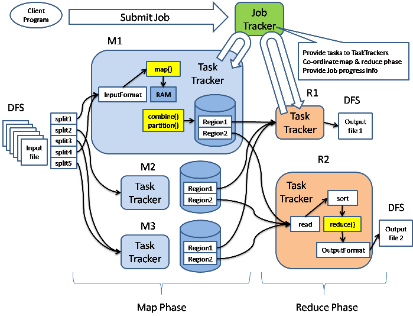
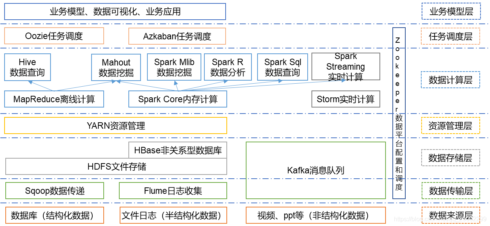

# Hadoop：事实上的大数据标准

Apache基金会的Hadoop根据Google的论文实现MapReduce开源计算框架，结合分布式文件系统HDFS（Hadoop Distributed File System），  Hadoop是目前应用最为广泛的分布式大数据处理框架，其具备可靠、高效、可伸缩等特点。在分布式环境下提供了海量数据的处理能力，可以让用户在不了解分布式底层细节的情况下，开发分布式程序，充分利用低成本机器集群进行高速运算和存储。

## 核心组件

Hadoop的核心组件是HDFS、MapReduce、Yarn。HDFS集群和YARN集群，两者逻辑上分离，但物理上常在一起。

- HDFS: Hadoop Distributed File System 分布式文件系统，负责海量数据的存储，集群中的角色主要有 NameNode / DataNode/SecondaryNameNode。
- YARN: Yet Another Resource Negotiator  资源管理调度系统，负责海量数据运算时的资源调度，集群中的角色主要有 ResourceManager /NodeManager。就是图中的jobtracker和tasktracker的替代（暂时没找到新版的图片，hadoop2中就使用yarn重构了调度过程）。
- MapReduce：分布式运算框架，它其实是一个应用程序开发包。

## 生态圈

随着处理任务不同，各种组件相继出现，丰富Hadoop生态圈，目前生态圈结构大致如图所示：

- Spark（分布式计算框架），一种基于内存的分布式并行计算框架，主要批量处理海量数据。
- Flink（分布式计算框架），一个基于内存的分布式并行处理框架，主要处理流数据，类似Spark。
- hive（基于hadoop的数据仓库），类似sql的查询语言（hql）转化为mapreduce任务在hadoop上执行。
- pig（基于hadoop的数据流系统），定义了一种数据流语言-pig latin，将脚本转换为mapreduce任务执行，类似Hive。
- hbase（分布式列存数据库），针对结构化数据的可伸缩，高可靠，高性能，分布式和面向列的动态模式数据库。
- mahout（数据挖掘算法库），包含了聚类、分类、推荐引擎（协同过滤）和频繁集挖掘等广泛使用的数据挖掘方法。
- flume（日志收集工具），cloudera开源的日志收集系统。
- sqoop（数据同步工具），主要用于传统数据库和hadoop之间传输数据。
- zookeeper（分布式协作服务），解决分布式环境下的集群或数据管理问题。
- Kafka（消息队列），是一种高吞吐量的分布式发布订阅消息系统。
- Oozie(工作流调度器），可扩展的工作体系，集成于Hadoop的堆栈，用于协调多个MapReduce作业的执行。

## Hadoop vs Spark vs Flink

Google对MapReduce编程模型的提出为大数据分析和处理开创了一条先河，之后发条陆续涌现出了Hadoop、Spark和Flink等大数据框架。在大数据分布式计算技术中，这几个技术都实际依赖HDFS来存储数据，也可以借助Yarn做调度。

Hadoop的MapReduce是面向批处理并基于磁盘的处理工具，特点是离线批量。也支持可多个阶段连续。

Spark也是一个批处理系统，数据计算全部在内存中完成，最终才将数据保存到集群。但它也支持流处理，Spark Streaming以微批处理数据流（“先收集再处理”的计算模型）。

Flink是真正的流引擎，采用连续流式流传输模型，实时对数据进行处理。