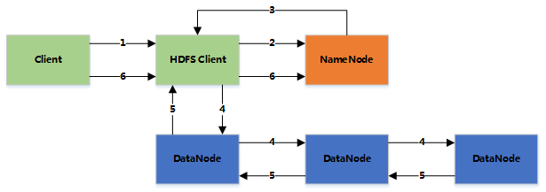

# HDFS：分布式文件存储

HDFS（Hadoop Distributed File System）分布式文件系统，是Hadoop的储存系统，能够实现创建文件、删除文件、移动文件等功能，文件被平均分块通过网络在多台主机上存储，就可以并行从多机器上读取。HDFS高吞吐量的数据读写的特性，能够面向大规模数据使用，可进行扩展的文件存储与传递。

## 主要面向的问题域

- 大数据文件，可以支持T级别的大文件，或大量文件存储。当然大量小文件存储就存在较大性能问题，需要额外的方案解决。
- 块存储，将文件平均分块存储到不同的机器上，并且有多个副本，多主机并行读取效率要高很多。
- 流式数据访问，就是一次写入并可追加，多次读取。不可以修改数据，只能删除。
- 分布式集群存储，成本低廉并解决单点故障。

## 关键模块

- **Block（块）**，将一个文件进行分块存储在多个DataNode上，每个块都有副本。
- **NameNode（名称节点）**，保存整个文件系统的元数据：目录信息、文件信息及分块信息，运行时所有数据都保存到内存，此节点支持动态备份。也会定时将数据保存到硬盘。备份的名称节点会定时与主节点同步数据。
- **DataNode（数据节点）**，分布在集群的计算机上，用于存储Block 块文件。数据节点之间会同步副本。

## 写过程

- HDFSClient 向NameNode 发起文件写入的请求。
- NameNode 根据文件大小和文件块配置情况，返回给HDFSClient 它所管理部分DataNode 的信息（block id 和要写入的 DataNode 的列表）。
- HDFSClient 将文件划分为多个Block，根据DataNode 的地址信息，按顺序写入到每一个DataNode 块中。
- HDFSClient写完数据后告知NameNode，NameNode返回成功信息给Client。

HDFSClient使用了ack queue队列来确认每个节点写入操作都正常完成，NameNode同时也知道文件的所有Block信息。所有过程结束后，此文件才可用。HDFS的副本的存放策略是可靠性、写带宽、读带宽之间的权衡。

Hadoop有机架感知功能，默认不开启且不是自适应，需要告诉 Hadoop 集群中哪台机器属于哪个机架。这主要是为了提高不同节点的通信效率，并将副本放不同的机器，提高容错性。

## 读过程

- HDFSClient 向NameNode 发起文件读取的请求。
- NameNode 返回文件存储的DataNode 的信息：文件的所有block和这些block所在的DataNodes（包括复制节点）。
- HDFSClient 直接从DataNode中读取文件信息。优先本地读取，出现错误从副本中读取。

## 故障处理

- 写故障， 如果DataNode在数据写入的时候发生故障，HDFSClient直接跳过此节点写其他节点，并通知NameNode，NameNode等故障DataNode恢复时删除写入没有完成的块。
- 读故障，就会试图从这个块的另外一个最邻近DataNode读取数据。并标记故障节点。
- DataNode故障导致副本不足的块可以手动修复或配置自动修复，复制一个数据块到新的DataNode。