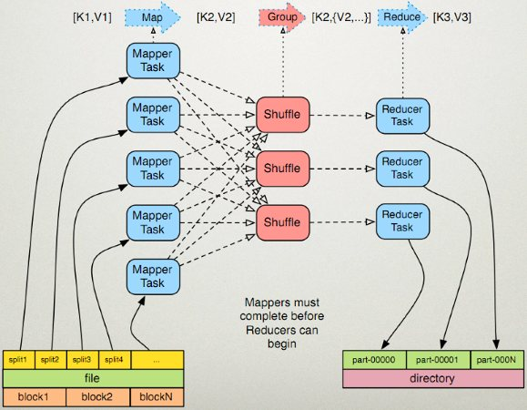

# MapReduce程序框架

MapReduce是一个分布式运算程序的编程框架，用户在此框架下编写的业务逻辑代码然后打包提交到一个hadoop集群上，并发运行。

MR程序最主要的操作是读取HDFS存储的数据/文件，将数据切成若干块，交给map线程去执行分析过程，执行的结果交给reduce线程进行合并整理，最后又写回HDFS。程序的重要事情一个是map的分析过程，需要实现Mapper的map接口处理数据分析业务代码；另外一个是reduce合并整理过程，需要实现Reducer的reduce接口处理分析结果数据的归集。

## MR框架的处理流程



MR程序的类处理顺利是 HDFS -> InputSplit -> RecordReader -> InputFormat -> **Mapper** -> shuffle -> **Reducer** -> OutputFormat -> WriteReader -> HDFS 。

MR框架中有两个类似的包，mapred代表的是hadoop旧API，而mapreduce代表的是hadoop新的API。下面只对org.apache.hadoop.mapreduce新的API进行整理。所有的abstract class类下都是public abstract 方法，整理时省略此关键字。MapContext基本上充当着JobConf的OutputCollector和Reporter的角色。

## 详细的类

**Map阶段的核心类是Mapper**，组合了Mapper.Context做输出，Context的子类组合了MapContext（WrappedMapper.Context），MapContext的子类（MapContextImpl）由InputSplit、RecordReader（做input）、RecordWriter（做output）等构建。

```java
// InputFormat：把HDFS中数据拆分（不限），拆分后再构造K，V。创建RecordReader、InputSplit
public abstract class InputFormat<K,V> {
    RecordReader<K,V> createRecordReader(InputSplit split,TaskAttemptContext context);
    List<InputSplit> getSplits(JobContext context);
}
// InputSplit：数据拆分
public abstract class InputSplit {  
   long getLength(); 
   String[] getLocations();
}
// RecordReader  拆分后的构造K，V，为每个split创建一个RecordReader实例
public abstract class RecordReader<K, V> {
	void initialize(InputSplit split, TaskAttemptContext context);
    boolean nextKeyValue();
    K getCurrentKey();
    V getCurrentValue();
    float getProgress();
    void close();
}
// 构造K，V后，map业务处理具体过程。组合Mapper.Context类
public class Mapper<KI, VI, KO, VO> {
    protected void map(KI key, VI value, Context context){...}
    public void run(Context context){...} // 默认调度
    // 默认实现：还有两个方法setup、cleanup分别是map前与后处理（都run调度）。
}
// Map后，给到Reduce，可以写HDFS
// 写在Mapper内部的类，继承: MapContext <- TaskInputOutputContext
public abstract class Context extends MapContext<KI, VI, KO, VO> {
    public InputSplit getInputSplit(); //来自MapContext
}
// Map与Reduce共同的接口，处理输出到HDFS（可选）
// 继承: TaskAttemptContext <- JobContext，子类MapContextImpl实现了其中的接口
public interface TaskInputOutputContext<KI, VI, KO, VO> extends TaskAttemptContext {
    public boolean nextKeyValue();
    public KI getCurrentKey();
    public VI getCurrentValue();
    public void write(KO key, VO value);
}
```

**Reduce阶段核心类是Reducer**，组合Reducer.Context做输出。Context的子类组合了ReduceContext（WrappedReducer.Context），ReduceContext的子类（ReduceContextImpl）由RecordWriter构建（做output）。

```java
// Map后，Reduce业务处理具体过程。有内部类Reducer.Context
interface Reducer<KI, VI, KO, VO> {
    protected void reduce(KI key, Iterator<VI> values，Context context){...}
    public void run(Context context){...}
    // 默认实现：还有两个方法setup、cleanup分别是reduce前与后处理（都run调度）。
}
// Reduce后，输出。输出RecordWriter
public abstract class OutputFormat<K,V> {
    RecordWriter<K, V> getRecordWriter(TaskAttemptContext context);
    OutputCommitter getOutputCommitter(TaskAttemptContext context);
}
// 汇总输出到HDFS
public abstract class RecordWriter<K,V> {
    void write(K key, V value);
    void close(TaskAttemptContext context);
}
```

**Job类，调度类**，配置各阶段处理类、初始化、提交、停止等操作管理MR任务。运行参数来自core-default.xml和core-site.xml中的配置，或者由Configuration来指定。

```java
public class Job {
    // 构造与实例，合成了Configuration或其子类JobConf
    Job(JobStatus status, JobConf conf){...}
    public static Job getInstance(Configuration conf, String jobName){...}
    public void setJarByClass(Class<?> cls){...}
    public void setMapperClass(Class<? extends Mapper> cls){...}
    public void setReducerClass(Class<? extends Reducer> cls){...}
    // 输入、输出
    public void setInputFormatClass(Class<? extends InputFormat> cls){...}
    public void setOutputFormatClass(Class<? extends OutputFormat> cls){...}
    // 合并、切分、排序、分组等shuffle过程
    public void setCombinerClass(Class<? extends Reducer> cls){...}
    public void setPartitionerClass(Class<? extends Partitioner> cls){...}
    public void setSortComparatorClass(Class<? extends RawComparator> cls){...}
    public void setGroupingComparatorClass(Class<? extends RawComparator> cls){...}
    // 提交任务与获得结果
    public void submit() {...}
    public boolean waitForCompletion(boolean verbose) {...}
}
// 配置参数类 默认读取core-default.xml和core-site.xml中的相同配置
public class JobConf extends Configuration {
    public void set(String name, String value, String source){...}
}
// 文件输入辅助类
public abstract class FileInputFormat<K, V> extends InputFormat<K, V> {
    public static void setInputPaths(Job job, Path... inputPaths){...}
    public static void setMaxInputSplitSize(Job job, long size){...}
}
// 文件输出辅助类
public abstract class FileOutputFormat<K, V> extends OutputFormat<K, V> {
    public static void setOutputPath(Job job, Path outputDir) {...}
    public static void setOutputCompressorClass(Job job, Class<? extends CompressionCodec> ) {...}
}
```

