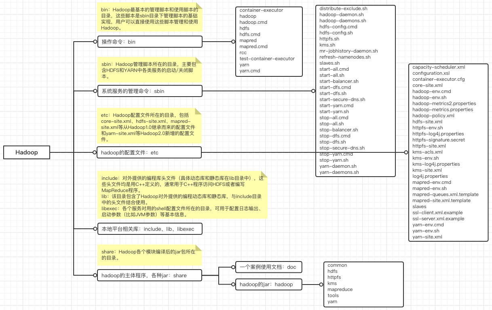

# Hadoop的目录结构详解

完整的Hadoop安装包中包括了所有的核心组件，主要有HDFS、MapReduce、Yarn、Client这几个。

## 安装目录

- **bin**：放着Hadoop最基本的管理脚本和使用脚本，sbin目录下管理脚本就是依赖这儿的脚本来实现的，用户也可以直接使用这些脚本管理和使用Hadoop。
- **etc**：配置文件所在的目录，包括：core-site.xml、hdfs-site.xml、mapred-site.xml和yarn-site.xml等配置文件。
- **include**：对外提供的编程库头文件（具体的动态库和静态库在lib目录中），相当于HDFS和MapReduce的C++ API。
- **lib**：包含了Hadoop对外提供的编程动态库和静态库，与include目录中的头文件结合使用。
- **libexec**：各个服务对应的shell，可用于配置日志输出目录、启动参数（比如JVM参数）等基本信息。
- **sbin**：管理脚本所在目录，主要包含HDFS和YARN中各类服务启动/关闭的脚本。
- **share**：下面有两个目录，hadoop目录：各个模块编译后的组件Jar包所在目录；doc目录中包含了Hadoop文档。

## 数据目录

- 临时目录：hadoop.tmp.dir的目录默认指向的是：/tmp/hadoop-${USERNAME}，修改配置在core-site.xml，加一个名字为"hadoop.tmp.dir"的property。
- HDFS的数据（Namenode本地目录和Datanode数据块），位置是在hdfs-site.xml中配置的dfs.namenode.name.dir和dfs.namenode.data.dir。分别是存储hdfs元数据信息和数据的目录，如果没有配置则默认存储到临时目录。
- 日志数据，位置是log4j.properties中的配置。默认放在${HADOOP_HOME}/logs/，${HADOOP_HOME}则是系统参数。