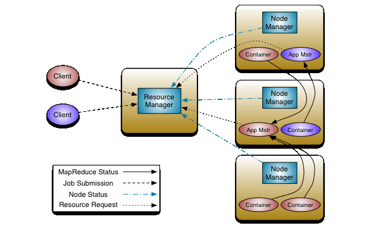

# YARN：分布式资源管理

YARN（Yet Another Resource Negotiator），Hadoop独立出来的资源管理框架，代替JobTracker来负责资源管理和调度的。YARN是一个分布式资源管理系统，用于提高分布式的集群环境下资源的利用率，这些资源包括内存，I/O，网络，磁盘等。其产生的原因是为了解决MapReduce框架的不足。

## 组件

Yarn从整体上还是属于master/slave模型，主要依赖于三个组件来实现功能。

- 第一个就是ResourceManager，是集群资源的仲裁者，它包括两部分：一个是可插拔式的调度Scheduler，一个是ApplicationManager，用于管理集群中的用户作业，启动、监控、重启ApplicationMaster。Scheduler接收来自ApplicationMaster的应用程序资源请求，ApplicationManager分配集群中的资源（Container容器）。
- 第二个是每个节点上的NodeManager，管理该节点上的用户作业和工作流，也会不断发送自己Container使用情况、节点健康状况给ResourceManager，以“心跳”方式与ResourceManager保持通信。
- 第三个组件是ApplicationMaster，用户作业生命周期的管理者，它的主要功能就是向ResourceManager（全局的）申请计算资源（Containers）并且和NodeManager交互来执行和监控具体的task。

## 工作流程

1. 用户提交程序，包括ApplicationMaster程序，启动AM的命令和用户程序。
2. YARN中的ResourceManager负责接收和处理来自客户端的程序，选择NodeManager中的一个容器，启动ApplicationMaster。
3. ApplicationMaster创建后会先向 ResourceManager注册。
4. ApplicationMaster轮询向ResourceManager申请资源。
5. ResourceManager分配AM容器。
6. 在容器中启动任务，先MapTask，再ReduceTask。
7. 各个任务向AM报告状态与进度。
8. 应用程序结束后，AM向RM注销并关闭自己。